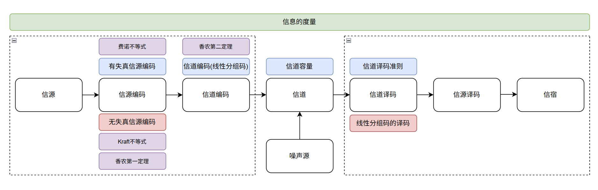
# 第一章 信息的度量

## 1.1 随机事件的自信息

我们定义一个随机事件的自信息为**事件发生前后的不确定性的减小量**。

- 自信息量
$$I(x) = -logP(x)$$
- 联合自信息量（x、y同时出现的不确定性）
$$I(x,y)=-logP(x,y)$$
- 条件自信息量（出现x后再出现y的不确定性）
$$I(x|y)=-logP(x|y)$$
- ⭐互信息量（收到x后从中获取到y的信息量，**即x给定后y的不确定度减少量**）

$$I(x;y)=I(x)-I(x|y)=-log\frac{P(x)}{P(x|y)}$$
$$I(x;y)=-logP(x)+logP(x|y)=log\frac{P(x|y)P(y)}{P(x)P(y)}=-log\frac{P(x)}{P(x|y)}$$
>💡**互信息量=自信息量-条件自信息量，可正可负（取决于$P(x|y)$和$P(x)$的孰强孰弱）**。
>    **互信息量还可以理解为前验概率的自信息量-后验概率的自信息量**。

- 互信息量的性质（**多次给定**）
$$I(x;yz)=I(x;y)+I(x;z|y)$$
$$I(x;y|z)=-log\frac{P(x|z)}{P(x|y,z)}$$
## 1.2 离散信源的熵

相较于自信量考虑的是**单一信息的局部非平均自信息量**，熵则是描述**整个信源所有消息符号的平均自信息量**。
故信息熵的物理意义为：**表示信源输出后，每个符号所提供的平均信息量**

### 1.2.1 熵的表达式
>💡此时不再是单一符号x、y，而是随机变量（代表整个信源）X、Y，且信源输入$X=[a_1,a_2...a_i]$信宿输出为$Y=[b_1,b_2...b_j]$

- 熵
$$H(X)=-\sum{P(X)logP(X)}$$
- 联合熵
$$H(X,Y)=-\sum\sum{P(a_ib_j)logP(a_ib_j)}$$
- 条件熵
$$H(X|Y)=-\sum\sum{P(a_i)P(b_j|a_i)logP(a_i|b_j)}=-\sum\sum{P(a_ib_j)logP(a_i|b_j)}$$
### 1.2.2 熵的性质

- 对称性、非负性、可加性（**独立时**）、递增性（**⭐计算**）、扩展性、确定性（其中一个概率为1）
- ⭐⭐⭐极值性/上凸性（最大熵定理）（等概时成立）：
$$H(X)_{max}=logN$$

>💡由***詹森不等式***（函数的期望小于等于期望的函数）可以证明并且当为**BSC**信道时熵的极值为1。
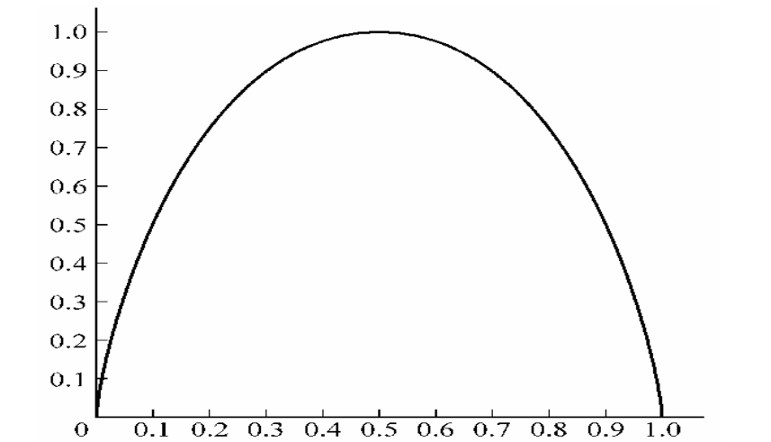

## 1.3 平均互信息量

平均互信息量是**所有符号互信息量的统计平均，与熵之间存在紧密联系**。（⚔️解决熵和平均互信息量的利器是两个图：**维恩图和信息流图**）
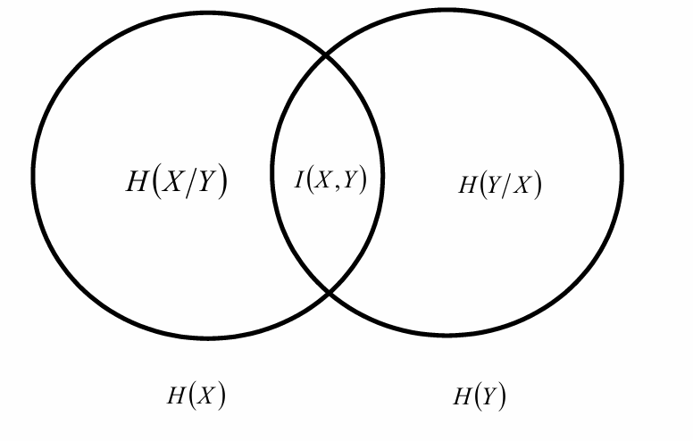
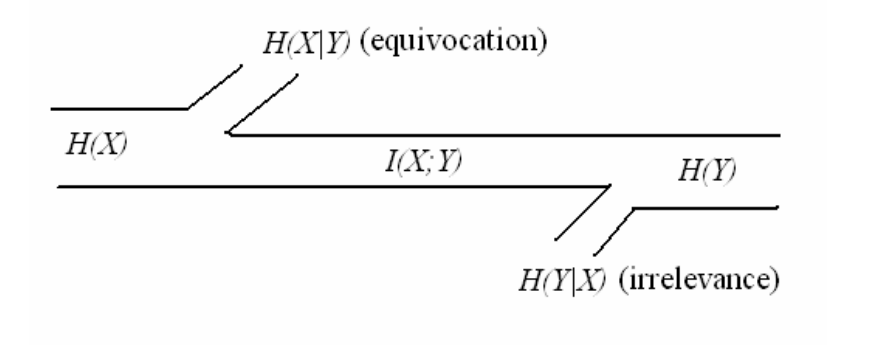

>💡平均互信息量在后面**两处**都会用到：信道容量（最大值）、率失真函数（最小值）！ 

- 平均互信息量 
$$I(X;Y)=-\sum\sum{P(a_ib_j) log\frac{P(a_i)}{P(a_i|b_j)}}=H(X)-H(Y|X)=H(Y)-H(X|Y)$$
- 联合平均互信息量
$$I(X;Y,Z)=I(Y;X,Z)=I(X;Z)+I(X;Y|Z)$$
- 条件平均互信息量
$$I(X;Y|Z)=-\sum\sum\sum{P(a_ib_jc_k) log\frac{P(a_i|z_k)}{P(a_i|b_j,z_k)}}=H(X|Z)-H(X|Y,Z)$$
$$I(X;Y|Z)\geq0$$
>💡上面的维恩图和信息流图直观展现了平均互信息量和熵的关系：其中$H(X|Y)$为**疑义度（损失熵）**，$H(Y|X)$为**散布度（噪声熵）**。

## 1.4 数据处理定理

数据处理定理很好的反映了信息经过多级处理后始终保持**信息不增性**。

我们把$X$当作信源，$Y$是经过编码器后的符号，$Z$是经过信道之后的符号。则通过多级数据处理后，**熵（不确定性）增大，平均互信息量（关联程度）减小***。

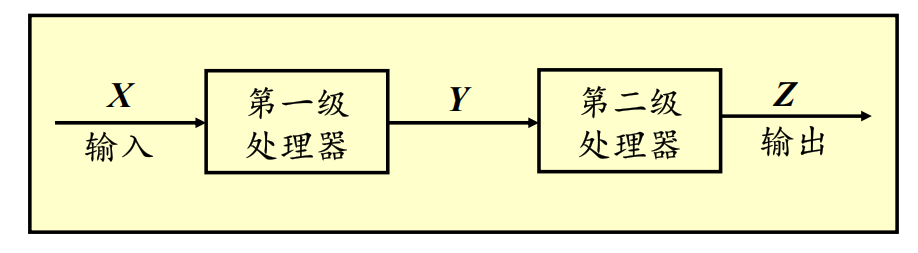
$$H(X|Y)<H(X|Z)$$
$$I(X;Y)>I(X;Z)$$
## 1.5 离散信源序列的熵

我们考虑的信源序列满足**离散平稳无记忆条件**（平稳是指概率与时间无关，无记忆是指概率只与当前有关），则离散信源序列可以理解为**单个信源$X$的N次拓展**。
已知$X=[X_1,X_2,X_3...X_N]$，$P=p_1p_2p_3...p_N$：

- 平均符号熵$H_N(X)$:
$$H_N(X)=H(X_1)$$
- $X^N$的熵：
$$H(X^N)=NH(X_1)$$
- 熵率$H_{\infty}$：
$$H_{\infty}=H_N(X)=H(X_1)$$

## 1.6 连续信源的熵

连续信源是**时间离散幅度连续**（采样后的信号），而波形信源是**时间连续幅值连续**。
### 1.6.1 微分熵的表达式

>💡微分熵和离散信源的熵表达式同，只不过**求和换积分**。

### 1.6.2 微分熵的性质

- ⭐极值性($Y=X+N$)：
  1. 峰值功率受限下的最大微分熵(**$Y$满足均匀分布取等**):
$$h(X)\leq{log(b-a)}$$
  2. 平均功率受限下的最大微分熵(**$Y$满足正态分布取等**):
  $$h(X)\leq{\frac{1}{2}log(2\pi{ep})}={\frac{1}{2}log(2\pi{e\sigma^2})}$$
  - ⭐微分熵可负！
  
>💡可以总结出离散信源的熵非负而微分熵可负。

## 1.7 信息的冗余度

- 相对熵率（实际的熵/最大熵）（**归一化操作**）
$$\eta = \frac{H_\infty}{H_0}$$
- 冗余度
$$\gamma = 1 - \eta = 1 - \frac{H_\infty}{H_0}$$
# 第二章 信道容量

信道由**转移概率矩阵**刻画，我们主要讨论**DMC（离散无记忆信道）** 的容量（二元对称信道BSC是DMC的特殊情况之一）

## 2.1 信道参数

- 信息传输率$R$/最大信息传输率$C$(bit/符号):
$$R=I(X;Y)$$
$$C=maxI(X;Y)$$
- 信息传输速率$R_t$/最大信息传输速率$C_t$(bps):

$$R_t=\frac{R}{t}$$
$$C_t=\frac{C}{t}$$
- 最佳分布和匹配信道

## 2.2 DMC信道容量

- 无噪无损/无噪有损/有噪无损信道容量（**看信息流图**）
- ⭐DMC信道容量定理
- 一般DMC信道容量（**解线性方程组，需验证**）
- ⭐⭐⭐ 对称信道的信道容量（做题）
- ⭐⭐⭐准对称信道的对称容量（做题）

## 2.3 组合信道的信道容量

- 级联信道（**级联越多容量越小**）
- 并联信道（**2个**）

## 2.4连续无记忆信道容量

- 一维加性高斯无记忆信道容量：

$$C=\frac{1}{2}log(1+\frac{S}{N})$$
- L维加性高斯无记忆信道容量：
$$C=\frac{L}{2}log(1+\frac{S}{N})$$
## 2.5 波形信道容量

- ⭐香农公式：
$$C=Wlog(1+\frac{S}{N})$$

# 第三章 无失真信源编码

## 3.1 信源编码分类

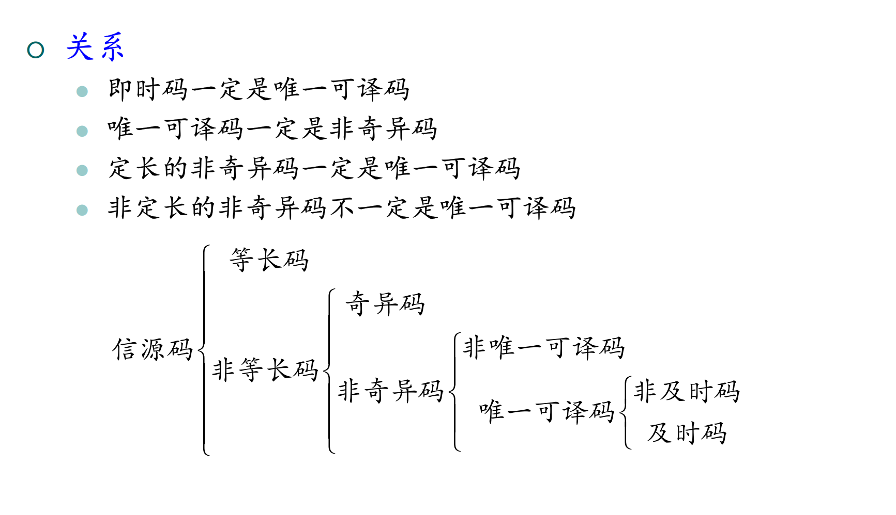

## 3.2 等长编码

- 等长无失真信源编码定理：
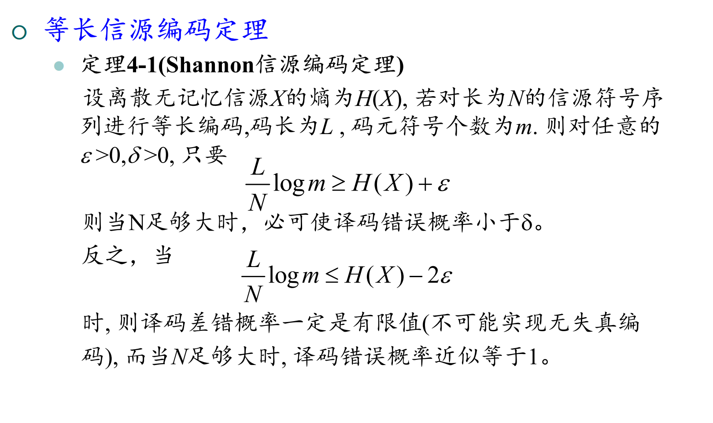

  此时的最佳等长编码为：
  $$R=\frac{L}{N}logm=H(X)+\varepsilon$$
  编码效率为：
  $$\eta =\frac{H(X^N)}{R}=\frac{NH(X)}{Llogm}=\frac{H(X)}{H(X)+\varepsilon}$$
## 3.3 不等长编码

- ⭐⭐⭐ Kraft不等式（**及时码的存在性**）：
  长度为$l_1,l_2,l_r...$的$m$元及时码存在的充分必要条件是：
$$\sum_{i=1}^{r}m^{-l_i}\leq1$$
- 单个符号不等长编码定理（**类比于等长编码定理**，N=1）：
$$\bar{l}\geq{\frac{H(x)}{logm}}$$
>💡平均码长（码元/符号）：$\bar{l}=\sum{P(s_i)l_i}$
>  编码速度（比特/符号）：$R=\frac{\bar{l}·logm}{N}$
>  编码效率：$\eta = \frac{H(X)}{R}$
>  码的多余度：$1-\eta$

- ⭐⭐⭐信源序列编码定理（**香农第一编码定理**）
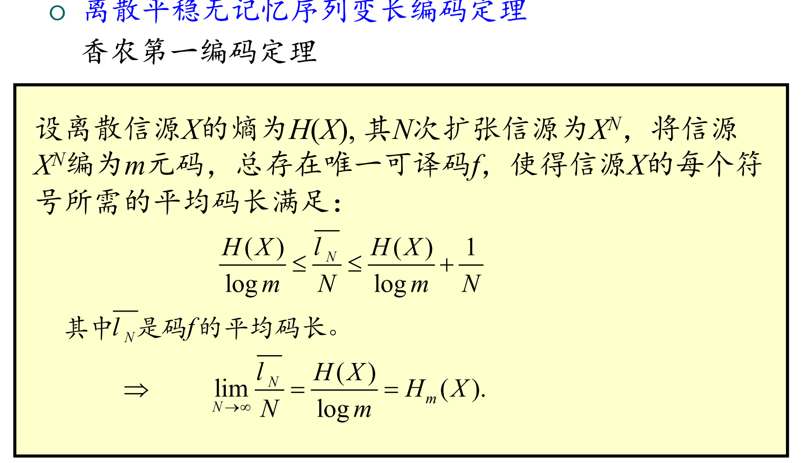
>💡实质上就是$\varepsilon$换成$\frac{1}{N}$

## 3.4 常见变长编码算法

- 香农编码
- 费诺编码
- ⭐⭐⭐霍夫曼编码（**是最佳、及时码，不唯一**）
- 算术编码
- LZ编码

# 第四章 有失真信源编码

## 4.1 失真函数

$$d(x,y)$$
  

## 4.2 平均失真

$$\bar{D}=\sum\sum{p(a_i)p(b_j|a_i)d(a_i,b_j)}$$

## 4.3 信息率失真函数

- 率失真函数表达式：
$$R(D)=minI(X;Y)$$
- ⭐⭐⭐率失真函数的定义域、值域（**计算**）：
  $$D_{min}=0,R(D_{min})=H(X),R(D_{max})=0$$
- 率失真函数的性质：

  **下凸、连续、严格递减**
  
- 率失真函数与信道容量的比较：
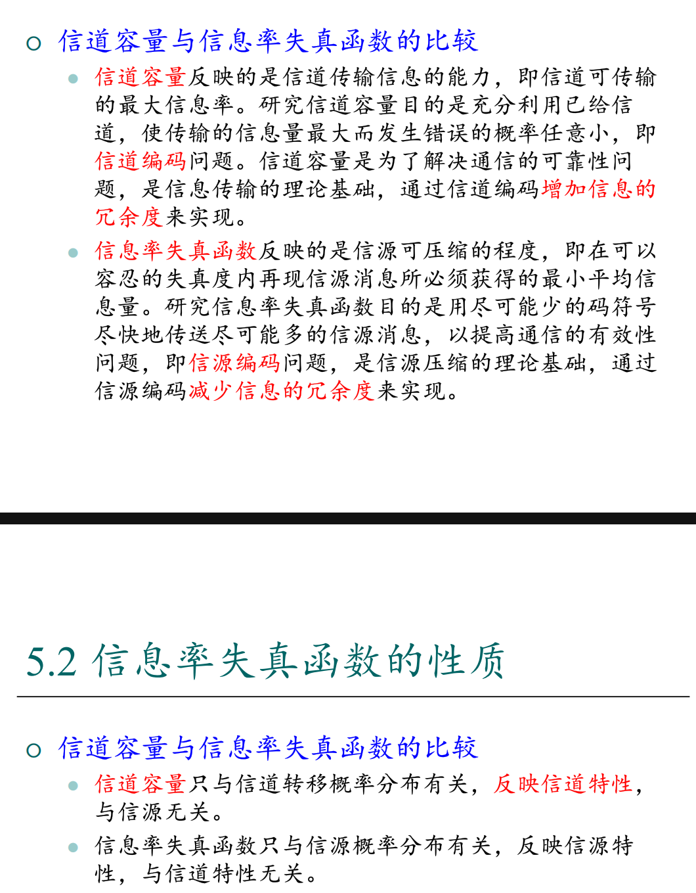
## 4.4 有失真信源编码定理
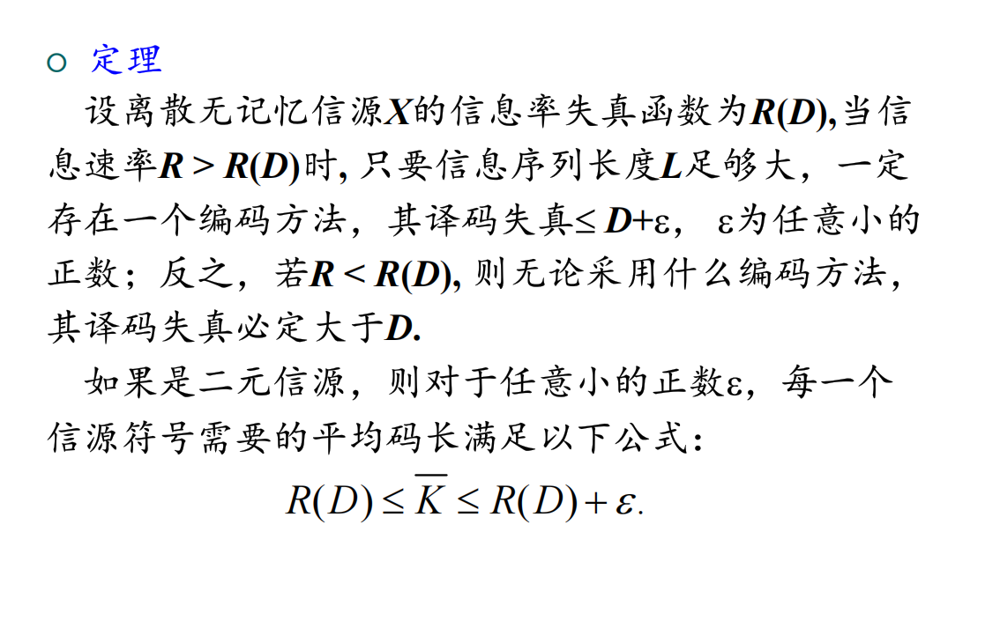

# 第五章 信道编码概述

## 5.1 信道编码分类

## 5.2 信道译码准则

- ⭐⭐⭐最小错误概率译码（**一定最佳**）
- ⭐⭐⭐最大似然准则(**最大后验译码的特殊情况**)
- ⭐⭐⭐最小汉明距离译码
  **非负、对称、三角不等式**
- ⭐⭐⭐费诺不等式
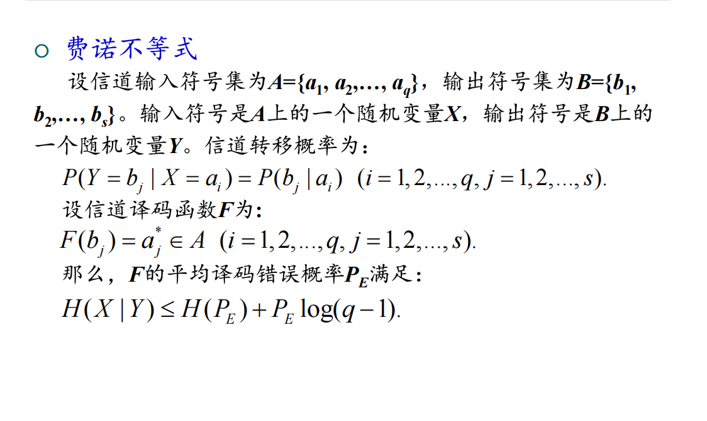
>💡费诺不等式建立了疑义度和误码率的桥梁：**疑义度小于等于平均误码率的不确定度加上某个点的误码率**

## 5.3 码的检错纠错能力

## ✨5.4 信道编码定理（香农第二编码定理）
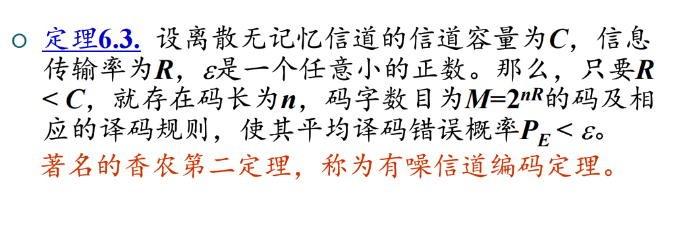

# 第六章 线性分组码

## 6.1 线性分组码的生成矩阵 G

## 6.2 线性分组码的校验矩阵 H

- 对偶码
## 6.3 线性分组码的最小汉明重量 

## 6.3 线性分组码的译码

- 错误图样
- 陪集
- 伴随式

## 6.4 完备码和汉明码

- 汉明界