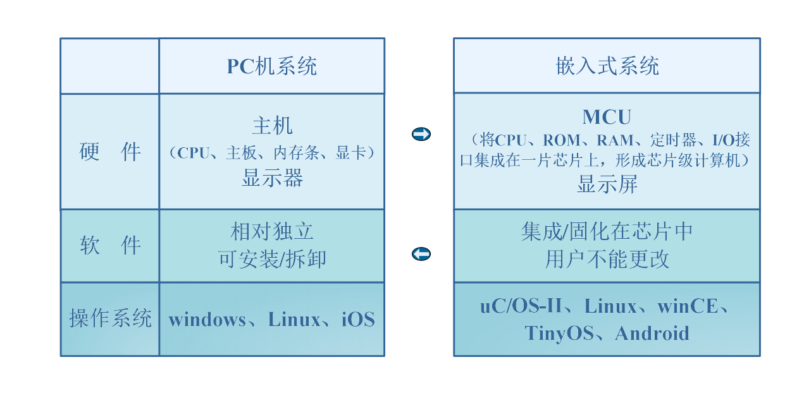
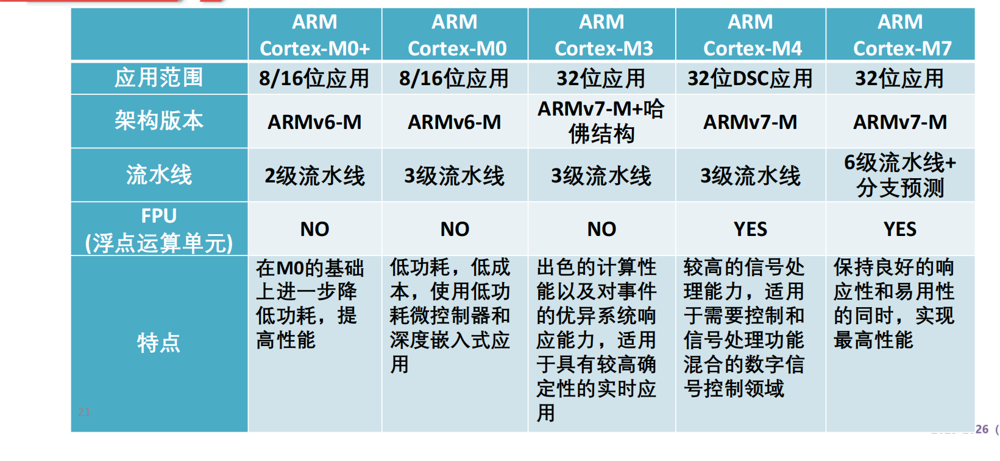
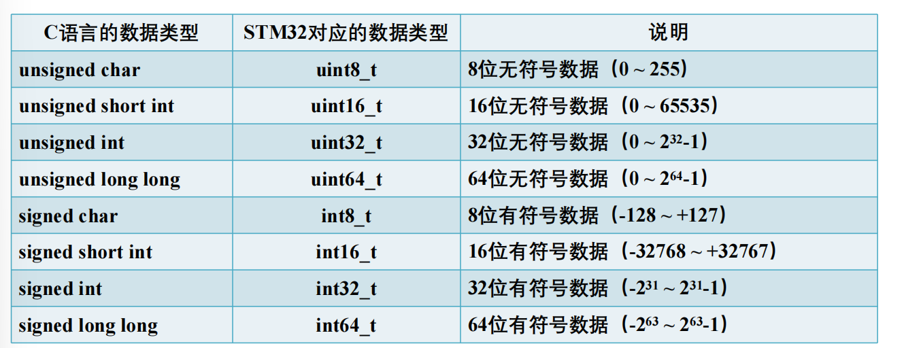
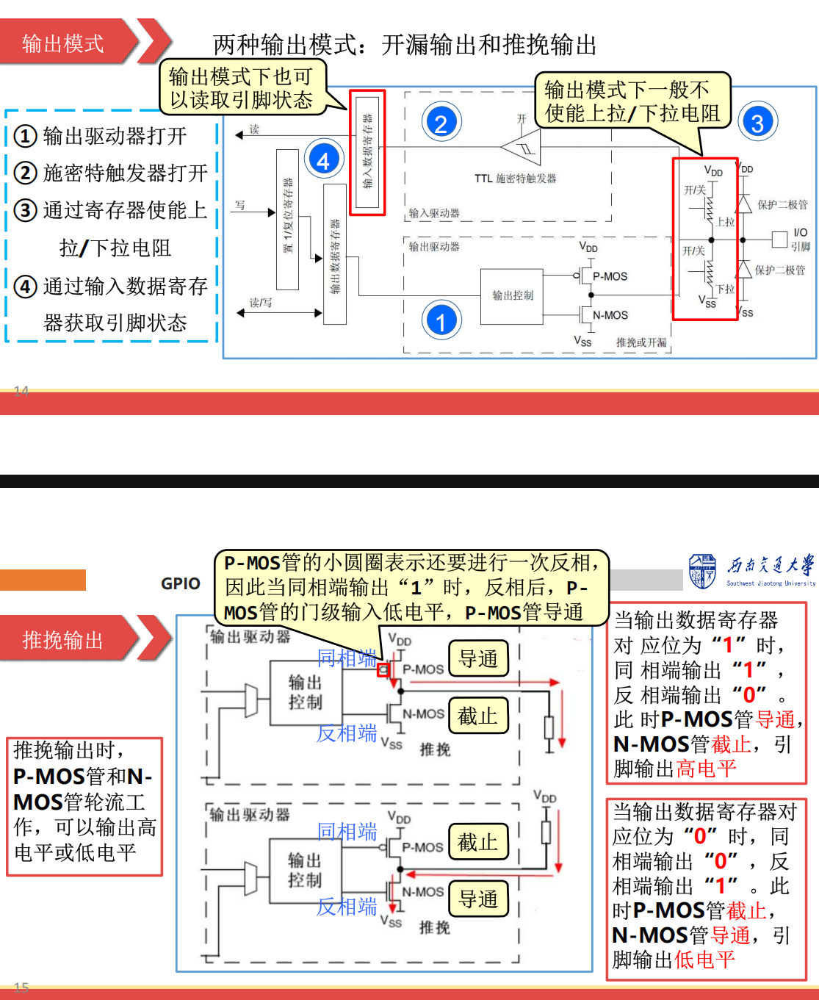
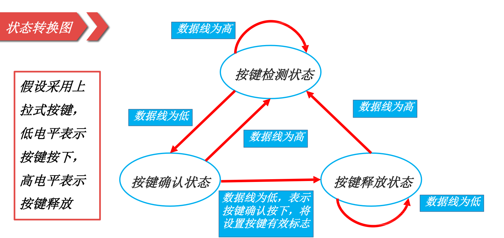

# 第一章 嵌入式系统概要

## 1.1 嵌入式系统的定义和特点

- 嵌入式系统的定义：**控制监视的装置**（国外）、**专用计算机系统**（国内）
- 嵌入式系统的三大特点：**嵌入性、专用性、计算机系统**
- 嵌入式系统与PC机的区别（**硬件集成度、软件灵活度、操作系统**)：

## 1.2 嵌入式系统硬件

- 嵌入式系统的硬件组成：**CPU、存储器和中断系统**
- MCU（单片机/微控制器）：由CPU、存储器、片内外设、中断系统组成（**可以理解为就是一个主机**）
- MPU（微处理器）：只是增强版的CPU，需要接上外围电路才构成嵌入式系统。（**主要用于智能手机**）
- DSP：数字信号处理芯片（有专门的乘法器、数据程序分离的哈佛架构）
- Soc：可编程的用户定制的Soc（FPGA）
- ARM处理器（**只设计芯片**）：
  1. 内核架构：Cotex-A/-R/-M（高端、实时【无线通信】、嵌入式【9种】）
  2. 外围电路：环境感知类、交互类、I/O接口类、存储类
## 1.3 嵌入式系统软件
- 软件架构：**应用程序-操作系统-硬件抽象层（HAL库）-硬件驱动-硬件电路**
- HAL库的意义：**移植简单和屏蔽硬件多样性**
- 两种编程模式：**前后台编程和操作系统**
- 两种程序开发方式：寄存器开发（**难上手**）和固件库开发（**代码冗余运行速度受影响**）
---
# 第二章 嵌入式基础知识


- 冯诺依曼结构和哈佛架构：
  1. 冯诺依曼架构指令和数据存储在同一个存储器中，**故不能同时取指令取数据**
  2. 哈佛架构为双总线独立编址
- CISC复杂指令集计算机：**指令大多需要多个时钟周期完成，指令字长不同**
- ⭐流水线结构：取指（从存储器）-译码-执行（**时间和吞吐量的计算**）
- ARM存储模式：小端（低字节放低地址）和大端模式
---
# 第三章 嵌入式C语言


- *volatile*关键字：**避免编译器优化**（每次取或修改变量值，都得重新从内存中操作）
- 条件编译：
```
#ifdef
#elif
#endif
```
- const关键字：在编译阶段，**有类型检查占内存**（区别于#define）
---

# 第六章 GPIO

>💡GPIO电路结构包括：输入输出驱动器（PMOS/NMOS）、施密特触发器（**转换电平为0/1信号**）、上下拉电阻、端口寄存器组、引脚电路（保护二极管：**防止异常电压（5V容限）损坏芯片**）
## 6.1 GPIO的工作模式
- 输入模式：（浮空、上拉、下拉）
- 输出模式：推挽输出、开漏输出
> 💡推挽输出受到同相反相（PMOS/NMOS）控制，能输出高低电平，可以实现负载控制、SPI；**而开漏输出只受NMOS控制，只能输出低电平（若需要高电平则要接上拉电阻->上拉电阻可以调节输出电压->改变电平功能）（如I2C的SDA和SCL）**
- 模拟模式：低功耗和片内模拟外设的复用
- 复用模式：推挽复用和开漏复用

## 6.2 GPIO寄存器
- 配置寄存器：
  1. 模式寄存器（GPIOx_MODER）：**每两位控制一个引脚**（00输入/01输出/**10复用/11模拟**）
  2. 输出类型寄存器（GPIOx_OTYPER）：**16-31保留**（0推挽/1开漏）
  3. 输出速度寄存器（GPIOx_OSPEED）：00低速/01中速/10高速/11超高速
  4. 上拉下拉寄存器（GPIOx_PUPDR）：00复位（无上拉下来）/01上拉/10下拉/11保留
- 数据寄存器：
  1. 输入数据寄存器（GPIOx_IDR）：0低电平/1高电平
  2. 输出数据寄存器（GPIOx_ODR）：0低电平/1高电平
  3. ⭐置位/复位寄存器（GPIOx_BSRR）：**高十六位控制低电平（1->0）；第十六位控制高电平（1->1）。输入0无效！**
  >设置多个引脚时使用BSRR。BSRR和ODR的区别在于**不会被中断打断**。
- ⭐寄存器编程实例——控制LED灯闪烁
```
GPIOA_MODER & = ~(3<<(5*2)); //设置模式寄存器bit11和bit10为00，进行清空操作
GPIOA_MODER | = 1<<(5*2); //设置为输出模式
while(1)
{
  GPIO_ODR | = 1<<5; //PA5高电平，LED亮
  delay = 100000;
  while(delay--); //延时
  GPIOA_ODR & = ~(1<<5); //LED灭
  delay = 100000;
  while(delay--); //延时
} 
```
## 6.3 基于HAL库的GPIO编程

- 基于HAL库的GPIO编程思路（**四步走**）：**使能时钟->设置参数（GPIO_InitTypeDef结构体）->配置引脚（HAL_GPIO_Init()）->控制引脚**
- ⭐驱动指示灯
- ⭐按键检测消抖
- ⭐⭐状态机按键检测
  状态机四要素：**现态、条件、动作、次态**


---
# 第七章 中断

## 7.1 中断的概念
- 处理器与外设的数据传输方式：
  1. 无条件传输
  2. 中断方式
  3. 查询方式
  4. DMA方式（直接存储器访问）
- 中断的过程：中断发生/请求->中断响应/处理->中断返回
- 中断的作用： **速度匹配、分时操作、实时响应、可靠性高**
- 中断优先级（抢占优先级和子优先级）和中断嵌套
- 外部中断线（EXIT）：管理外设中所出现的中断
- 中断服务程序ISR（**自动生成**）和中断回调函数（**用户编写**）
- 中断向量（**中断向量的入口地址**）和中断向量表
## 7.2 基于HAL库的中断编程
- ⭐中断方式读取按键
- ⭐中断方式改变指示灯闪烁频率

---
# 第八章 定时器
- 定时器/计数器的功能：**定时/计数、PWM输出、输入捕获**
- STM32中的定时器：1个32位高级定时器（TIM0）、2个32位通用寄存器（TIM2和TIM5）、5个16位通用寄存器
- STM32中的三个重要参数（**时基单元的三大组成**）：**自动重载ARR、预分频PSC、计数寄存器**
$$定时时间T = \frac{(ARR+1)(PSC+1)}{TIM\_CLK}$$
$$计数时间T=\frac{1}{时钟频率}$$
- ⭐基于HAL库的定时器编程：定时闪烁指示灯、测量外部脉冲个数、电子时钟
- ⭐⭐⭐PWM输出功能（呼吸灯）和输入捕获功能（信号测量）
---
# 第九章 串口通信

- 同步串口：SPI和I2C（一主多从）
>⭐SPI有**SDI、SDO、SCK、CS**四条数据线，全双工工作；I2C只有SCL和SDA两条数据线。
- 异步串口：UART（帧格式、波特率、接收采样和错误校验）
- 串口收发单元：（4个寄存器：发送TDR/接收RDR数据寄存器（**双缓冲结构**）、发送TX/接收RX移位寄存器+3个标志位：TXE（**TDR空**）、TC（TX空）、RXNE（RDR不空））。
- ⭐基于轮询的串口通信编程（printf重定向）
- ⭐基于中断的串口通信编程
- ⭐基于DMA的串口通信编程
---
# 第十章 ADC
- ADC的主要技术参数：分辨率、转换时间/速率、转换误差
>转换时间/速率与AD转换器有关：双积分型->逐次比较型->并行比较型（**精度从低到高，速度从慢到快，成本从低到高**）
- STM32中的ADC：（**采用3个逐次逼近型ADC，输出为12位二进制，采用左右对齐存储在16位寄存器中）**
  1. 19个通道（16个模拟输入，2个内部信号源，1个内部温度传感器）
  2. ⭐ADC模拟量输入量的计算
  3. ADC的工作流程：信号输入->硬件/软件触发->AD转换（采样量化编码）->数据保存（**产生一个转换完成的中断）**
  4. ADC通道选择（组转换模式）：规则通道组和注入组
  5. ADC的转换模式：单次模式/连续模式/扫描模式/间断模式
  6. ADC的采样时间

# 第十一章 嵌入式操作系统

- 任务：**独立性**（不能同时调用）、**并行性**（每个任务一个虚拟CPU）
- 内核（**执行任务的调度**）：抢占式调度（不同级）、时间片调度（同级）
- 事件（**快速驱动的操作**）：信息量、标志组、消息队列
- 任务状态：**运行态、就绪态、阻塞（被动）/挂起（主动）态、终止态**
- 任务组成：任务函数、任务栈、任务控制块
- 任务优先级：**编号越大优先级越高！**
