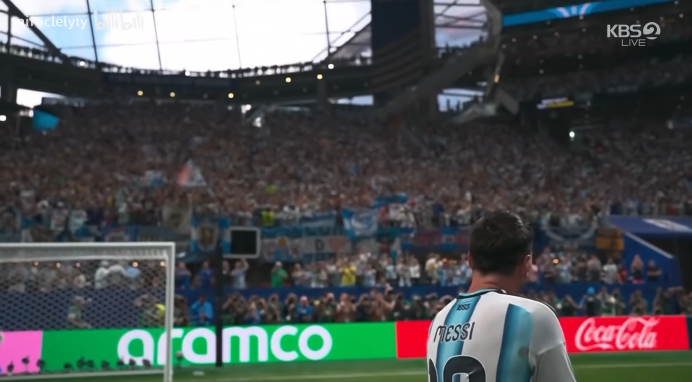

仍然记得去年暑假的这一天我写下了**戒-病**的反思的时候自己颓废不堪的模样，过去了整整一年，变化呢？成长呢？

虽说不会全有或全无的放弃，但依旧今天会在练腿后疲惫不堪时选择**逃避与放弃**。

但，逃避和厌恶现实永远不会让你获得自由，只有直面未知、惨淡的人生却依旧能爬起并回到正轨所产生的力量才是真正的自由。

**习惯性自律是自由**。

你问我想成为自己喜欢的样子而付出的一切非如此不可吗？我的回答是：**对，非如此不可。**

