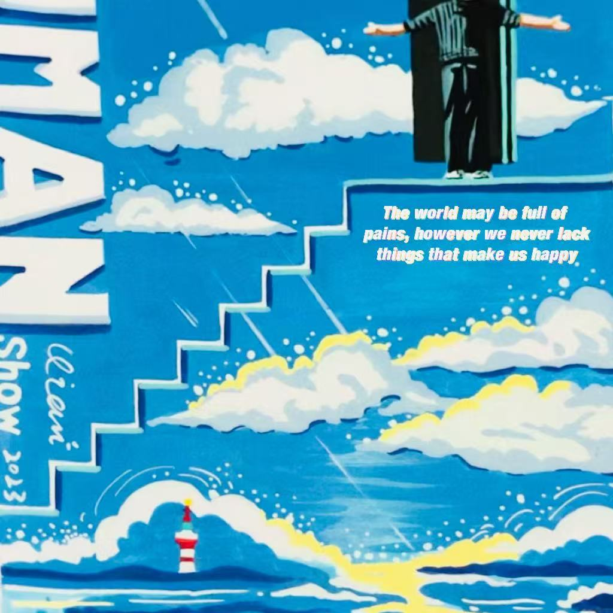
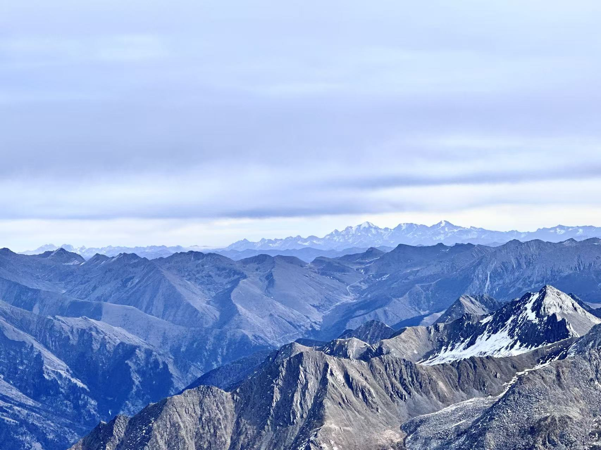

🛌昨天下午考完通原后，所谓的“心态崩溃”，让我低效复习"停摆"了一天。

又一次，寻找着逃避现实去苟活的方式：熬夜、吃炸鸡、藏在虚拟世界中无法脱身，在宿舍的一隅罪恶之地中苟延残喘，闻到的只有沉沉的死气......

多么似曾相识与荒诞啊，上学期的期末周也曾经历过这样的起伏，怎么了，又重蹈覆辙？但我真的疲了，反反复复。

可自己在前天之前还是个热爱生活热爱运动热爱学习、更深深爱自己的人啊，怎么又一次这么轻易的被击倒了呢？

我一直对自己充满自信，我也永远相信我是个有着坚定身份信念、崇高理想和钢铁般意志的人。

回顾这学期，我爱上了健身跑步和其它所有运动，我喜欢每次在高压工作后通过力量训练虐自己身体的内啡肽分泌和不断挑战自我的喜悦，我喜欢清晨同城市、校园一起复苏，环绕学校跑步的主宰的感觉。我会尽可能抽出清晨的一切可能利用的时间去健身房、去跑步，哪怕在期末周、哪怕只有45分钟。因为我深深体会到了益处，它让我更加自信、精力更加充沛、学习更高效、心情更快乐、身体更健康......当然，运动给我最深刻的是让我学会活在当下：力训中的每一次离心向心的反复、跑步中每一次左脚迈完迈右脚...点点滴滴汇聚在当下的每一刻，完全不会想到过去和未来。

当然，我更爱上了学习与阅读。知识的汲取、头脑风暴与运动一样都能让我学会沉浸在当下的每一刻，一行文字、一个定理，总能让我掌握打破时空的能力，与历史长流中的先哲的智慧交织、碰撞、对话。我也在学期末尾时及时反思调整自己的学习方式：**思考、高效才是学习的第一要义** 。不断地Active Recall，建立起属于自己的知识体系和思维链，融会贯通，抓住本质。或许命运安排与馈赠，这学期，在合适的年龄无意间拾起的两本书却成了自己成为一名真正读者的敲门砖：**《局外人》《悉达多》**。多少次，脑海中浮现出自己是默尔索，在判决死刑前的前夜，坐在监狱的窗口，折射月光在面庞，耳边只是属于夜晚的簌簌声，开始真正的觉醒，爱着自己所拥有的一切，哪怕是现在也敢于直面惨淡的人生；自己是悉达多，令人作呕的沉沦于世俗欲望的自己也是走到河边欲结束生命的自己，只是听到内心深处的那个”唵“，理解了世间的一切皆为圆满与美好...当然，还有那个我没有读懂的拉斯克尔尼科夫....

**学习和运动永远都是唯一努力与回报成正比的两件事，是唯一能获得心流体验的两件事，我永远相信**。

由于运动健身和学习的积极影响，我也爱上了早睡早起、干净饮食等良好的习惯。也慢慢开始注意自己的形象：护肤、坐姿站姿...当然回看到之前给一位健身网友的求教，也对目前的饮食有了一定反思，**”无论增肌还是减脂，只要吃的足够干净都没有问题。运动量大就多吃一点，少就少吃一点。”** 真的是朴素而又言简意赅，我后面也会好好的更加严格与注重碳、蛋、脂和膳食纤维等营养。

我这学期在心态和情绪上也开始刻意练习，不在关注外界一切的看法与评价，不在关注这个不可控且荒谬的世界且受其困扰了；我开始学会冥想，只关注自己，体验每一次呼吸和身体变化；我也不会有任何对完美的执念和对万事万物的期待，抛弃让人恐惧而焦虑衰老的时间，抛弃对未来的幻想和对过去的遗憾，只是做好当下可控的事情并做到极致，因为我有我的要求和底线，**瞬即即永恒**。我也没了对于世界的戾气，只是留下宽容、理解和善良，只为了追求自己内心的快乐与平和。

**没有审视的人生不值得一提。只有这样好好的爱自己、爱学习、爱运动、爱学习，才能逐渐构建起悉达多所谓心中安静的一隅：人生如恒星恒定的轨迹而非如落叶坠落。**

而每次的逃避呢？是虚拟世界重复无底线刺激着你的情绪点和底层的欲望、人性。它如同毒药和酒精一般，让你的心智中毒成瘾、身体中毒，让你一次次的多巴胺分泌跌入谷底难以爬起，以至于越来越感受不到快乐。我不理解为什么本知有毒却还一次次去尝：**是本性和猎奇作祟**。但这些都不是你爱自己的表现，更不是优秀的人的自控力的表现。李诞的播客讲述了杀死一只羊的故事和李娟的《阿勒泰的角落》让我再次清醒：**从来没有诗和远方，打卡只是酷刑。网络是肮脏的、虚伪的的化粪池。而我们真正要做到的只是抓住当下，注重生命的体验。**

没有网络的生活该多美好，不在知道什么实时热梗与节日，只是用身体的一切感官与心灵去发现：银杏叶落与成都的天空...多么美好啊。让我想到悉达多认为作为苦行僧让自己克制欲望受苦与农夫去酒馆寻求短时刺激麻痹别无二样，悉达多终其一生追求法义却错失了身边沿途太多的风景，**真正重要的是如倾听永恒之河一样，找到属于自己内心却无法言传的智慧与法义**。

无所谓啦！随它去吧！管它呢！过去就过去吧！没关系啦！我还是那个不断成为我喜欢样子的努力的我！很喜欢陶渊明的《归去来兮辞》中的“悟已往之不谏，知来者之可追”和苏轼《定风波》中的“竹杖芒鞋轻胜马，谁怕？一蓑烟雨任平生”。周一开始剩下三门的考试，我相信自己一定可以，如果连自己都控制不了，如何控制不定未知的外界？

**山高万仞，只登一步**。

人生如登山，不再关注社会划定的不断移动的终点线，只关注脚下的每一步，时刻警醒，严于律己，习惯性自律是自由。

🏔️以上是大三上学期的总结和反思，也是一次期末周中途出现问题后的自我和解与调整吧，不要再酒精中毒了，连攀登的机会都没有。

