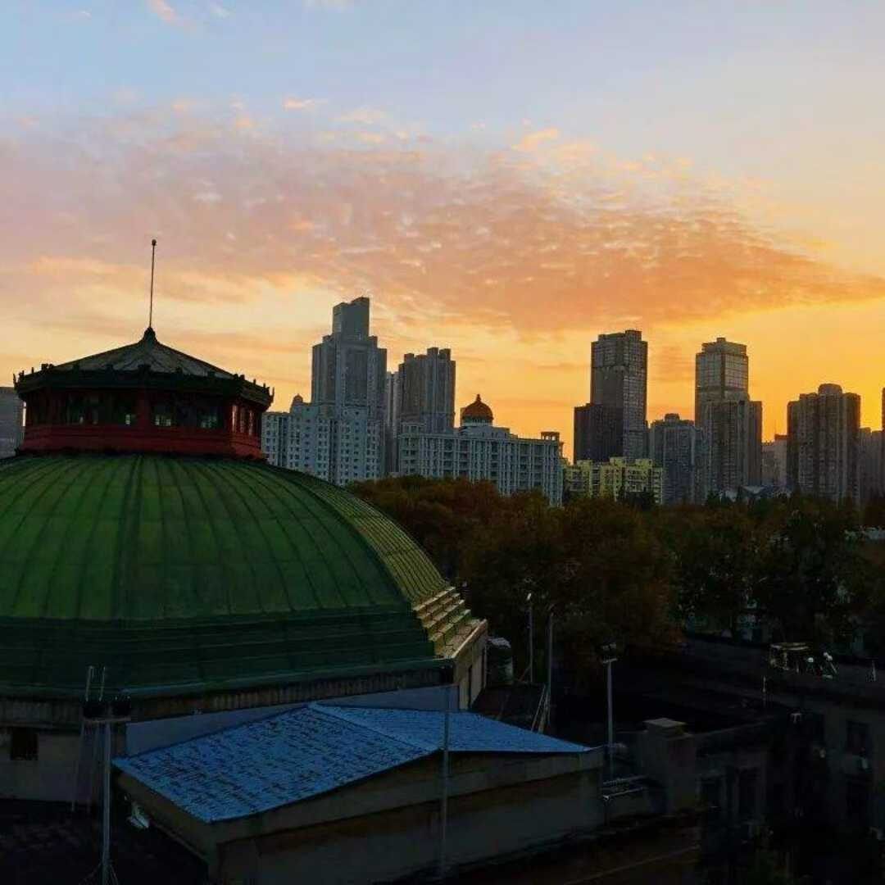
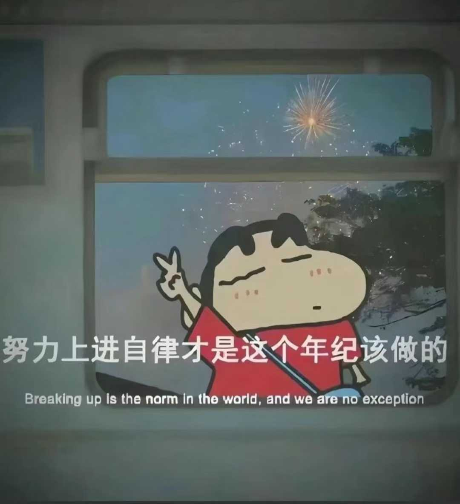

上周期末考完后调整休息了几天，昨天看完了《谁动了你的奶酪？》后对自己的整个目前阶段的心得做了一个体系化结构化的总结，顿时感觉通透舒坦了许多，亦想记录下来，继续出发🏃‍➡️

>**没有谁动了你的奶酪，只是奶酪本身就有保质期。**

《谁动了你的奶酪？》的核心观点就是：**在面对不可控的变化的外界，自己能做的只是时刻警醒准备着，随着变化而变化，享受变化。** 人生不是通途而是迷宫，再完美的计划也会失效。我们是人，不能像小老鼠嗅嗅、匆匆一样凭借直觉乐此不疲地在迷宫中穿梭。但我们可以像小矮人唧唧一样努力摒弃复杂的情感，只要勇敢踏出舒适区，怀着美好的想象，最终定会重新觅得另一块奶酪。**虽然过程会很辛苦，虽然时不时还会产生恐惧、想放弃的念头，但是只要不断汲取教训不断调整，一切都会越来越好的。因为你在主宰你的生活，而不是像哼哼一样消极等待、浑浑噩噩、患得患失、浪费生命**。

其实这个思想早已在千年前的苏东坡、陶渊明的智慧中出现了呀！不得不佩服中国古人的智慧。

>三月七日，沙湖道中遇雨。雨具先去，同行皆狼狈，余独不觉，已而遂晴，故作此词。
>莫听穿林打叶声，何妨吟啸且徐行。
>竹杖芒鞋轻胜马，谁怕？一蓑烟雨任平生。
>料峭春风吹酒醒，微冷，山头斜照却相迎。
>回首向来萧瑟处，归去，也无风雨也无晴。

>悟已往之不谏，知来者之可追。实迷途其未远，觉今是而昨非。
>已矣乎！寓形宇内复几时，曷不委心任自由。胡为乎遑遑欲何之？

《谁动了你的奶酪？》搭建好了这一阶段的心得体系最后一块砖，让我不断审视剖析自我：适合自己的高能量生活究竟是什么样的？采取什么方法才能让自己向成为自己喜欢的样子上越来越近？

# 1. 信念

**自律源于习惯，习惯源于行动，行动源于信念**。

信念是自己最不能或缺的一部分，只要信念有所模糊或者动摇，人的本性就会暴露，自己就会无所事事和松懈懒惰等种种恶习，直到生命消逝。

## 无穷的欲望

这里的欲望绝对不是沉沦世俗当中的物欲、两性关系之中的情欲、真假难辨的网瘾......而是自己所发出的对自己想成为的样子的无穷欲望与理想。我无时无刻不在想着自己能有强壮极美的身材、挺拔帅气的外表、对社会有贡献的学识......这些欲望和理想都是属于自己的信念，想要坚定，就必须将这些欲望和理想拆解为当下的每一个小目标、小check中，**否则会如同在登山时眺望山峰时一样眼花缭乱**。（这是经过多次的假期/开学伊始的松懈教训所总结的）

## 坚定的身份信念

从《原子习惯》中习得，坚定的身份信念对自己很有益处。当自己从以结果为导向转为以过程为导向后，你做的每一件事倘若赋予了身份信念（如自己是个勇敢的人，自己是个能吃苦的人...），你将不再会轻言放弃。其不仅仅是自我激励的作用，更是一个不断向内认识自我、找到自我的过程，永无止境。

## 钢铁般的意志力

当你相信自己具有钢铁般的意志力时，你便不会再退缩或者将你的人生受限，你只会享受吃苦苦尽甘来的感觉。

## 榜样的力量

彭于晏、箱根驿传、蔡老师、陆老师......每个偶像都形成光点刻画在脑海里面，永远在提醒自己：世上有那么多美好值得奔赴，哪怕粉身碎骨。
# 2. 爱

## 爱自己

我会深深地爱自己，我就不会吃垃圾食品、浪费生命于虚拟世界、熬夜、焦虑迷茫......我只会做着爱自己的方式：早睡早起、冥想、摆脱时间束缚、运动健身、护肤、学习、探索新爱好......

## 爱他人

对他人的宽恕、理解和善良，实际上也是让自己平和开心的方式。从来都不会关注他人，永远走好自己的路。每个人都是一个独立的个体，每个人都是不完美的，而在意他人的看法实则是对自己的侮辱。
## 爱世界

面对不可控、荒谬的世界，你只要爱与拥抱他。随着变化而变化，享受变化。

# 3. 专注

## 专注于自己

专注于自己，时刻警醒，严于律己。

## 专注于当下

没有过去，没有未来，一切都是本质与当下，做好当下自己能做的，把每件事请认真对待，做到极致，这是自己的要求和底线。
## 专注于微小

永远都不要急于求成和浮躁。把当下每一步走好，管它结果如何呢？是好是坏，我都选择接受。请相信，每一步都作数。微习惯的复利性及收益是最珍贵的。
# 4. 至简的系统

习惯是人大脑自动化的行为，每到一个新的环境，你都要设计出简单易坚持的习惯体系。请记住，你是你人生的建筑师。而现在，冥想、戒欲、早睡早起、健康饮食、形象、思考、运动健身、阅读、英语早已成为我习惯体系中不可或缺并且认为十分有用的部分。
# 5. 思考
## 思维体系

在这学期的末尾，我才摸索出真正高效的学习方式。相较于以往重复性无效学习，我抓住了思维链/体系。无论是active recall、联想、抽象简化、多问为什么...这些的本质都是在于深入的思考。
## 向内审视

每天的向内审视，实际上就是在提升自己，更是让自己更加清醒的活着。

>通过《谁动了我的奶酪？》并经历这次体系化总结之后，希望自己能在面对生活时能更加顺心应手。

