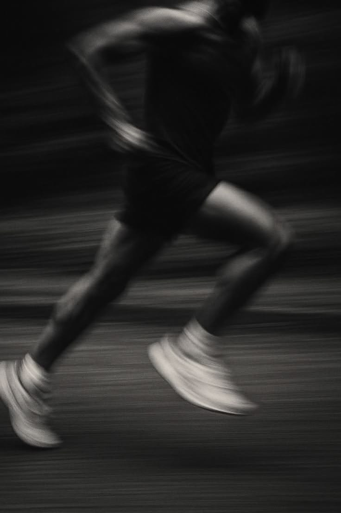

**Be An Actor —— Fighting & Experiencing**

2026年的国庆假期结束了，这个国庆假期回去是值得的，让我再次真正亲历了不同的事情，也有了很多反思和感想（回想起自己回来前的后悔和委屈，现在想想实际上还是不信任自己，畏惧变化环境而不认为自己能够处理好）。

首先谈**物质欲望**，当淘宝、得物等购物平台和小红书、短视频等社媒充斥着大量广告营销、夸张宣传和网红流量甚嚣尘上而自己却陷入其中而不自知，浪费自己宝贵的时间去“货比三家”，看刷单引流的评论和刺激博眼球的产品图……当你看累了才后知后觉：自己早已掉入了消费陷阱中去。大量网红化的产品外强中干，好看的外表下隐藏的是转瞬即逝的购买冲动、粗糙黑暗的产业链和差劲的耐用性、持久性。无论是网红食品、健身补剂（维生素、即食鸡胸肉、米糊…）、服装穿搭均是如此，几乎所有的宣传标语都透露着浮躁、夸大扭曲和急于求成的本质。穿几次不喜欢、用几次不喜欢、吃几次不喜欢，就扔、扔、扔……实际上最终会造成更大的浪费与不环保。扔完之后却发现手中真正必要所需的东西却没有得到满足。

这是过去几年的自己，受社媒的营销影响并且浮躁跟风，没有并且不相信自己的主观判断，逐渐与勤俭节约、节俭长期主义的生活方式背道而驰。今天健身年卡和蛋白粉花了1000元，但我毫不犹豫，因为这才是真正我需要的并长期坚持使用的东西，安心而舒适。可能这个月的钱无法买新的运动衣服了，但我觉得能够通过挑选健身背心的过程反思自己也很开心了。这样下次再次进入购物网站、社媒或者是身边人是，我可以清醒地知道自己真正需要的东西究竟是什么（哪怕再贵，好用并且能长期使用也值得的），而不是再让冲动操控你的大脑。

---

第二个我想谈的是**与这个世界和解**，当别人说你“自私”“高傲”“叛逆”，你却依旧认为自己的观念没有问题并强行灌输给他人，现在想想是幼稚的与毫无意义的。我之前厌烦父亲剔牙、吃饭吧唧嘴的坏习惯；自认为父亲除了出车装货就浪费时间于短视频的生活是浪费生命的、可怜的、不求上进不思进取的（甚至产生出“这种人活着有什么意义的”罪恶想法）；嫌弃父母的关心，认为他们越界；瞧不起很多人，认为他们说话和行为奇葩、世俗和平庸（比如昨晚在柠檬鱼吃饭隔壁自带涮菜的那桌）；当和他人谈话时总是说出些自以为很厉害、很高尚的特立独行的极端言语（和我有什么关系、没有意义、垃圾、结婚生小孩、人能活多久、三观）却从来不考虑别人的感受和看法……现在看来无疑都是很low 的自恃清高、独善其身的理想化丑行。

帕特诺普学会观察世间的一切，包容一切的善与恶、美与丑；默尔索在临刑前的最后一刻才接受了世界的荒诞，希望受刑时听到人们仇恨的呐喊；而我的状态则是心灵捕手中的威尔刚开始的一样：逃避躲藏，自认为通过用读过的书的理论加上主观看法就能对他人品头论足、伪装清高，这是很低级的、叛逆不成熟的。真正要做到的只是去体验、理解和包容人间的世俗与迷雾重重，他人的生活由不得你来决定和评判，生活的选择没有绝对的对与错，在波诡云谲的世间坚守好自己的选择足矣。多一些耐心与温柔，少一些戾气与抱怨。好好爱与关心自己和家人，珍惜每一段时光。

---

最后我想反思的是**边界和身份信念**。这个国庆假期前五天实事求是地说我要认可我自己：即使环境变化我有勇气和决心做出调整与改变系统，饮食、运动、学习……专注当下并做好可控该做的事。这相较于以往的假期有很大提升。但最后两天仅仅因为一场梅德韦杰夫和德约科维奇的晚间中网比赛就轻而易举地再次打破了我的边界系统，而且自己也没有能够及时远离诱惑和干扰并回归正轨，这种“不是我”的状态持续了一天多。这次没有情绪、身体的影响但依旧越界只能说明自己的身份信念还是不够坚定、克服外界阻力的平静调整能力还差很多。

~~“好累，多睡一会没事吧，反正也没事”、“多看一会手机没事的，晚几十分钟学也没关系”、“今天感觉身体没恢复好而且时间比较紧，今天的训练就不去吧”、“突然来了欲望，来一次没关系吧”、“周围人都在这样做，我还是做一下吧”、“不行这实在看着太好吃了，忍不住了”…… ~~这一切借口与推辞都是身份信念不清晰的体现。在这场短期极度快乐长期代价和短期痛苦长期真正欢愉的抉择中，我会毫无疑问的选择后者。为了改善这个状况，我会开始激励仪式的习惯（做每件事情前后排除一切干扰，深呼吸喝水让自己安静想来警醒自己的身份信念：即我是谁，我想成为谁，我当下在做什么……），更重要的是，当我遇到累了想多睡一会、情绪低落不想训练、暴饮暴食看社交媒体的冲动时，与其受外界noise牵着鼻子走，我必须要主动出击：*放下手中所有事情，远离这个noisy 环境，可以闭上眼深呼吸也可以出去散散心，只是为了反复提醒自己并察觉当前遇到的困难，告诉自己相信自己：我是个……的人，人不能为理念而活，我只知道我这个真理紧紧攥在手中，我永远相信自己有能力掌控自己把当下可控的事情做到极致努力…… 战胜杂念的过程何不是一场自我提升的修行？*

加缪说过演员是反抗荒诞世界的典型，像丹尼尔-戴-刘易斯等演员体验钢琴家、减重增肌增肥、运动员等等短暂角色的一生在荒诞中穿行、反抗、消失与重生。身份信念何不是意味着我们成为了我们自己生命剧本的演员？Be an actor，在注定的剧本中活出独属于我的每一个精彩的角色：Math  algorithm scientist 、High efficiency researcher & reader、life experiencer 、Romantic gentleman or Hybrid training athlete ……每一个角色或短暂或漫长，或灿烂或崎岖，anyway，this is my life ,  just try my best to enjoy , to experience , be my own actor。

---

人生苦短，从出生之日起就被判死刑，我要努力活着去反抗而非逆来顺受。PASSION。