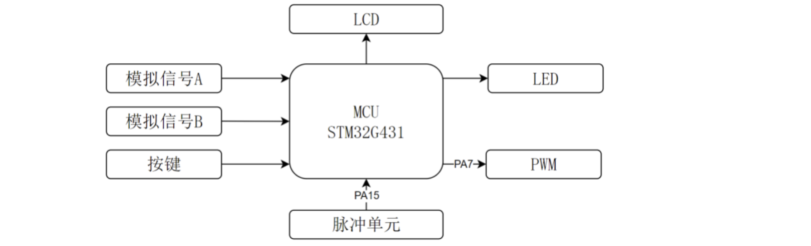
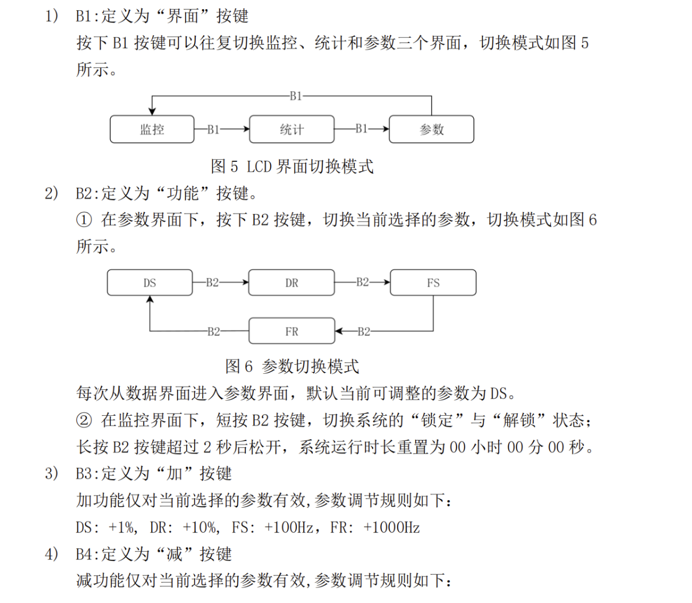
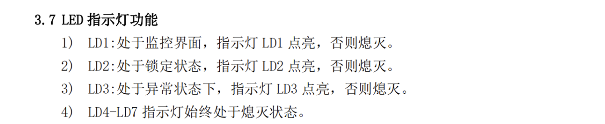

# ⭐工程思维/比赛思路

受到B站up主的启发，其做嵌入式题的思路体现了工程思维，兼具高效性和准确性。
- **另辟工作区**：创建工程时另外创建一个文件夹**Code和fun.c**用于存放自己编写的代码和比赛官方给的板子。
- **总头文件**：创建**bsp_system.h**总头文件（包含各种子头文件），好处在于main.c中最终只需调用这个总头文件即可，清晰便捷。
- **函数分区**：**main.c**中只写配置函数和调用main_proc的总函数（写在fun.c中），其它的局部函数、辅助函数（如data_proc用于所有数值计算）都隐藏在fun.c中，这样的函数分区使得工程封装很好

# ⭐比赛注意事项/小技巧

- **工程配置**：注意创建project的**物理路径和逻辑路径**、将头文件加入C/C++的**编译路径**
- **CUBEMX配置：** 系统时钟选择外部晶振、输入频率为24MHz、优先配置Led引脚**PC8~PC15**和PD2、四个按键引脚**PB0~PB2和PA0**

# ⭐比赛常见模块



>💡 16届省赛主要考察了**模拟信号的读取、定时器输入捕获、定时器PWM输出、定时器实现时钟、LED/LCD显示、按键长短按操作**等。

## 1. 头文件和主函数设置

### fun.h
```c
//fun.h
#ifndef __FUN_H__
#define __FUN_H__

#include "bsp_system.h"
void main_pros(void);

#endif
```
### bsp_system.h
```c
#ifndef __SYSTEM_H__
#define __SYSTEM_H__

#include "stm32g4xx.h"                 
#include "stdio.h"  //标准输入输出
#include "string.h" //字符串
#include "stdint.h" 

#include "main.h"
#include "gpio.h"

#include "fun.h"
#include "lcd.h"
#include "adc.h"
#include "tim.h"
#include "math.h"
#include "stdlib.h"

#endif
```
### main.c

```c
/* Private includes ----------------------------------------------------------*/
/* USER CODE BEGIN Includes */
#include "bsp_system.h"
/* USER CODE END Includes */
/* USER CODE BEGIN SysInit */
LCD_Init();
LCD_Clear(Black);
LCD_SetTextColor(White);
LCD_SetBackColor(Black);
/* USER CODE END SysInit */

/* USER CODE BEGIN 2 */
HAL_ADCEx_Calibration_Start(&hadc2, ADC_SINGLE_ENDED);
HAL_ADCEx_Calibration_Start(&hadc1, ADC_SINGLE_ENDED); //ADC
HAL_TIM_PWM_Start(&htim17, TIM_CHANNEL_1);
TIM17->CCR1=50;
HAL_TIM_IC_Start_IT(&htim2, TIM_CHANNEL_1); //输入捕获
HAL_TIM_PWM_Start(&htim17, TIM_CHANNEL_1); //PWM
HAL_TIM_Base_Start_IT(&htim3); //定时器
/* USER CODE END 2 */

/* USER CODE BEGIN WHILE */
  while (1)
  {
	    main_pros();
    /* USER CODE END WHILE */

    /* USER CODE BEGIN 3 */
  }
```
## 2. LCD显示

LCD显示直接借助比赛官方给的板子并移植到自己的工程中去（~~如果自己手搓难度很大~~）

>💡本题要求LCD刷新时间为**0.1s**并且呈现出背景黑色字体白色的**三个界面**：监控、异常和参数界面。

```c
char text[20];
uint32_t lcd_dece;

void lcd_show(void)
{
	if(uwTick - lcd_dece < 99) return; //利用滴答定时器的更新
	lcd_dece = uwTick;
	uint16_t temp = GPIOC -> ODR;
	
	sprintf(text, "       PWM          ");
	LCD_DisplayStringLine(Line1, (uint8_t *)text);
	
	GPIOC -> ODR = temp;
}
```
⭐~~不要再犯显示格式的错误了~~：
- 显示时候要以所有界面最大行数为准，倘若某界面小于需要用**空行**来覆盖
- 每行注意从**第几列**开始并且总字符数为**20**

## 3. 按键操作



>💡按键在考察**长短按**的同时，还考察了按键的**响应时间<0.2s**且需要做**防抖动处理**。

```c

void key_scan(void)
{
	
	B1_data = HAL_GPIO_ReadPin(GPIOB, GPIO_PIN_0); 
	B2_data = HAL_GPIO_ReadPin(GPIOB, GPIO_PIN_1); 
	B3_data = HAL_GPIO_ReadPin(GPIOB, GPIO_PIN_2);
	B4_data = HAL_GPIO_ReadPin(GPIOA, GPIO_PIN_0);
	
	if(!B1_data&B1_last) // B1按下
	{
		if(lcd_mode == 1)//保存上一次的值
		{
			PARA_DFSR_last[0] = PARA_DFSR_past[0];
			PARA_DFSR_last[1] = PARA_DFSR_past[1];
			PARA_DFSR_last[2] = PARA_DFSR_past[2];
		}
		if(++lcd_mode >2) //B1短按切换2->0
		{
			lcd_mode=0;
			DFSR_index = 0;
		}
	}

	if(lcd_mode == 2)//参数界面
	{
		if(!B2_data&B2_last) // B2
	    {
		    if(++DFSR_index > 3) DFSR_index = 0;
	    }
		if(!B3_data&B3_last) // B3 +
		{
			PARA_DFSR[DFSR_index] += pow(10, DFSR_index);
		}
		if(!B4_data&B4_last) // B4 -
		{
			PARA_DFSR[DFSR_index] -= pow(10, DFSR_index);
		}
	}
	
	if(lcd_mode == 0)//监控界面（长短按）
	{
		if(!B2_data&B2_last)
		{
			time_2s = uwTick;
		}
		if(B2_data&!B2_last)
		{
			if(uwTick - time_2s >= 2000)
			{
				memset(time_clock, 0, 3);
			}
			else
			{
				ST_flag ^= 1;
			}
		}
		
		
	}
		
	
	B1_last = B1_data;
	B2_last = B2_data;
	B3_last = B3_data;
	B4_last = B4_data;
}
```
⭐在进行状态判断、计时、比较大小等操作时一定要记得**清除残留**！！
⭐针对于清除残留，长按为了避免与短按冲突和消抖，分为**按下、按中、停止**三个状态来写

```c
if(B3_data == 0 && B3_last == 1) // 按下 
{ 
    flag_long = 1; 
    cnt_1s = 0; 
} 
else if(B3_data == 0 && B3_last == 0) // 长按中 
{ 
    if(flag_long) cnt_1s++; 
    if(cnt_1s >= 1000) // 长按1秒 
    { 
        NDA=NDB=NHA=NHB=0; 
        flag_long = 0; 
        cnt_1s = 0; 
    } 
} 
else if(B3_data == 1 && B3_last == 0) // 松开 
    { 
        flag_long = 0; 
        cnt_1s = 0; 
    } 
} 
B3_last = B3_data;
```


## 4 . LED显示


```c
void led_show(uint8_t led, uint8_t mode)
{
	HAL_GPIO_WritePin(GPIOD, GPIO_PIN_2, GPIO_PIN_SET);
	
	if(mode)
		HAL_GPIO_WritePin(GPIOC, GPIO_PIN_8<<(led-1), GPIO_PIN_RESET);//mode不等于0为开
	else
		HAL_GPIO_WritePin(GPIOC, GPIO_PIN_8<<(led-1), GPIO_PIN_SET);
	
	HAL_GPIO_WritePin(GPIOD, GPIO_PIN_2, GPIO_PIN_RESET);
}
```
⭐LED显示时一定要注意把不需要的LED需要**设置关闭状态**
## 5. ADC

>💡ADC最主要的注意点是要在mian.c中调用配置函数后，在fun.c中要写adc_read函数。（不要忘了adc采集值的数据类型是**double**!!!!!）

```c
  HAL_ADCEx_Calibration_Start(&hadc2, ADC_SINGLE_ENDED);
  HAL_ADCEx_Calibration_Start(&hadc1, ADC_SINGLE_ENDED);

  double adc_read(ADC_HandleTypeDef *hadc)
{
	HAL_ADC_Start(hadc);
	uint16_t value_adc = HAL_ADC_GetValue(hadc);
	return 3.3*value_adc/4096;
}

```

## 6. 定时器输入捕获、输出PWM和时钟

>💡本题使用TIM2作为输入捕获、TIM17作为PWM输出、TIM3作为时钟。基本步骤为在main.c中调用配置函数，fun.c中编写回调函数（在CUBEMX中配置时要注意不要选择TIM7/8高级定时器）
>
>1. PWM模式下**预分频系数PSC为800-1，自动重载值ARR为100-1**（这样的好处在于STM32G431RBT6的主频为80MHz，分频下来为**1ms/1kHz**且**占空比的值**就为**计数器CCR**的值。
>2. 输入捕获模式下**预分频系数PSC为80-1，自动重载值ARR不用改**，这样频率$f=1000000/(TIM->CCR1 +1)$，周期$T = 1000000/f$（✨记得CNT清零）
>3. 计时器模式下**预分频系数PSC为800-1，自动重载值ARR为100-1**，这样计时单位为**1ms**（✨记得清零）

```c
void HAL_TIM_IC_CaptureCallback(TIM_HandleTypeDef *htim)
{
    if(htim -> Instance == TIM2)
	{
		fre_R40 = 1000000/(TIM2 -> CCR1+1);
		TIM2 -> CNT = 0;
	}
}

void HAL_TIM_PeriodElapsedCallback(TIM_HandleTypeDef *htim)
{
	    if(htim -> Instance == TIM3)
	{
		if(++time_clock[2]>59)
		{
			time_clock[2]=0;
			if(++time_clock[1]>59)
			{
				time_clock[1]=0;
				if(++time_clock[0]>999)
				{
					time_clock[0]=0;
					time_clock[1]=0;
					time_clock[2]=0;
				}
			}
		}
			
	}
}
```

## 7. EPROM
  
AT24C02 就是一种常用的 I2C 接口 EEPROM 芯片（电可擦除可编程只读存储器）。

AT24C02 的关键参数：
- 容量：**2Kbit = 256 字节**
- 地址范围：**0x00 ~ 0xFF**（一共 256 个地址）
- 通信接口：**I2C**
- 功能：存密码、存参数、存设置，掉电不丢

```C
eeprom_wirte(0x00, passwd_input[0]);//向0x00内存地址写入值
passwd_right[0] = eeprom_read(0x00);//从0x00内存读出存储值
```
>⭐工程配置上需要导入i2c_hal.c和i2c_hal.h。
>    这两个函数**需要自己实现**（在i2c_hal.c中编写、i2c_hal.h中声明），且pass_right数组需要在bsp_system头文件中**外部声明**

```C
//
void eeprom_wirte(uint8_t address, uint8_t data)
{
	I2CStart();
	I2CSendByte(0xa0);
	I2CWaitAck();
	
	I2CSendByte(address);
	I2CWaitAck();
	
	I2CSendByte(data);
	I2CWaitAck();
	
	I2CStop();
	HAL_Delay(10);
}

//
uint8_t  eeprom_read(uint8_t address)
{
	I2CStart();
	I2CSendByte(0xa0);
	I2CWaitAck();
	
	I2CSendByte(address);
	I2CWaitAck();
	I2CStop();
	
	I2CStart();
	I2CSendByte(0xa1);
	I2CWaitAck();
	
	uint8_t data = I2CReceiveByte();
	I2CSendNotAck();
	I2CStop();
	return data;
}

```

## 8. I2C串口

>⭐16届模拟题1找了很久的问题：为什么工程代码与满分工程一模一样，**但是就是页面跳转不了**（输入正确密码下），最后才发现是**CubeMX中I2C的SCL和SDA（PB6和PB7）引脚没有配置**🤣细节决定成败。


## 9. 滴答定时器

⭐在做16届模拟题1的时候，发现自己通过用**定时器TIM4**计时烧录之后出现黑屏死机（而满分工程中调用的**滴答定时器**却不会），后来发现**两个原因**：

- 用定时器模拟内部时钟CubeMX配置时优先级为15（最低）❌
- 定时器会影响系统运行的时序引起拥塞 ❌

故我们可以使用内部滴答定时器（不占用硬件资源且运行效率高）：
⭐**编写时要把系统原来定义好的同名函数注释掉，避免重复定义**

```C
void SysTick_Handler(void)
{
  /* USER CODE BEGIN SysTick_IRQn 0 */
	if(time_flag) time_3s++;
  /* USER CODE END SysTick_IRQn 0 */
  HAL_IncTick();
  /* USER CODE BEGIN SysTick_IRQn 1 */

  /* USER CODE END SysTick_IRQn 1 */
}
```