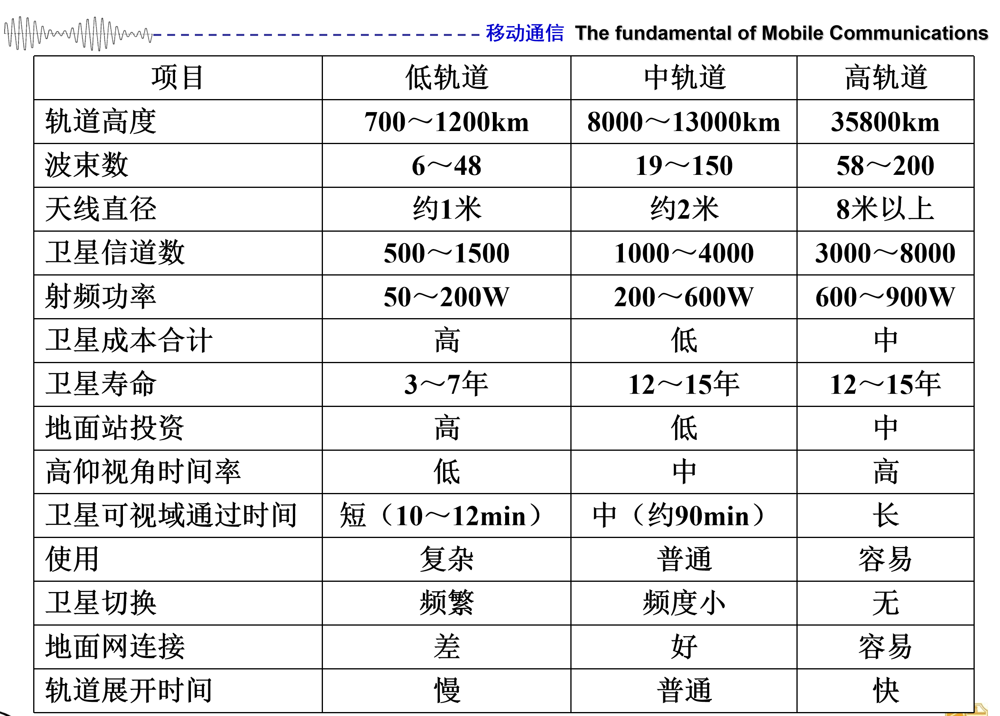

# 第一章 概述

## 😘本章概览

本章作为整个移动通信的概述部分，主要**定性、宏观**的介绍了什么是移动通信、移动通信的难点和特点、移动通信的发展历程、移动通信的模式、移动通信系统的分类等知识点。而针对于移动通信当中**定量、具体**的技术建模与分析解决将会贯穿于后续的所有章节。

## 1.1 移动通信的定义

所以什么是移动通信呢？**核心在于通信双方或者至少一方处于运动之中**。双方在运动的典型为MS-MS，一方在运动的典型为BS-MS。（其中MS为Moblie Station，BS指Base Station）

>⭐这里之前有个误区：~~移动通信就是无线通信~~。这个理解是有失偏颇的，移动通信过程依赖于有线通信（如基站-基站，基站-服务器之间的连接），只能说**无线通信是移动通信的基础**。*无绳电话就是一个典型移动+有线场景，以前家里也有过。*

此外移动通信也属于**三大通信手段**之一，另外两大手段分别是光纤通信（~~在学~~）和卫星通信。

## 1.2 移动通信的特点

我们在了解完移动通信之后，会思考**为什么我们要学习移动通信呢？为什么移动通信现在依旧被学术届、工业界大量研究推陈出新新技术呢？** 这与移动通信的本身的特点有密切联系：

1. **传播媒介**：无线电传播，传播性差。（**第二章会具体学习**）
	- 地形/障碍物：阴影衰落、多径衰落
	- 距离：路径损耗
	- 移动：多普勒频移
2. **干扰**：互频干扰（💡即通信电路中学习的因为**非线性器件**引起的组合频率干扰）、邻道干扰（由于**距离差**导致相邻信道**强信号干扰弱信号**）、同频干扰（**蜂窝网络独有**，与**组网技术**中多频复用的蜂窝距离有关）
3. **供需**：频谱有限（供**少**）、用户数量大（需**多**）（💣供需不平衡的关系也引起了**组网技术复杂**这一特点）

## 1.3 移动通信面临的困难

正是由于移动通信本身的特点引申出了一系列移动通信领域需要解决的技术困难（**主要有6点**）：

1. **quality**：*信道*的质量怎么提升
2. **association**：*用户*怎么连接*基站*
3. **roaming**（漫游）：*基站*怎么找到*用户*
4. **multi-access**（多址）：*基站*怎么区分*用户*
5. **security**：怎么保障通信安全（不被窃听）
6. **handover**：怎么在*用户*移动中**从一个基站交付给另一个基站**

## 1.4 移动通信的发展进程

>💡这部分是让我最**激动的**，无法想象在几十年的时间里通信技术的快速迭代下**每一代都是在超越技术困难的里程碑**，也深深感受到信息技术发展下带给人类的**巨大福祉**。

与光纤通信中**F1G~F6G**一样，移动通信也经历着从**1G~6G**的万象更新，每一代都有其独特的技术和特点（也能从中窥探到发展巨轮下的规律）：

1. **1G（1980s）**: 1G主要由**模拟通信系统**组成，多址技术为**FDMA（1维）**，组网技术**从大区制向蜂窝网络转变**，当时处于**初级语音时代**。
2. **2G（1990s）**: 2G由**数字通信系统**组成，多址技术为**TDMA（2维）**（难点在于**同步、定时**），开始引入**编码技术**，典型制式为欧洲的**GSM**，处于**高质量语音时代**。
3. **3G（2000s）**：3G在**接入层**使用的多址技术为**CDMA（3维）**，**编码层**使用**Turbo编码**（信道容量逼近**香农极限**），典型制式有很多，而且当时三大运营商处于**三足鼎立**状态，**各占一制式且不通用**（⭐所以后来有了3GPP会议），其中中国电信当时是**cdma2000**，处于**Web时代**。
4. **4G（2010s）**：4G使用**OFDM-MIMO（4维）**，典型制式为欧美的**WCDMA**、中国的**TD-SCDMA**（🔥中国崛起）以及**LTE**，处于**视频时代**。
5. **5G（2020s）**：5G在4G基础上引入了**大规模MIMO（多天线阵列）**、**超密度组网技术（D2D微机）**、**毫米波**等技术并制定了eMBB(增强移动宽带，针对**用户体验**)、mMTC(大规模机器类型通信，针对IOT物联网)、uRLLC(高可靠低延迟通信，针对自动驾驶、远程医疗等需求)**三大要求**，处于**万物互联时代**。
6. **6G（2030s）**：6G未来将要深扎的四个前景领域：**沉浸式通信**（针对虚拟现实和元宇宙）、**通信感知一体化**（针对具身智能、自动驾驶）、**通信AI一体化**（针对人工智能）、**空天地一体化**（针对星链计划）

>💡从六代移动通信技术的发展，我们可以发现市场/工程的本质是：**有需求才会有技术发展去填充**，这可能也是把握住风口所考虑的重要因素之一。

## 1.5 移动通信的模式

本部分之前在微机接口、嵌入式、计算机网络等课程中涉及过，但是在这里用**具体的通信实例**让我把通信模式这一部分知识点理解透彻了：

1. **单工、双工（逻辑层）**：单工指同一时刻只能发送或者接收（**单天线**）；双工指同一时刻既能发送也能接收（**多天线**）（⭐此处的**同一时刻的刻画是以人的感知为基础的，不是严格物理意义上的同一时刻**）。此外，双工可以分为**频分双工FDD**、**时分双工TDD**、**半双工**、**全双工**（类比于自己说话时听别人说话，虽然效率翻倍但是有自干扰）。
2. **单向、双向（物理层）**：单向是指设备只存在发射或者接收**电路**，而双向是指设备即存在发射**电路**，也存在**接收电路**。
3. **同频、异频**：FM广播、对讲机属于同频，而打电话则属于异频。

>⭐以下给出一些具体例子：传呼机/BB机是单向、单工模式；对讲机是双向、单工、同频模式（机制类似于计网中的**CSMA（载波监听）**）；小灵通（**小时候用过**）是双向、半双工（因为**小灵通单天线**）、异频模式；蜂窝网络则是双向、双工、异频模式。

## 1.6 移动通信系统等分类

移动通信系统可以根据众多分类标准分成很多类别：如根据信号的类型（数字/模拟）、多址接入方式等，此外还有一些特殊的系统比如**无绳电话系统**、**无线传呼系统**、**蜂窝网络系统（现在广泛使用）**、**AD  Hoc Network（类似于计网中运用洪泛的自治系统）**、**无线传感网络**（用于机器-机器间）、**集群通信系统**（公安、铁路（⭐**GSM-R**）、电力、军队等的专用网，具备**优先级中断**的特殊功能）

此处我们重点关注**卫星通信系统**：

1. **特点：** 长距离、大带宽、高动态、信道质量好（接近真空）、费用低
2. **业务：** 海上、空中通信、卫星电视、人烟稀少区域网络覆盖、应急通信（地震）
3. **缺点：** 时延长、功率受限（太阳能电池板）
4. **技术难点：** 处理的频带很宽（从分米波到毫米波）、时延难同步（导致子载波干扰）、多普勒频偏、多径信道的信号处理

## 😍本章总结

本章我们主要了解了移动通信的基本概念、发展历程等。而目前移动通信所遇到的种种困难与解决方法都会在以下章节中介绍（例如下一章的信道部分引出**多径**）。

# 2.2 信道
