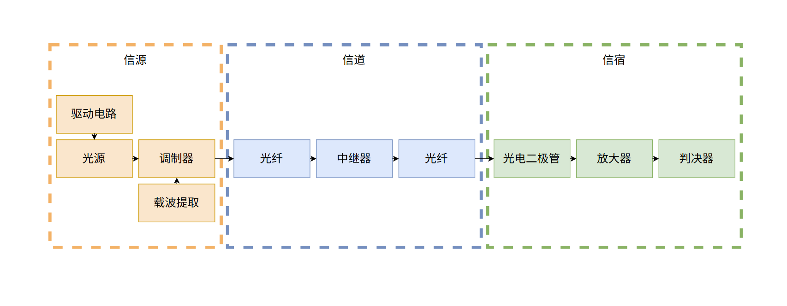
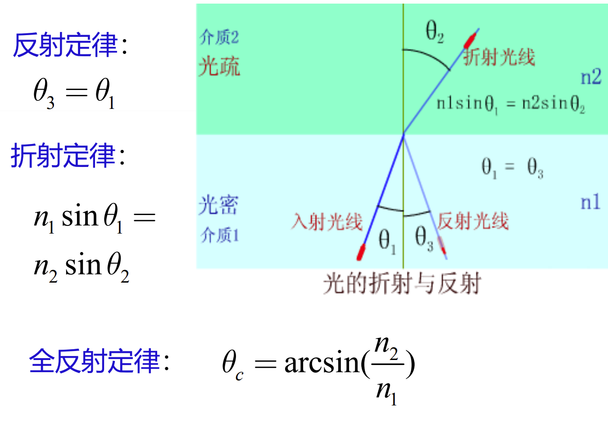
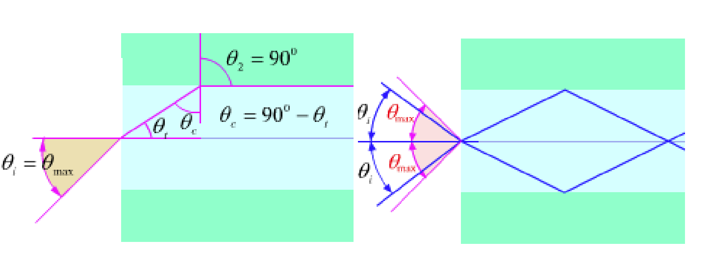
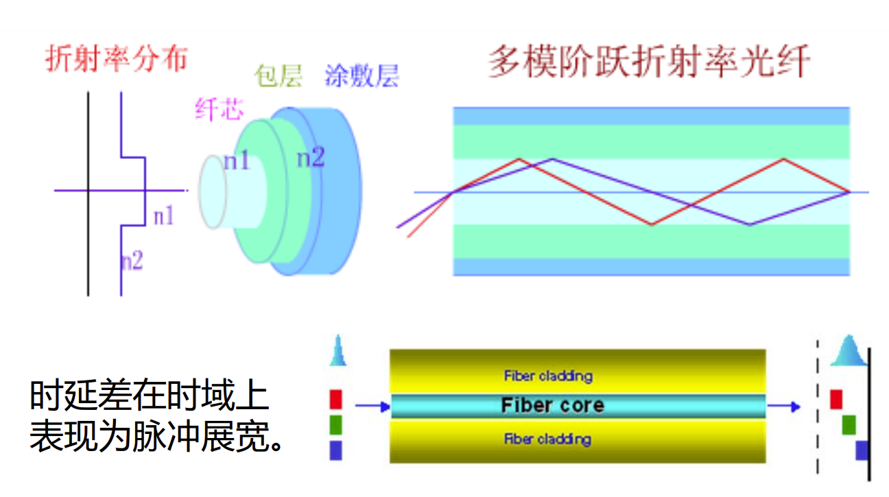

# 第一章 光纤通信基本原理

## 😘本章概览

本章作为整个光纤通信的**概述/引言**部分，将会介绍：
- 光纤通信的发展进程
- 光纤通信的优缺点
- ⭐光纤通信系统的基本组成

## 1.1 光纤通信的发展进程

光纤通信（**以光为传输媒介，光纤为传输信道**）同无线通信一样在以电子信息技术和互联网主导的**第三次工业革命**下，从1960年莱曼发明的红宝石激光器到70年代的半导体激光器再到1988年**第一条横跨大西洋的海底光缆的部署**，光纤通信在几十年间经历了**从F1G到F6G**的迭代升级的同时也承担着全球信息交换的**90%以上**的业务量（**大到跨洋小到芯片间**）。

>🏃‍➡️深深感受到科学技术的高速发展对人类文明进程的重大影响！

1. F1G（1980s）：采用**多模**光纤
2. F2G（1990s/语音时代）：采用单模光纤
3. F3G（2000s/Web时代）：采用**1550nm**的单模光纤
4. F4G（2010s/视频时代）：采用密集型波分复用（**WDM**）和**掺铒光纤放大器**
5. F5G（2020s/万物互联）：采用相干光通信（**幅度、相位、偏振**）
6. F6G（2030s/天地一体化）：空天地一体化通信

⭐其中为什么F1G使用多模光纤F2G又转为单模光纤？由于**多模光纤的模间色散**。（**类比于移动通信当中的多径衰落**）

## 1.2 光纤通信的优缺点

1. 光纤通信的优点：
	  - 频带宽、传输容量大（以光为载波）
	  - 低损耗（现在应用中损耗为**0.2dB/km**）
	  - 传输距离远（低损耗导致）
	  - 成本低、体积小（材料特性，光纤直径为**微米级别**）
	  - $SiO_2$资源丰富（材料特性）
	  - **抗电磁干扰、防爆**（在俄乌战争中体现）

2. 光纤通信的缺点：
     - 难连接（⭐相较于电路的连接，光纤的连接需要**融化后**芯层之间精准对接）
     - 易折断

## 1.3 光纤通信系统的基本组成

>💡联系通信原理/信息论的知识，光纤通信的基本组成也是由信源（光发射机/光源（**第三章**））、信道（光纤（**第二章**））和信宿（光接收机（**第四章**））三部分组成，只不过系统内部光纤通信有属于它自己的特色。

 

1. 光发射机：

	光发射机中的**调制方式分为直接调制(施加变化电流)和间接调制（加一个调制器）**，**调制格式有幅度、相位和偏振**。

2. 中继器
	 在移动通信中我们也有中继（**相当于马拉松赛过程中的补给站**），中继器有**3R**功能：**再放大、再定时（消除时间抖动）、再整流（消除波形畸变）**。

3. 光接收机
	我们怎么判断光纤通信系统的性能呢？
	除了通信原理中所学的**BER（误码率）** 外，光纤通信中我们还引入了**VEM（向量误差幅度）**。

## 😍本章总结

本章我们了解了光纤通信的基本概念和发展历程、系统架构等。在脑海里建立了一个具体的、宏观的系统认知的同时，也为后续章节打下了基础。

# 第二章 光纤基本理论

## 😘本章概述

## 2.1 光纤

>⭐我们在第一章了解到了光纤的材料是$SiO_2$，那么在现实生活中的光缆属于哪一种类型呢？

1. 光纤的分类：
	- 按材料分：石英光纤、**塑料光纤（多用于自动驾驶多传感器通信）**
	- 按模式分：单模光纤（10微米）、多模光纤（模间色散）（几十微米）
	- 按结构分：实芯光纤（实际中使用）、**空芯光纤（类真空，损耗可达0.01dB/km）**
	- 按横截面分：阶跃型光纤、渐变型光纤（作用：有利于减小模间色散💡why?）

2. 光纤的构成：
	- 纤芯层（core）：折射率$n_1$
	- 包层（cladding）：折射率$n_2$（$n_1>n_2$）
	- 涂覆层

3. 光纤的制造工艺（**容易**）：**预制棒**和**拉丝**

## 2.2 光纤的几何光学分析

>💡光纤的几何光学的分析是将光简化成**光线**（**前提满足满足纤芯直径$d$>>波长$\lambda$**），从**定性的角度**分析信号在光纤中的传输原理和多路径传输的状态。

1. 菲涅尔定律和全反射定理

**全反射定理是信号在光纤中传输的基本原理**，基本公式如下（~~中学知识点~~），此外补充一个**相对折射率差**的概念（后面经常用到）：
$$\Delta = \frac{n_1-n_2}{n_1}$$

>💡**子午面**是指包含光轴的**任意**平面，**子午光线**是指在子午面内以**临界角**进行全反射的光线。

1. 数值孔径NA和最大时延差

⭐数值孔径的定义为：$$NA=n_0·sin\theta_{max}=\sqrt{n_1^2-n_2^2}$$
数值孔径反映的是**光纤收集光线的能力**和**光纤与发射机/中继器耦合的能力**。

简单来说，**数值孔径代表的是入射光线的角度范围，在这个角度范围内入射的所有光纤都能在光纤中传输（即满足全反射），而且反射角始终小于等于临界角（最大角度入射取等）**。 那么也就好理解，数值孔径越大（角度越大），光纤与机器耦合时候角度对准要求没那么高，耦合能力也就越强。

一般来说$NA\leq1$，但如果出现**数学形式上**$NA>1$，则说明：入射光线随便怎么入射，都能在光纤中达到全反射，而且**始终无法达到临界角**。

⭐最大时延差则反映的是如果光纤中有**多个路径**的光线在传输，那么到达接收端就存在最大时延差（**产生模间色散的原因**）

中学时计算过此问题，最大时延差即以**临界角进行全反射传输（最慢）** 和 **沿着光纤轴线直线传输（最快）** 的时间差。

$$\Delta{\tau_{max}}=\frac{L·n}{sin\theta_c·c}-\frac{L·n}{c}$$

2. 模间色散

我们知道模间色散（~~和噪声一样，我们讨厌的东西~~）的产生原因就是最大时延差，**而最大时延差的大小与纤芯层和包层的折射率差（$n_1-n_2$）有关**。（上式化简）

💡故根据这一理论，我们可以有多种方式减小模间色散：
- 减小NA（临界角变大，路径波折程度更小）
- 阶跃型光纤->渐变型光纤（核心目的依旧是减小NA）
- 多模光纤->单模光纤
## ⭐2.3 光纤的波动光学分析

### 2.3.1 波动方程的建立（关系）

1. 基础知识

	- 梯度、散度、旋度、拉普拉斯算符（🤣具体理解可以看$3Blue1Brown$的视频）
     $$ \nabla\varphi =\frac{\partial\varphi}{\partial x}\vec{i} +\frac{\partial\varphi}{\partial y}\vec{j} +\frac{\partial\varphi}{\partial z}\vec{k} $$
$$ \nabla\cdot\vec{A} =\frac{\partial A_x}{\partial x} +\frac{\partial A_y}{\partial y} +\frac{\partial A_z}{\partial z} $$
$$ \nabla\times\vec{A} =\begin{vmatrix} \vec{i}&\vec{j}&\vec{k}\\ \displaystyle\frac{\partial}{\partial x}&\displaystyle\frac{\partial}{\partial y}&\displaystyle\frac{\partial}{\partial z}\\ A_x&A_y&A_z \end{vmatrix} $$
$$ \nabla^2\vec{A} =(\nabla^2 A_x)\vec{i} +(\nabla^2 A_y)\vec{j} +(\nabla^2 A_z)\vec{k} $$
	- 麦克斯韦方程组（微分形式）
	  
	  ①安培定律：时变电场/电流产生磁场
$$\nabla\times\vec{H}= \frac{\partial \vec{D}}{\partial t}+\vec{J}$$

      ②法拉第电磁感应定律：时变磁场产生电场
      $$\nabla\times\vec{E}=-\frac{\partial \vec{B}}{\partial t}$$

      ③电通量密度的散度为自由电荷
      $$\nabla\cdot\vec{D}= \rho$$
      
      ④磁通量密度的散度为0
      $$\nabla\cdot\vec{B}=0$$

>💡光纤作为光介质波导，其满足**无传导电流、无自由电荷、线性各向同性**三个特点。

2. 从麦克斯韦方程推导出亥姆霍兹方程

### 2.3.2 光纤中的模式（解）

 1. 波动方程的解（通解）
 2. 归一化频率$V$
 3. 特征方程的解（特解）
 4. 模式的截止条件
 5. 模式的单模传输条件
 6. 模式的多模数量
 7. 模式的多模功率

## 😍本章总结
