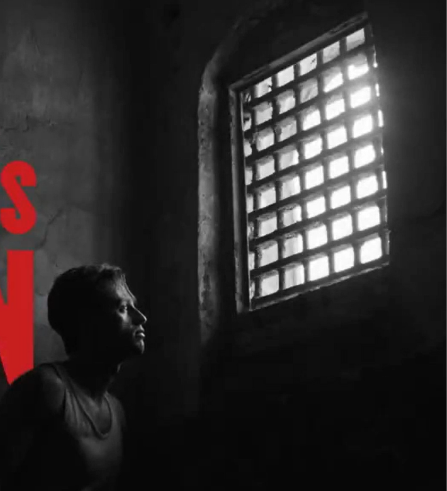

**在荒谬且充满苦难的世界里，人该怎么活？**

**世界的本质是荒诞的、无意义的、冷漠的。** 任何苦难都有可能如鼠疫一样潜伏着不断地凌驾于人类社会之上而又悄然地离去，无论是无辜的人还是有罪的人，都有可能罹患而惶惶不可安之。就像善良正义的塔鲁以及那位安东先生的小男孩的死。正是世界的荒诞性（目睹了男孩的惨死），帕纳鲁神甫也放弃了所谓天谴的宗教信仰，如同挖去了他的一只眼的痛苦之下以死亡作为对于世界的妥协。~~社会千年刚坚不摧的不平等体系却在苦难面前显得如此的平等与渺小~~

**社会的本质是集理想主义、高尚英雄主义、抽象主义、唯利主义形成的巨大机器**。政府总是打着保障人民权益的口号给出推敲字眼的防疫条例却没有实事；媒体总是报道街上鼠疫的新闻和冷冰冰的数据而却不关注人们歇斯底里的呻吟...社会总是推崇着高尚的行为并进行表彰时，实际上**是在掩盖政府的失职、制度的漏洞和集体的冷漠**，间接为犯罪推波助澜。在鼠疫发生时，社会层面考虑的不是如何马上处理，而是优先考虑自己的利益以及能安抚民心使其顺从的抽象理念。

而人真的是为了抽象的理念而活吗？

塔鲁说”**每个人身上都潜伏着鼠疫，充斥着谋杀**“，这是**人的本质**，也是**平庸之恶**。很多时候，人们遇到危难时的明哲保身、独善其身，遇到不公时的默默忍受，遇到他人受难时的冷漠，遇到所谓金科玉律与强权下的顺从与随波逐流...鼠疫下的群众从幻想侥幸到恐惧麻木，但却在鼠疫过去之后穷奢极欲似乎忘记所有痛苦。他们认为鼠疫影响的永远都是打破他们的习惯或者利益，优先想到的只是抱怨当局或者逃避于理念当中。**当今工业社会技术性发展、消费主义和文化产业的侵袭下，人们何不也是在娱乐至死的信息茧房、精加工食品工业、AI算法推荐下丧失了独立清醒思考的能力、否定性批判性超越性的权利，被压制顺从，逐步沦为马尔库塞的单向度的人？** 

**细菌自然形成无法避免，那我们能做什么才能避免一场场谋杀呢？** **是反抗。** 是里厄大夫不管什么圣人、宗教、高尚、英雄...只知道救人是他**该做的事和职责**；是塔鲁**时刻警醒的意志力**，主动组建防疫队伍冲上一线，只有这样才能避免呼口气就将鼠疫祸害并谋杀他人；是朗贝尔从**我转变成我们**，从**局外人转变成一份子**进行反抗的力量；是格朗小职员反复琢磨一句话的小说时折射出的平凡底层人的反抗，人生的篇章哪里需要像形容词这种华丽辞藻或者宏大叙事，人生更关注的**只是现实与当下能做的种种...** 当然，芸芸众生中也不乏有像柯塔尔这类寄生于混乱之中，受鼠疫（人性）完全控制的极端分子。

**鼠疫永远不会消失，世界也如同西西弗斯推着的巨石一样世事无常，唯有坚持对抗的本身方为人存在的意义，永远不要忘了头顶那把达摩克利斯之剑🗡**

