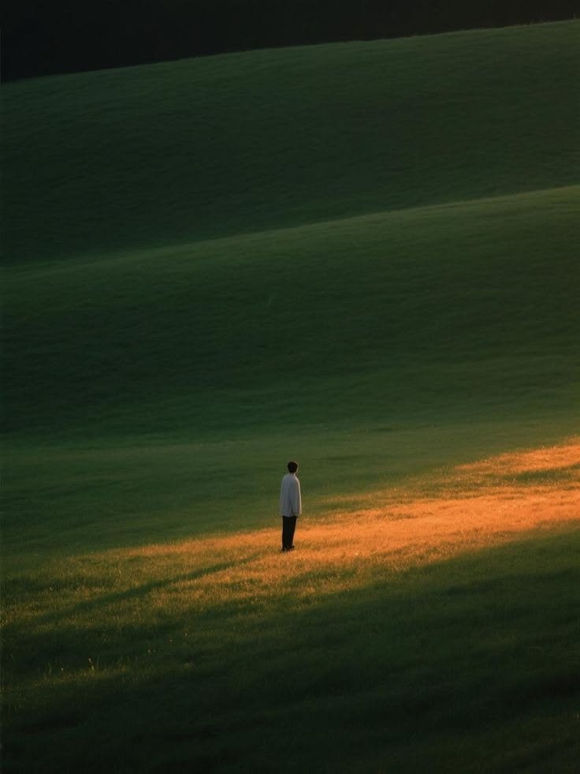

**达摩克里斯的舞姿只有在剑下才显得优美，你要接受无法接受无法接受的事情，坚持无法坚持的事情**。保研似乎像一场戛然而止、意犹未尽的梦，让我有些许恍惚。几年的努力准备，而最终的结果只是接受待录取的一个确认键，无疑有些荒诞。当然，人类害怕黑天鹅事件，恐惧失去当下所拥有的，渴望掌控未来所不可控的，与概率模型世界本身之间的对立矛盾亦是荒诞。

而我好像也逐渐陷入了这个怪圈之中：担忧黑天鹅事件，焦虑不可控的未来。从担心能不能保研到担心有没有学校上再到如今担心接受待录取是否真的结束了...我陷入了无止尽的内耗循环中，而这也让我浪费了很多活在当下的真真切切的时光与沿途的风景。当我真正孤立我的大脑向内探寻原因是，细思极恐，我的身心灵已经被很多病毒感染上恶疾，而它们是无意识地侵入我的潜意识中，进而说明我的信念和边界亦出现了裂缝。

**你要尽可能地投身于去感受这个世界，摒弃一些所谓的价值判断，在无情的绝望中寻找快乐，再盲目的奴役中寻找自由。** 小红书B站短视频等所有社交媒体、朋友圈、新闻热点以及人云亦云的聊天，都如同鼠疫般朝你侵袭而来，是潘多拉的盒子，更是把你拉入世俗标准地狱中的暗中杀手。看完《坠落的审判》《局外人》等电影后，人生永远都不是陷入于唇枪舌剑、口诛笔伐，追求外界认同和所谓世俗标准。我不想沦为被集体情绪操控下的平庸之辈，我也和别人不一样。**我始终相信我是一个有原则、自律的人。** 谨小慎微是好事，放下执念亦是如此，但永远不要被社会单向道标准所裹挟并上升到内耗焦虑，**毕竟个体终究淹没在人类命运与世界永恒中，存在即永恒，哪怕大海再次将你抛至滩涂，我也绝不放弃**。

每天都有太多不可控的事情发生，而除了死亡一切结果都能从头再来，我都能接受。我能做的反抗唯有：**清醒地做好充足的准备并时刻警醒，把每件当下可控的事做到极致的好，坚定自己的信念并捍卫自己的梦想，感恩自己所拥有的一下，足矣。剩下的只是听天命、静待花开，相信一切都会水到渠成，一切幸运与结果都会自然被吸引到你身边。**

**一颗被暴风雨裹挟折磨的心，与暴风雨建立了短暂而鲜活的联姻。** 想到这里，我好像也不那么患得患失、瞻前顾后了，因为我不再畏惧失败和死亡并且我有敢于破圈的**勇气**，体验每一天的喜怒哀乐、失败又爬起、成功并享受、冷静并自省的充实时光。

**自由是抛开目的的，是伟人的苦行主义，是拉满弦的弓，习惯性自律是自由。** 我清醒知道保研后的玩与放纵会让自己更空虚，保研期间的一些情绪、自我管理还不够成熟和冷静。但我接下来会坚定信念逐步过渡到研究生的模式，相信自己。

与现在的自己共勉。