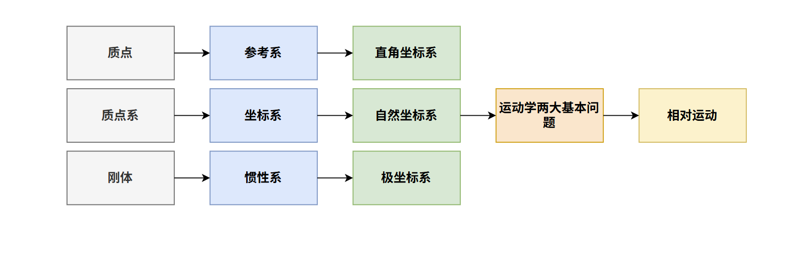
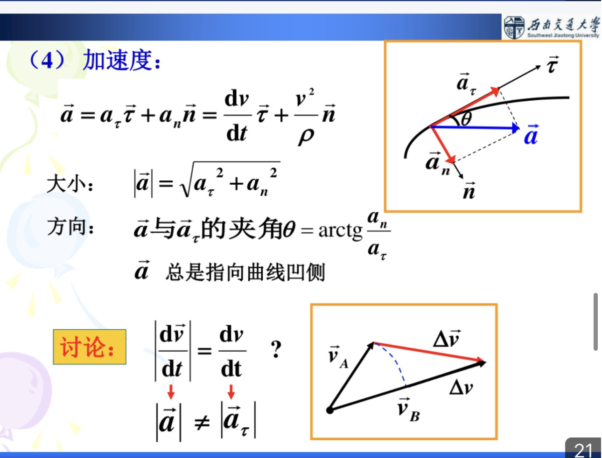
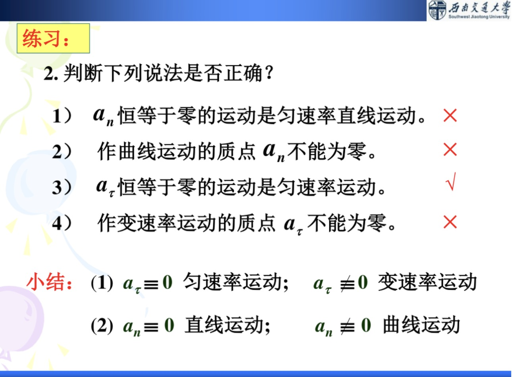
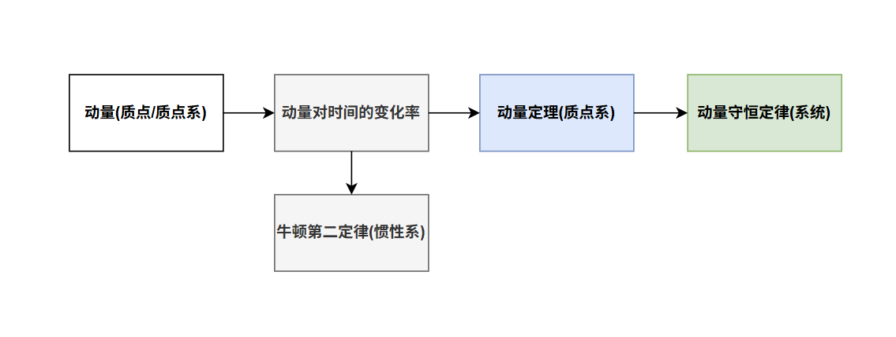
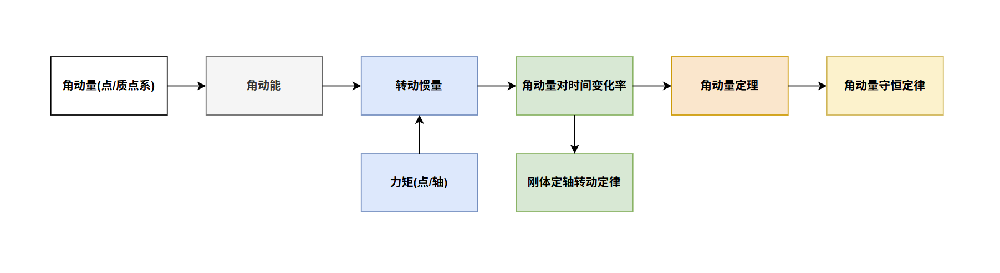

# 第一章 质点运动学

>💡运动是绝对的，运动的描述是相对的。
## 😘本章概览

本章是后续牛顿世界动力学的基础：**质点运动学**。核心要义是要~~抛弃高中的所有死记硬背的公式~~，学会通过微积分从定义出发推导出各个物理量的内涵。

本章我们将学习：
- 质点运动学的**基本概念**：质点/质点系/刚体、参考系/坐标系/惯性系
- 运动描述的**三个工具**：直角坐标系、自然坐标系和极坐标系
- 运动学的**两个基本问题**：微分法和积分法
- 简化运动描述的**技巧**：相对运动

## 1.1 质点运动学的基本概念

### 1.1.1 质点、质点系、刚体

1. 质点：质点是**在一定条件下**可以**忽略大小和形状**的物体（⭐但是不可以忽略质量）

2. 质点系：质点的**集合**

3. 刚体：是任意两个**距离相等**的质点的集合（⭐刚体是质点系的**特例**）

### 1.1.2 参考系、坐标系、惯性系

1. 参考系：参考系是用来描述目标物体运动的**实物**（⭐注意：虽然粒子可以由实物和场的形式存在，但是参考系只能是**实物**）

2. 坐标系：坐标系是以数学的**矢量描述**对参考系的一种**定量**表示
3. 惯性系：惯性系**理论上**是指满足牛顿第一定律的参考系，是参考系的一种理想模型；而**实际上**惯性系是相对的，判断方法是：**一个参考系相对于地面（良好惯性系）作匀速平动/静止**。（同理，非惯性系则是相对于地面作变速平动/转动）

>💡 注意点：**牛顿第二定律只适用于惯性系。** 如果是非惯性系（如关联体中求一个物体相对于另一个物体的加速度）中有两个解决方法：一是运用相对运动中的加速度合成分解，二是构造一个虚拟的惯性力（$\vec{F}=-m·\vec{a_0}$，$\vec{a_0}$是非惯性系相对于惯性系的加速度）。

## 1.2 运动学描述的三个工具

### 1.2.1 直角坐标系

直角坐标系我们再熟悉不过了，直角坐标系中的基本物理量是：**位置矢量、位移、速度、加速度**

1. 位矢：描述质点的位置
	- 粗略描述：$\vec{r}=r_x\vec{i}+r_y\vec{j}+r_z\vec{k}$
	- 精确描述：$|\vec{r}|=\sqrt{r_x^2+r_y^2+r_z^2},cos{\alpha}=\frac{x}{r}...$
	- 质点的运动方程：$\vec{r(t)}=r_x{(t)}\vec{i}+r_y{(t)}\vec{j}+r_z{(t)}\vec{k}$
	- 质点的轨迹方程：运动方程写成**参数方程形式消去t**
>💡重点：辨析$|d\vec{r}|$和$dr$
>
>	$|d\vec{r}|$是位矢增量的大小（即**位移的大小**），而$dr$是位矢大小的增量。

2. 位移：描述质点位置变化的大小和方向
	- 粗略描述：$\Delta{\vec{r}} = \Delta{r_x}\vec{i}+\Delta{r_y}\vec{j}+\Delta{r_z}\vec{k}$
	- 精确描述：同位矢
	- 元位移$d\vec{r}$：这个常在**积分式**中遇到，元位移的模等于元路程（即$d|\vec{r}|=ds$）
>💡重点：辨析位移和路程
>
>	位移的大小始终**小于等于**路程：$|\Delta{\vec{r}}|\leq{ds}$
>	当且仅当**直线运动和$t\rightarrow{0}$的一般曲线运动**等号成立

3. 速度：描述质点位置变化的快慢和方向
	 - 平均速度（粗略描述）：$\bar{\vec{v}}=\frac{\Delta{\vec{r}}}{\Delta{t}}$
	 - 速度（净效果）：$\vec{v}=\frac{d\vec{r}}{dt}$
>💡重点：辨析速度和速率、平均速度和平均速率
>
>	由速率：$v=\frac{ds}{dt}$、平均速率：$\bar{v}=\frac{\Delta{s}}{\Delta{t}}$
>	可以看出：**平均速度的大小和平均速率不相等，速度的大小和速率相等**

4. 加速度：描述质点速度变化的快慢和方向
     -  平均加速度（粗略描述）：$\bar{\vec{a}}=\frac{\Delta{\vec{v}}}{\Delta{t}}$
	 - 加速度（净效果）：$\vec{a}=\frac{d\vec{v}}{dt}$

### 1.2.2 自然坐标系

自然坐标系虽然是新学的，但实质上就是**高数中的曲线微积分**，用于描述物理中的一般曲线运动。基本物理量有：位置、位置的变化、速度和加速度

1. 位置$s$、位置的变化$\Delta{s}$：两者均为**标量**，度量曲线上**确定一点后**的路程/路程差
2. 速度（切线速度）：表示为**速率乘以方向**的形式（$\vec{v}=\frac{ds}{dt}*\vec{e_t}$）
3. 加速度：分为**切向加速度$\vec{e_t}$和法向加速度$\vec{e_n}$**
$$\vec{a}=\vec{a_t}+\vec{a_n}=\frac{dv}{dt}\vec{e_t}+\frac{v^2}{\rho}\vec{e_n}$$
$$|\vec{a}|=\sqrt{a_t^2+a_n^2}$$
$$\theta = arctan{\frac{a_{n}}{a_{t}}}$$
>⭐法向加速度中的$\rho$是曲率半径：$\rho=\frac{ds}{d\theta}$
>⭐重要性质：**切向加速度只改变速度的大小而不改变方向；法向加速度只改变速度的方向而不改变大小**

>⭐经典的两类曲线运动：
>     1. 斜抛运动：$a_t=0,a_n=g$
>     2. 匀速率圆周运动：$a_t=0,a_n=\frac{v^2}{g}$

如上图的辨析，由于$a_n$只改变速度方向，**所以$a_n$恒为零只能代表在做直线运动**，其它同理。
### 1.2.3 极坐标系

极坐标系让我联想到微积分中的**圆柱/球坐标系**。极坐标系适合用于描述物理中的圆周运动、刚体定轴转动等。涉及到的物理量有：角位置、角位移、角速度、角加速度。

1. 角位置、角位移：二者与自然坐标系类似，均为标量。角位置包含圆周半径$R$和位置函数$\theta(t)$两部分构成；角位移则是弧度的变化量$\Delta{\theta}$（⭐单位为$rad$！）
2. 角速度：角速度最大的特点是**其方向是人为定义的！**
	- 平均角速度大小：$\bar{\omega}=\frac{\Delta{\theta}}{\Delta{t}}$
	- 角速度大小：$\omega = \frac{d\theta}{dt}$
	- 角速度方向（**右手螺旋定则**）：$\vec{v} = \vec{\omega} ×\vec{r}$（⭐体现了线速度和角速度的方向关系）
3. 角加速度：没有方向，为**标量**（$\bar{\beta}=\frac{\Delta{\omega}}{dt}$,$\beta=\frac{d\omega}{dt}$）

>💡线量和角量的关系：
>⭐根据弧度和角度的对应关系：$s = R*\theta$可以推导出其它物理量的关系
>$$v=R*\omega$$
>$$a_t=R*\beta$$
>$$a_n=R*\omega^2$$

## 1.3 运动学的两个基本问题

相较于高中死记硬背匀变速直线运动、圆周运动的公式，现在我们在学完微积分之后可以系统地将所有运动学问题**溯源到最基本的微积分定义**。

### 1.3.1 微分法

已知运动方程/轨迹方程求速度、加速度这些物理量。微分法主要分为三种题型：
- 给出运动方程的数学表达式
- 给出质点运动的轨迹图
- 给出具体运动情景（如拉船归岸）
⭐但这些问题的核心都是要知道物体的运动方程然后微分（**特别注意做题时得出的结果要精确描述大小和方向，严谨**）

### 1.3.2 积分法

积分法则是微分法的逆过程：已知速度/加速度和初始条件，求位移。这类问题只需要知道三个微分逆过程的式子即可（角量同理）：
$$v=\frac{dx}{dt}$$
$$a=\frac{dv}{dt}$$
$$a=\frac{dv}{dt}=\frac{dv}{dx}*\frac{dx}{dt}=\frac{vdv}{dx}$$
**⭐注意积分式子中的$a$是随$t$变化的函数$a(t)$，只有常量才能从积分式中提取出来。**

## 1.4 相对运动

相对运动是通过选取合适的参考系简化运动的描述，解决此类问题有两种方法：**解析法和图解法**。

⭐此处讨论相对运动的前提是在低速（$v << c$）**伽利略变换和牛顿绝对时空观**下，后面学到**狭义相对论**这里就不成立。

⭐相对运动中的加速度合成与分解将会用在后续非惯性系中求相对加速度的题目上，这个思想比较重要。

>💡相对运动题目最重的是**读清题意**（是以谁作为参考系）和向量合成时候的**角标对应**

## 😍本章总结

本章主要学习了质点运动学，**其核心就是质点的运动方程**。已知运动方程则可以通过微分和积分两种基本方法和三个坐标工具成功求出所有其它物理量。

本章还有一个重点是培养我们运用**微积分的思维**来求解物理题目，这是后续动力学、电磁学的基础之基础。当你学会从**微元积分的思想**解决物理问题时，其背后内涵和解题思路也会**更加本质**。

# 第二章 动量

## 😘本章概览

我们已经知道力是**改变物体运动状态的原因**，本章我们将进入**动力学**部分。本章我们将学习：

- 质点的动量、牛顿第二定律（**动量对时间的微分**）/ 质点系的动量、质心运动定律（**动量对时间的微分**）
- 质点的动量定理、质点系的动量定理（**力对时间的积分【冲量】**）
- 质点系的动量守恒定律（**普适性**）

## 2.1 动量

### 2.1.1 质点的动量

$$\vec{p}=m·\vec{v}$$

质点的动量用来**衡量机械能的强度**。

### 2.1.1 质点系的动量

$$\vec{p}=\sum_{i}m_i·\vec{v_i}$$
由于质点系的动量按上式计算不方便，所以我们采用**类比**的思想引入了**质心**的概念。假设质心的等效质量为$M$，等效速度为$\vec{v_c}$
$$ \vec{p}=M·\vec{v_c}=M·\frac{d\vec{r_c}}{dt}=M·\sum_i\frac{m_i·d\vec{r_i}}{M·dt}$$
由上式可以看出质心的$\vec{r_c}、\vec{v_c}、\vec{a_c}$是各个质点的位矢、速度、加速度的**加权平均**。

## 2.2 动量随时间的变化率

### 2.2.1 质点的动量随时间的变化率

$$\vec{F_{合}}=\frac{d\vec{p}}{dt}=m\vec{a}$$
上式是**牛顿第二定律的一般形式**：**质点**的**合力**的大小等于**质点**的动量随时间的变化率。

⭐牛顿第二定律的适用条件是**宏观、低速、质点、惯性系**。

### 2.2.2 质点系的动量随时间的变化率

$$\vec{F_{合外}}=\frac{d\vec{p}}{dt}=M\vec{a_c}$$
同理，上式是**质心运动定理**：质点系（系统）的**合外力**的大小等于**质心**的动量随时间的变化率。

>💡这里引出了**内力和外力**的概念：顾名思义，内力是系统中**质点间**的相互作用力，外力是外界施加给**质点系**的作用力。

⭐⭐⭐合外力的大小决定了是否满足**动量守恒**，合内力也有**4条重要的定理**（4个零）
1. **合内力矢量和为 0**
$$\sum\vec{F_{内}}=0$$
2. 合内力冲量和为 0
3. 合内力矩矢量和为 0
4. **内力做功和不一定为 0**
## 2.3 动量定理

前面讨论了**动量对时间的微分作用**，那**力对时间的积分作用**呢？

我们引入了**冲量**和**动量定理**。

### 2.3.1 质点的动量定理

将牛顿第二定律**分离变量求积分**：

$$I=\int\vec{F_{合}}·dt=\Delta\vec{p}$$
即**合力的冲量等于动量的增量**

### 2.3.2 质点系的动量定理

同理，将质心定理**分离变量求积分**：
$$I=\int\vec{F_{合外}}·dt=\Delta\vec{p}$$
即**合外力的冲量等于系统动量的增量**

同时，系统合内力的**冲量矢量和为0**：$\int\vec{F_{合内}}·dt=\Delta\vec{p}$
⭐如滑冰互相推对方，内力的作用在于**系统内的动量分配**。（💡这个过程从**初总动能为0**到**末总动能不为0**，也体现了内力做功之和不一定为0）

## 2.4 动量守恒定律

首先，动量守恒定律是一个具有**普适性**的规律，反映了**自然界中的空间平动对称性**且**不随时间变化**。而且从上式看出：在一个系统中，如果合外力为0则满足动量守恒定律（也就意味着一个不受外力作用且质量不变的孤立系统满足动量守恒）。

>💡那只有合外力为0才能使用动量守恒定律嘛？

其实不然。
1. **如果合外力不为0但在某一方向合外力为零**（子弹射入悬挂的物体）：可以在这个方向上用动量守恒。
2. **如果合外力不为0但内力远远大于外力**（爆炸）：可以使用动量守恒定律。

⭐⭐⭐十分注意**绳子从松到绷紧**的模型，不满足动量守恒！（重力的冲量<<张力的冲量）

>💡那只有动量不变代表动量守恒嘛？

不一定。动量守恒是不随时间变化的，所以动量+500再-500的过程虽然变化前后总动量不变，但不是动量守恒。

## 😍本章总结

本章我们主要学习了**动量、动量随时间变化率、动量定理、动量守恒**：

动量随时间变化率部分要学会运用牛顿第二定律（**注意惯性系**）。对于关联体系统的求解，要学会判断**是否动量守恒**，如果不是要**单个物体进行动量定理求解**，有时甚至会结合机械能守恒，是**考试时候的一道综合大题**。

# 第三章 角动量

## 😘本章概览

当一个物体在定轴转动时，质心速度为0，则我们**无法使用动量来描述物体转动的状态**（动量反映机械能的强度），故我们需要引入**角动量**来刻画。

本章是中学未涉及到的知识点，但是通过与上一章线动量的**类比**，可以很好的理解这一章的主要内容：
- 角动量（对点/对轴）、角动能
- 转动惯量（**类比质量**）
- 力矩（对点/对轴）（**类比力**）
- 刚体定轴转动定律（**类比牛顿第二定律**）
- 角动量定理
- 角动量守恒定律（普适性）

>💡在角动量部分我们默认研究的是**刚体定轴的转动**，非定轴（如卫星）问题暂时不考虑。（理论力学中会有涉及）

## 3.1 角动量、角动能

### 3.1.1 角动量

1. 质点的角动量

	质点的角动量定义是在**某参考点下的位矢（由参考点指向质点）和质点动量的矢积**。
	$$L = \vec{r}\times\vec{p}=\vec{r}\times{m\vec{v}}$$
	 角动量的大小为**以$|\vec{r}|$和$|\vec{p}|$为邻边的平行四边形的面积**，即
	 $$|L| = r·m·vsin\theta$$
	 角动量的方向则遵循**右手螺旋定则**

2.  质点系的角动量
$$L = \sum_i\vec{r_i}\times\vec{p_i}=\vec{r_i}\times{m_i\vec{v_i}}$$
>💡注意：不一定只有曲线运动的物体才具有角动量（判断是否含有角动量的依据是**连接参考点和质点的位矢的方向是否发生变化** ）（⭐即角动量的本质是反映物体**转动的倾向**）

### 3.1.2 角动能

此处我们通过讨论推导**刚体**的角动能（通过利用质心和质点间的位矢关系）

$$E = \frac{1}{2}mr^2\omega$$
类比于平动动能可以发现，角动能公式中的$mr^2$等效于平动动能中的质量$m$，由此我们引出了**转动惯量**的概念。

## 3.2 转动惯量

类似于平动中**质量是对平动惯性的度量**，刚体的转动惯量则是**对转动惯性的度量**，定义为**刚体中各质点的质量与其到转轴距离平方的乘积再求和**：
$$J = \sum_im_ir_i^2$$
如果质量连续，则可利用**微元分析法**（⭐常考常用）进行积分：

$$J = \int{r^2dm}$$
>⭐⭐⭐此处常考题型就是计算转动惯量，一般步骤为$$dm ->dJ->J$$(即先确定质量微元（线、面、体)、然后求出$dJ$、最后积分）

>💡转动惯量的全称是**对轴**的转动惯量，对于同一个轴转动惯量可以**分解合成相加减**，且转动惯量**与质量是否分布均匀无关**（积分）

1. 常用的转动惯量：
	- 细杆：$\frac{1}{3}mL^2$（端点）$\frac{1}{12}mL^2$（中点）
	- 实心圆柱：$\frac{1}{2}mR^2$
	- 球壳：$\frac{2}{5}mR^2$
	- 实心球：$\frac{2}{3}mR^2$

2. 平行轴定理和正交轴定理
	- $J_z=J_c+mh^2$($h$为两个平行轴之间的距离)
	- $J_z=J_x+J_y$

## 3.3 力矩

## 3.4 定轴转动定律
