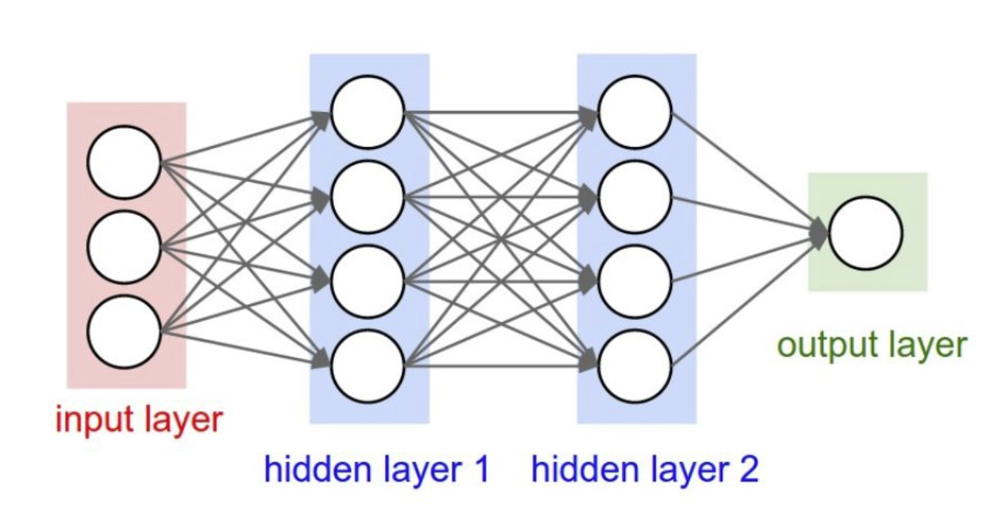
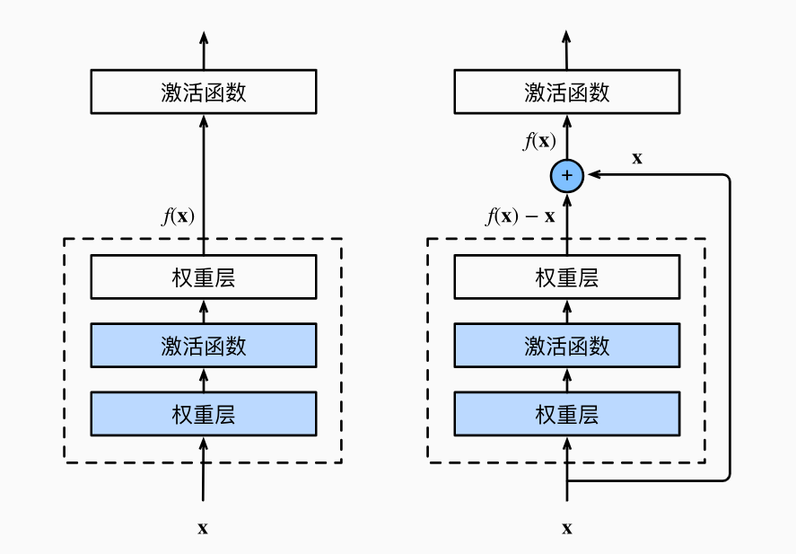
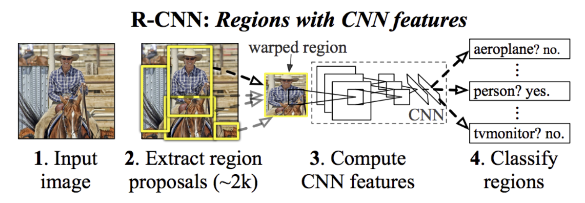
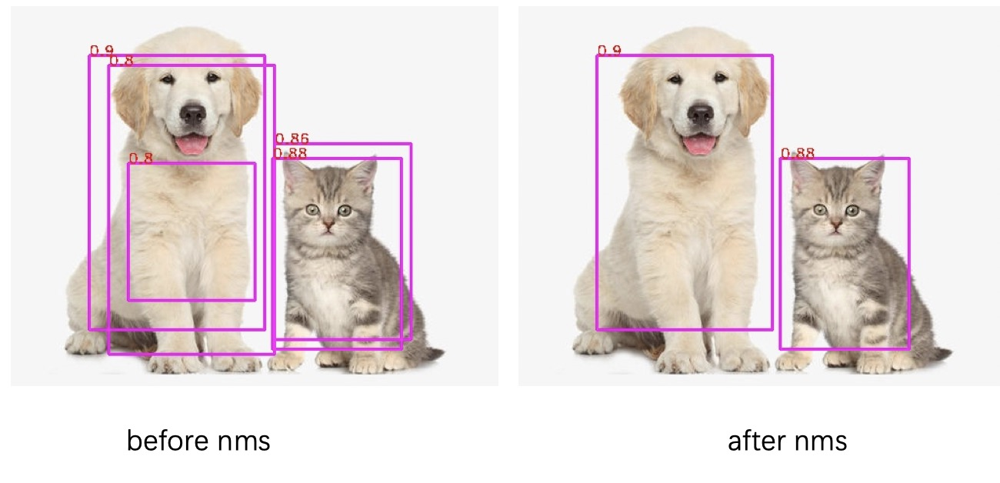
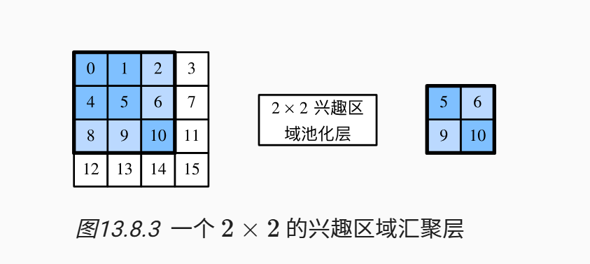
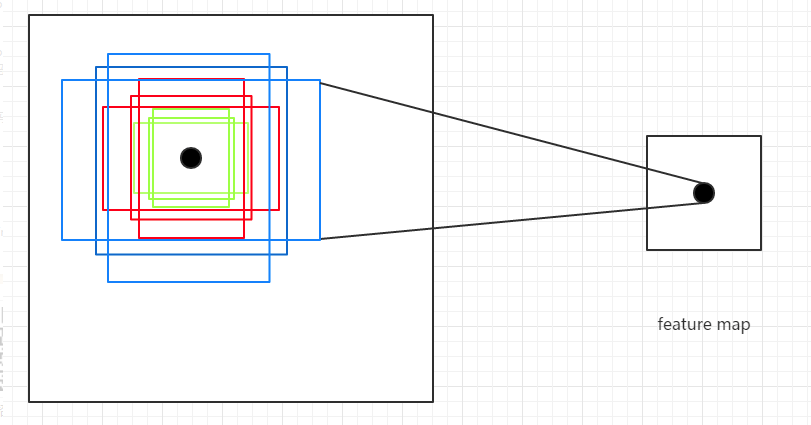
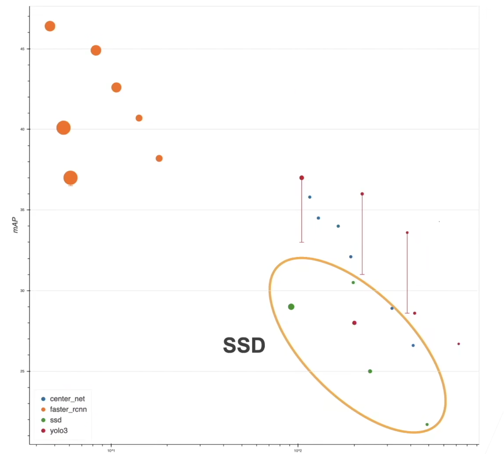
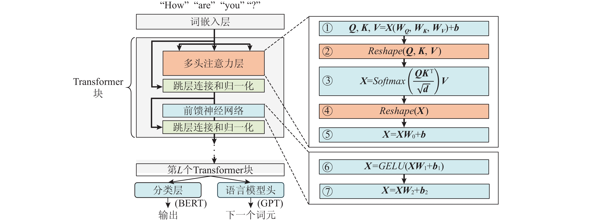
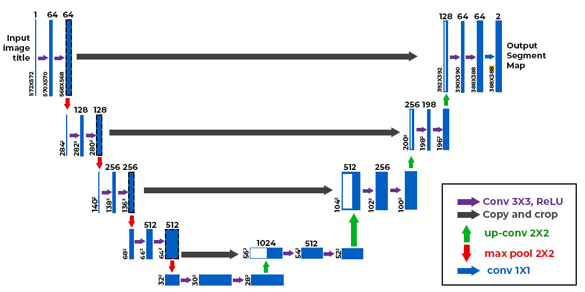

# 二、视觉感知

## 1.1 目标检测

> 💡机器人感知的一个重要组成部分就是**视觉**。无论是二维的相机还是三维的激光雷达，都需要运用到目标检测，而一个检测模型需要由主干网络backbone（**车的引擎**）和算法（**车的外壳**）等构建。所以我们需要从基础的神经网络NN、卷积神经网络CNN、ResNet等基础知识开始，层层深入掌握目标检测。

### 1.1.1 基础知识

#### 1.1.1.1 神经网络NN

神经网络是模拟人脑神经元连接和激活的“**函数**”，也就是输入多个张量（文本、图片、音频）输出预期结果的过程。

1. 神经网络的三层：
神经网络主要分为**输入层、隐藏层和输出层**（其中隐藏层的操作最为关键）

2. 神经网络的流程：
- 初始化：确定输入层的**输入张量**，隐藏层的**层数N**和**随机初始化权重**，输出层的**理想输出张量**
- 前向传播：倘若只对这个类似加权图的神经网络进行加权乘积和的线性连接，那我我们很难得到一个近似的预测值。**所以除了加入偏置以外，还需要激活函数对线性加权和进行非线性扰动**。通过激活函数（如Sigmod、RELU...）我们可以求出各个隐藏层节点的值并最后得到预测值，这就是前向传播的过程。
- 反向传播：由于只迭代一次，预测结果与理想值误差很大（离散值和连续值分别用**均方误差、交叉熵衡量**）。所以我们需要定义损失函数，并通过反向**扰动调整权重**以减小误差。其中，**权重扰动的程度称为学习率，算法用的是梯度随机下降、ADMM等（数学核心为偏导数）。**
- 迭代更新：不断重复前向、反向传播n个epoch。

>⭐**学习率的选取**对结果影响较大，太大可能造成梯度爆炸或者陷入局部最优。
>⭐但如果训练的准确率过高则会造成**过拟合**（模型泛化能力不足），我们需要通过dropout机制或者L1/L2正则化来解决。（dropout机制是在训练过程中丢弃部分隐藏节点**以减少模型对边缘部分的过度优化**，正则化则是在原有损失函数上加上一个权重和【L1】/权重平方和【L2】的惩罚项。
>⭐输入层准被的数据集要考虑**是否归一化**。

#### 1.1.1.2 卷积神经网络CNN

>💡在《信号与系统》这门课中我们学习了连续信号（函数）和离散信号（序列）的卷积的计算方法：**反褶、平移、加权求和**。而卷积这一操作也是CNN的重要组成。

CNN本质上还是**NN**（只不过升级了NN中间层的**线性连接**），所以前/反向传播的过程依旧存在。只不过CNN由**特征学习层**和**分类层**两部分构成。
![[CNN.png]]
1. 特征学习层：
特征学习层主要由卷积和池化两部分组成。假设输入的是黑白图片（二维张量），那么卷积和（又称滤波器）则是**权重矩阵**，两者的卷积结果的权重大小会体现该店特征的激活值（特征提取）。而池化（pooling）就相当于一个**筛选操作**（例如只保留每行特征值最大的）输出更加精简的结果。⭐**这也就是CNN能用在图片增强、加噪的原因。**

2. 分类层：
分类层则是将经过多个epoch卷积、池化的结果先**扁平化操作**再进行**SoftMax**输出。

#### 1.1.1.3 ResNet

ResNet是**何恺明**2015年（😍Salute!）提出的（**21世纪引用量最高的论文**），用于解决**VGG系列**由于**反向传播时梯度消失为0难以更新学习**问题的**预训练模型**（以VGG16为例，由13个卷积和/池化层和3个线性层组成）。⭐ResNet的重大贡献在于：在保持相同精度的前提下，ResNet比VGG速度更快、内存消耗更小。

ResNet的**核心创新点**在于：**引入残差块提高模型的可学习性**

具体如下图展示了一般的VGG和加入残差块之后的模型，VGG要求你输入$x$要直接学习到复杂映射$f(x)$，这种复杂性很容易导致反向传播时梯度愈来愈小甚至到0；而ResNet每次只要求你学习个残差（即变化量），这样能保证每一轮都容易有东西可学（获得增量）从而梯度始终不为0，慢慢积累到最后也能得到$f(x)$。

>🏃‍➡️**这就像自己如果直接接受一个复杂难实现的目标，很容易学不下去，但是倘若每天抽丝剥茧分解学习一点点，那么始终能够保持自己有动力去学，最终就能实现这个复杂目标。**

### 1.1.2 基于RNN的目标检测模型

#### 1.1.2.1 R-CNN

由R-CNN（Region_based） 框架图可以看出其依靠**区域建议**和**卷积**就实现了对于图片的**检测+分类**。(⭐R-CNN使用的backbone为VGG或者ResNet)

R-CNN的基本流程为：
1. 利用**selective search**选取出大量的区域建议（✨基本原理是根据**像素的亮度相似性**划分区域，比如照片的背景和人像素亮度差异就很大）【Stage1:找框】
2. 输入卷积层**提取特征**作为模型训练的输入
3. 定义**损失函数**（如分类出错/边界框偏移误差最小）进行模型训练，得出分类结果以及目标boundingbox（当与groundtruth的**IoU**大于某阈值）【Stage2:分类（SVM）+ 识别】

>⭐IoU是指boundingbox和groundtruth两个边界框的**交集除以并集**（用于衡量两个边界框的重叠程度和偏移误差

此外，为了确定最后的目标框，我们引入了**NMS（非极大值抑制）** 算法：由于在最后的建议区域中会存在诸多相互重叠的候选框，使用NMS之后可以在保留最准确的目标框的同时丢弃掉所有冗余的候选框。
#### 1.1.2.2 Fast R-CNN

由于R-CNN暴露出来了处理速度太慢的问题，所以有了**Fast R-CNN**的改进方法。

简单来说，相较于R-CNN先选择性搜索许多区域建议并且扭曲成相同大小然后**逐个提取特征**（效率慢），而Fast R-CNN则是**整张图先提取特征**得到features map，然后裁剪成相同大小的区域建议并且进行**RoI 池化**的再次筛选。（⭐RoI是指兴趣区域，与之前讲到的池化层原理类似，只不过RoI分割**更加随意**。如下图可以随意从特征矩阵中**随意**选取$m*m$(3\*3)的兴趣区域，然后再在兴趣区域中**随意**分割$n*n$的子区域进行池化操作）

所以，Fast R-CNN在与R-NN相同精度的前提下，实现了运算速度的提升。

>✨✨✨制约Fast R-CNN和R-CNN的模型预测速度的**核心瓶颈**是**两个网络（two-stage）**：一个用来识别可能包含目标的区域（生成区域建议），一个用来修正被识别目标的边界框（目标检测）。故针对这一瓶颈学者们提出了基于**one-stage**的模型：**Faster R-CNN、YOLO、SSD**
#### 1.1.2.3 ⭐Faster R-CNN

Faster R-CNN是何恺明提出的，较R-CNN家族前两代而言，Faster R-CNN最大的贡献是通过用**区域建议网络（RPN）替代原先的区域建议（selective search）**：这使得RPN融合到目标检测模型中形成**one-stage**，兼顾精度和速度。

如上图所示的包围特征的长宽比不同的多个boudingbox是RPN的核心技术：**锚盒**，针对已知目标的不同长宽比设计锚框并在图像（网格）中**平移**，如果包含特征则被记为1。

#### 1.1.2.5 YOLO家族

YOLO在我看来是目前工业界、智能车/RM等大学竞赛中运用最广泛的目标检测算法了（性价比高）。
YOLO全称为**You Only Look Once**（你只看一次），YOLO相较于Faster R-CNN最大的贡献点在于：Faster R-CNN每次修正目标边界框是根据RoI池化之后的特征矩阵进行识别（只能猜测），而**YOLO直接在图像上进行操作**（准确性越高）。

>💡从上图各目标检测算法性能对比可以看出（横坐标为速度，纵坐标为**mAP**(边界框偏移的误差精度指标)），R-CNN家族虽然精度遥遥领先，但是速度是其最大的短板。而YOLO家族则在速度和精度之间取得了良好的平衡。

### 1.1.3 基于transformer的目标检测模型

相较于之前利用卷积神经网络RNN**提取特征**这一核心发展出了RNN家族、YOLO家族、SSD等目标检测算法。当《Attention is All You Need》提出transformer架构（核心：**自注意力机制**）并广泛应用于NLP领域后，那我们会想：**能否把transformer架构迁移到CV领域呢？**
#### 1.1.3.1 DETR

在分析DETR之前，首先详细解构一下Transformer(~~虽然已经老生常谈，但是谈细节还是有诸多不明：比如为什么这样做效果好？~~)。Transformer架构适合于最大256维度的输入序列，通过**编码、多头注意力机制、解码**三大部分有效捕获文本序列中元素前后的依赖关系。（LLM的基础）

由上图可以看出transformer的主要流程：
1.  输入一段文本序列（比如 `[我, 爱, 编程]`）（**3维**）并经过 **Embedding**，变成长度为512的三个向量  ，再加上 **位置编码 Positional Encoding**（文本用正余弦）得到真正送入 Self-Attention 的**输入向量**。
2. 同一个输入向量，通过 **3 个不同的线性层** 投影生成三个嵌入向量$\vec{Q}$（Query 查询向量）、$\vec{K}$（Key 键向量） 、$\vec{V}$（Value 值向量）
3. **把 512 维切成 8 个 64 维，分别做注意力，形成多头**，所以 8 个头就对应：Q₁~Q₈、K₁~K₈、V₁~V₈
4. 每个头计算**Q · Kᵀ**得到 **注意力分数矩阵**，经过Softmax激活（变成每一行和为 1 的**权重**，代表 “每个词对其他词的关注度”），最后**再乘 V**输出。
5. 八个头计算完之后再经过一个**线性层**(Concat)投影得到最终的 **Multi-Head Attention 输出**，维度回到 512。
6. Attention 输出后，Encoder 还要进行**残差连接 + LayerNorm（层归一化）**、**前馈网络 FFN**（两层线性 + ReLU），再一次 **残差 + LayerNorm**

以上就是一个标准transformer的过程，那么三个向量的作用是什么？多头注意力机制什么用？为什么能捕捉文本间的依赖关系？

>😘通俗易懂讲，以前的传统模型（RNN/LSTM）只能对文本序列从左到右一个词一个词挨个看，那这样子没有active recall，和容易出现信息丢失的遗忘。
>但Transformer顾及了全局：把每个词想象成一个**人**：Q为我现在想找**和我相关的信息**、K为
  我这里有**什么信息**、V为我真正的**内容 / 信息**。那么Q・Kᵀ就是再计算相似度，Softmax 把其变成**权重**（我要分给每个词多少注意力），乘 V 就是把关联度越高越大，关联度越低越小（加权），而多头则是从**不同角度**看句子。

⭐那么DETR中的Transformer为了处理**图像**，在保持主体不变的情况下，有以下几点改进：
- **输入嵌入向量**生成的过程：输入图像→ 经 ResNet等 CNN 主干 → 输出高维特征图 →1×1 卷积降维（降至 Transformer 特征维度 ）→将二维特征图展平为**一维序列**适配Transformer 序列输入。
- **空间位置编码**：为每个特征位置添加二维空间位置编码，注入图像空间信息。
- 输出**后处理**：预测结果（N 个框 + 类别）与真值（M 个目标）做**二分匹配**（匈牙利算法），找到最优一一对应关系

⭐DETR相较于R-CNN家族和YOLO家族，最大的区别在于：**无锚框、无 NMS**

## 1.2 图像分割

>💡相较于目标检测给个边界框，图像分割要求向像素级的更加细节化：需要进行**像素分割**（也就是抠图）。
### 1.2.1 U-Net

由于在语义分割中要求图片中各个类别的形状、大小分割前后都不应该有变化，故使用**全卷积**技术（输入一张图像，输出一张图像）。

具体流程如上图，可以简单概述为**下采样（变小）、上采样（变大）和跳接**三部分。

**下采样**时不停做**卷积 + 池化 / 步幅卷积**，使得**空间尺寸越来越小**，**空间尺寸（分割类别）越来越小**，作用是能把不同类别的**细节、纹理、边缘**抽出来从而得到一张**很小、通道很多的 “高级语义特征图”**。

**上采样**时则不停做**上采样（反卷积 / 插值）+ 卷积**，使得**图像尺寸越来越大**，**通道数越来越少**
，作用是输出和原图一样大的分割图。

而**跳跃连接（Skip Connection）** 的作用是：每一层上采样，都会**把对应层下采样的特征直接拼过来**（从左往右），这样的拼接兼顾了**下采样学到的语义（这是猫、这是狗、这是背景）**和上采样得到的精确定位（边缘在哪、形状在哪）**，保证保证**边缘准、形状清晰**。

>💡但是U-Net只能实现多类别的语义分割（比如人都是白色，背景都是黑色），但如果我们想分割一个类别（人）当中的一个具体实例（比如戴帽子的人）呢？
>那就需要引出**Mask R-CNN**。
### 1.2.2 Mask R-CNN

Mask R-CNN也是何恺明提出的，可以和之前的Faster R-CNN一起做对比。

相较于Faster R-CNN，Mask R-CNN有三点拓展工作，使得其能在实现目标检测的基础上达到像素级分割的效果：

- **RoI对齐**取代RoI池化
- 引入用于预测目标掩码的**掩码头部**
- 使用**全卷积网络（FCN）** 进行掩码预测

