# 总览
通信原理作为认识通信系统的整个工作架构的基础。复习的最大要点是要围绕其系统架构展开，一方面自己要与[[通信电路]]、[[信息论与编码]]等知识的融合（通信电路承担了模拟通信系统传输的硬件实现，信息论承担了信源编码、信道和信道容量、信道编码），另一方面是要具备一定的数学基础（微积分+概率论+随机过程）。

# 第一章-确定信号分析(基础知识1)

## 😊学习概览  
这一章是重新复习了一遍[[信号与系统]]的知识。由于信号可以分为确定信号和随机信号，而确定信号又可以通过[[FT]]/[[FS]]进行时域->频域的变换，FT/FS也是[[通信原理]]中分析[[带宽]]、[[功率谱密度]]等性能指标的基石。
本章我们将学习：
* 确定信号的时域分析（能量、功率、相关系数）
* 确定信号的频域分析（以FT为基础来分析功率谱)
## ✨确定信号的时域分析
确定信号的时域分析主要是两个指标：**能量/功率**和**相关系数**。在介绍这两个指标前需要引入**内积**这个概念。
#### 内积
定义两个信号（也可为复信号）的内积表表达式为：
$$<x,y> = \int_{-\infty}^{+\infty}x(t)y^{*}(t)dt$$
可以理解为任意两个信号在时域上的**乘积的积分**。
#### 能量
能量则是内积的特殊情况（即信号与其本身做内积）：
$$E_x = \int_{-\infty}^{+\infty}x^2(t)dt$$
### 功率
功率为**能量在一个周期内取平均**:
$${P_x = \lim_{T\to\infty} \frac{1}{T} \int_{-T/2}^{T/2} x^2(t) dt}$$
**从以上两个公式可以得出"能量有限,功率为0(有限值/无穷大);功率有限,能量无穷"**
### 相关系数
由能量我们又可以得出（归一化）相关系数的定义式：
$$\rho_{xy} = \frac{1}{\sqrt{E_x}} \frac{1}{\sqrt{E_y}}\int_{-\infty}^{+\infty}x(t)y^{*}(t)dt$$
由式子可以看出，相关系数前有**归一化**是因为其是两个归一化能量的内积。
**能量和相关系数在后面数字基带、频带传输系统推导[[匹配滤波器]]为什么采样值为$E_s$和[[平均误比特率]]的一般表达式推导有很大联系。

## ✨信号的频域分析
介绍信号的频域分析前，必须引入基石：傅里叶变换（没有傅里叶变化就不会有频域分析）。
### FT
#### FT的定义
1. 对于连续周期信号，通过FS可以将其展开成多个谐波分量之和：
$$DFS[x(t)] = \sum_{n=-\infty}^{+\infty}X_ne^{jn2\pi{f}t}$$
   其中$X_n$称为频谱（也就是每个谐波频点的幅度值）。
$$X_n = \frac{1}{T}\int_{-\frac{T}{2}}^{\frac{T}{2}}x(t)e^{-jn2\pi{f}t}$$
   频谱的值可以理解为**第n个谐波频点在一个周期内的傅里叶变换的均值**。
2. 对于非周期连续信号，则通过FT：
   $$X(f) =\int_{-\infty}^{+\infty}x(t)e^{-j2\pi{f}t}dt$$
   $$x(t)=\int^{+\infty}_{-\infty}X(f)e^{j2\pi{f}t}df$$
> 这里引出了一直困扰我的问题：就是 频域上f 和 $\omega$ 究竟是怎么转换的（这本通信原理教材基本上都是f），为什么DSB的功率谱密度两者式子一模一样，而信号的傅里叶变换式有些有2$\pi$因子，有些又没有。前几天查资料和AI工具辅助，才浅懂一二。

总的来说$$\omega = 2\pi{f}$$
两者是一种线性关系。

* 但对于功率谱这种，由能量守恒（另一种理解是$X(f)=X(\frac{\omega}{2\pi})$，实际上就是坐标轴上的伸缩），直接替换就行。
* 对于不含$\delta(t)$的信号的FT由于变换式子里面有$\frac{1}{2\pi}$因子的变化，需要带入$\omega=2\pi{f}$。
* 对于含$\delta(t)$的信号要多一层变化，由其伸缩性质得到（如u(t)）：
  $$\delta(at)=\frac{1}{|a|}\delta(t)$$
即$$\delta(\omega)=\delta(2\pi{f})=\frac{1}{2\pi}\delta(f)$$
以下给出一些常见确定信号的傅里叶变换（两种形式）：

| 序号  | 时域信号 $x(t)$             | 角频率域 $X(\omega)$                                        | 频率域 $X(f)$                         |
| :-- | :---------------------- | :------------------------------------------------------ | :--------------------------------- |
| 1   | 单位冲激 $\delta(t)$        | $1$                                                     | $1$                                |
| 2   | 常数 $1$                  | $2\pi\delta(\omega)$                                    | $\delta(f)$                        |
| 3   | 单位阶跃 $u(t)$             | $1/j\omega + \pi\delta(\omega)$                         | $1/(j2\pi f) + \delta(f)/2$        |
| 4   | 矩形脉冲 $\text{rect}(t/T)$ | $T\text{sinc}(\omega T / 2\pi)$                         | $T\text{sinc}(fT)$                 |
| 5   | 余弦信号 $\cos(\omega_0 t)$ | $\pi[\delta(\omega-\omega_0)+\delta(\omega+\omega_0)]$  | $[\delta(f-f_0)+\delta(f+f_0)]/2$  |
| 6   | 正弦信号 $\sin(\omega_0 t)$ | $j\pi[\delta(\omega+\omega_0)-\delta(\omega-\omega_0)]$ | $j[\delta(f+f_0)-\delta(f-f_0)]/2$ |
| 7   | 指数 $e^{-at}u(t)$        | $1/(a+j\omega)$                                         | $1/(a+j2\pi f)$                    |
| 8   | 高斯 $e^{-\pi t^2}$       | $e^{-\omega^2/4\pi}$                                    | $e^{-\pi f^2}$                     |
| 9   | 符号函数 $\text{sgn}(t)$    | $2/j\omega$                                             | $1/j\pi f$                         |
| 10  | 三角脉冲 $\text{tri}(t/T)$  | $T\text{sinc}^2(\omega T / 2\pi)$                       | $T\text{sinc}^2(fT)$               |

#### FT的性质和常见信号的性质
而这些常见信号的傅里叶表达式的推导需要依靠两点：**信号本身的性质和傅里叶变换的性质**。([[信号与系统]]都学过，是复习)
1. FT的性质
   * 时移：$x(t-t_0)\xrightarrow{FT}X(f)e^{-j\omega{t_0}}$(时域的时移对应频域相移)(同号)
   * 相移: $x(t)e^{j\omega{t_0}})\xrightarrow{FT}X(f-f_0)$(时域相移对应频域频移)(异号)
   * ⭐⭐⭐伸缩（做完DSP课设的领悟）：$$x(at) = \frac{1}{|a|}X(\frac{\omega}{a})$$
   从式子可以得出，时域的伸缩（a>1）会使得频域幅值变小并且往高频移动（比如a = 2，那么原来100Hz现在到200Hz上了）
   * ⭐互易（很重要）：$X(jt))\xrightarrow{FT}2\pi{x(-\omega)}$
   * ⭐乘积卷积：
   $$x(t)y(t)\xleftrightarrow[IFT]{FT}X(f)Y(f) $$
   * 微分：$\frac{dx(t)}{dt}\xrightarrow{FT}j2\pi{f}X(\omega)$
   * ⭐帕萨瓦尔(建立了时域频域能量守恒的桥梁)：
   $$\int_{-\infty}^{+\infty}x(t)y(t)dt =\int_{-\infty}^{+\infty}X(f)Y(f)df $$
1. 常见信号的性质
   * 冲激信号的四个性质(含之前提到的伸缩性质):
   $$\delta(t-t_0)*f(t)=f(t-t_0)$$
   $$\delta(t-t_0)f(t)=\delta(t-t_0)f(t_0)$$
$$\int_{-\infty}^{+\infty}\delta(t-t_0)f(t)=f(t_0)$$
**一定要区分卷积和筛选\抽样性质**  !	
   * 矩形信号:
   矩形和sinc函数是一对傅里叶变换，傅里叶变换的易记口诀为:高x(t/长度) = 面积X(f 长度)。
### 能量谱密度/功率谱密度
之前讲过确定信号的时域分析的指标有能量和相关系数,相应的,在频域有能量谱密度和功率谱密度。
在这之前,要知道信号分为功率信号(如随机信号和周期信号)和能量信号,其中能量谱和功率谱可以直接由时域推出:
$$E(f)=|X(f)|^2$$
$$P(f)=\lim_{n\to\infty}\frac{1}{T}|X(f)|^2$$
此外，能量/功率谱密度通过一系统，功率传递函数为$|H(f)|^2$。
## 😍本章总结
本章我明白了：
* f 与 $\omega$ 的转换原则（分为能量/功率类，含$\delta(t)$类，不含$\delta(t)$类。
* 功率/能量与功率谱/能量谱的对应关系

# 第二章-随机信号分析(基础知识2)
## 😊学习概览
由于大二上学习过随机过程的知识，而在通信原理中最重要的两个随机过程就是**宽平稳随机过程(循环)和高斯过程** 。
我们一般假定通信系统中的发送信号都是满足宽平稳和**各态历经性**(简单来说就是每个时刻出现的随机状态能囊括所有情况)的。
通信信道中的噪声则假定服从高斯白噪声WGN(白是指噪声如白光在功率谱上均匀分布)。
本章我们将学习：
* 宽平稳和循环平稳过程的判断依据和计算
* 自相关函数、均值、功率谱密度、平均功率之间的关系
* 高斯过程和其在通信系统中的应用：AWGN
## ✨宽平稳
宽平稳判断的条件是:1.均值为常数 2.自相关函数只与$\tau$有关。
(循环平稳则是两者只与周期T有关💡推导PAM信号功率谱密度m(t)就是循环平稳随机过程！)
在判断时就得知道这几个函数怎么求:
$$E(x) = \int_{-\infty}^{+\infty}xp(x)dx$$
$$D(x)=E[x-E(x)]^2$$
$$R(\tau)=E[x(t)x(t+\tau)]$$
⭐⭐⭐其中有两个重点
第一个就是[[维纳-辛钦定理]]:
$$R(\tau)\xrightarrow{FT}P(f)$$
这个定理给出了自相关函数和功率谱密度是一个傅里叶变换对(在后面推导PAM信号功率谱会用到)
**它告诉我们，如果你想知道一个随机信号能量是怎么分布的，不需要去算复杂的傅里叶变换（因为随机信号可能不满足收敛条件），只需要算它的自相关再转频域即可。**

第二个是随机信号的平均功率求法(3种):
$$\bar{P}=R(0)=\overline{E[x^2(t)]}=\int_{-\infty}^{+\infty}P(f)df$$
## ✨高斯过程

* Q函数:均值为0,方差为1的右尾函数(即X>x)(平均误比特率都用Q函数表示)
* erfc(互补误差函数):均值为0,方差为1/2(X>|x|)
* 两者关系:Q(x) = $\frac{1}{2}erfc(\frac{x}{\sqrt{2}})$ 
* WGN:双边功率谱N0/2(单边功率谱为2倍),均值为0。
>对于均值为0的AWGN噪声，其方差=平均功率；功率谱密度=单位频率上的功率
## 😍本章总结
本章就是针对于通信系统中的两种过程：宽平稳和高斯过程。
* 宽平稳过程中最重要的就是[[维纳-辛钦定理]]。
* 高斯过程中最重要的就是Q函数和erfc函数及两者间的变换关系，是后续分析数字通信系统误比特率性能的依据。

# 第三章 模拟通信系统
## 😊学习概览
前两章作为后续具体分析信号的工具和基础。本章迎来了早期的模拟通信系统(现在不常用)，但是学习之后能对整个通信系统打下夯实基础。而且这章是数字频带传输的"父亲"，基本上都可以类比过去。（**也是另外一门通信电路课程的理论基础**）
本章的重点主要是:
* AM(包络调制\DSB-SC\SSB-SC)和角度调制(PM\FM)的调制解调
* 各个信号的带宽\功率谱密度的计算
* 各个信号的抗噪声性能比较
## ✨AM
### 包络调制
* 信号产生(乘一载波加一载波):
  **注意$A'$是乘的载波幅值,Ac是加的,不然推导出来的$m_n(t)$和调制指数a都是错的**
  $$s(t) = A'm(t)cos(\omega_ct)+A_ccos(\omega_ct)=Ac(1+am_n(t))cos(\omega_ct)$$
  其中$m_n(t)$为调制信号的归一化:$m_n(t)=\frac{m(t)}{|m(t)|_{max}},m_n(t)\in[-1,1]$

  a为调制系数($a\geq1$)(原因是保证包络始终在x轴上方,不然检波出来底部被削波了):
  $$a = \frac{A'}{A_c|m(t)|_max}$$
  检波效率(由于包络调制频谱存在离散分量,但我实际要的只有DSB,加上的载波只不过是为了能包络检波而已):$$\eta=\frac{\frac{A'^2P_m}{2}}{\frac{A_c^2}{2}+\frac{A'^2P_m}{2}}$$

* 包络检波(非相干解调):(💡联想到通信电路中的检波电路)
* 带宽\功率谱密度:
  
  B=2W
  $$P(f)=\frac{A'^2}{4}[P_m(f-f_0)+P_m(f+f_0)]+\frac{\pi{A_c^2}}{2}(\delta(f-f_0)+\delta(f-f_0))$$
### 双边带抑制载波调制
* 信号产生:
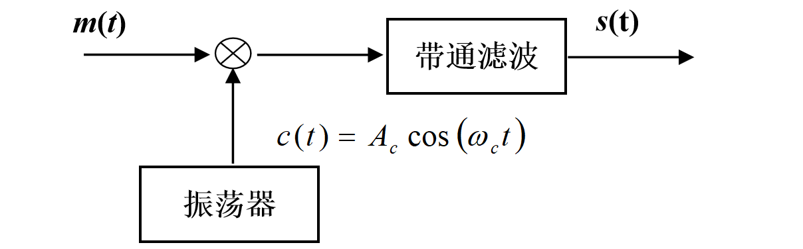
* 相干解调:

* 带宽\功率谱密度(无载波分量):
  B = 2W
  $$P(f)=\frac{A'^2}{4}[P_m(f-f_0)+P_m(f+f_0)]$$
### 单边带抑制载波调制
前提要引入两个基础知识:**希尔伯特变换和解析信号**
* 希尔伯特变换可以看作是一个系统,其单位脉冲响应$h(t) = \frac{1}{\pi{t}}$.系统函数为:

$$H(\omega)=-jsgn(\omega)=\begin{cases}-j,& \omega>0\\j,& \omega<0 \end{cases}$$
可以看出希尔波特变换就是个移相器(90度),不会改变频谱的幅值,能量也不会变化.
* 解析信号(处理带通的有效转换方法)
  我们定义解析信号:
*$$y(t) =x(t)+j\hat{x(t)}$$
 虚部为输入信号的希尔伯特变化,解析信号的作用是可以把双边谱转换为单边谱:
 $$Y(\omega)=X(\omega)+j(-jX(\omega)sgn(\omega))=2X(\omega),\omega>0$$
 理清楚这两个概念后,我们就能明白SSB-SC的原理了.
 * 信号产生(相移法)
 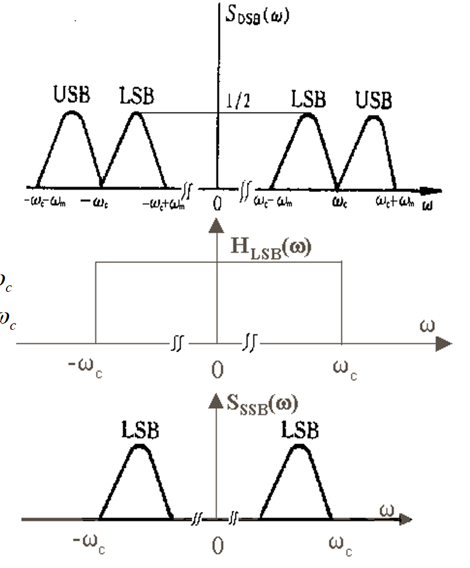
 
 $$S_{LSB}(\omega)=H_{LSB}(\omega)S_{DSB}(\omega)=[\frac{1}{2}(sgn(\omega+\omega_c)-sgn(\omega-\omega_c))][\frac{A_c}{2}(M(\omega+\omega_c)+M(\omega-\omega_c))$$
 展开得到：
 $$S_{LSB} = \frac{A_c}{4}[M(\omega+\omega_c)+M(\omega-\omega_c)]+\frac{A_c}{4}[M(\omega-\omega_c)sgn(\omega-\omega_c)-M(\omega+\omega_c)sgn(\omega+\omega_c)]$$
 而$$A_cm(t)cos(\omega_ct)\xrightarrow{FT}\frac{A_c}{2}[M(\omega+\omega_c)+M(\omega-\omega_c)]$$
 $$A_c\hat{m(t)}sin(\omega_ct)\xrightarrow{FT}\frac{A_c}{2}[M(\omega+\omega_c)sgn(\omega+\omega_c)-M(\omega-\omega_c)sgn(\omega-\omega_c)]$$
 则
 $$s_{LSB}(t) = \frac{1}{2}[A_cm(t)cos(\omega_ct)+A_c\hat{m(t)}sin(\omega_ct)]$$
$$s_{USB}(t) =\frac{1}{2}[ A_cm(t)cos(\omega_ct)-
 A_c\hat{m(t)}sin(\omega_ct)]$$
 总的来说,SSB就是DSB通过两个滤波器获得上下边频调制.
 * 相干解调(同DSB)
 * 带宽/功率谱
 B = W

## ✨角度调制
前提是角度调制是非线性调制,PM和FM其实是同一个东西。
核心就是了解PM\FM的最大频偏和调制指数、解调时的带宽和解调时的贝塞尔函数近似。
### FM、PM
- 最大频偏、相偏
我们假设输入信号为单频信号，则如果是FM，瞬时频率、最大频偏、相偏（调制指数）表达式为：
$$\omega(t)=\omega_c + K_f·u(\Omega{t})$$
$$|\Delta{\omega}|_{max}=K_fU_{\Omega{m}}$$
$$M_f = |\Delta\varphi|_{max}=|\int{K_f}·u(\Omega{t})|_{max}=\frac{U_{\Omega{m}}}{\Omega}K_f$$
由上式可以得到，调制指数与调制信号频率有关，FM信号可以表示为：
$$s_{FM}(t) = A_ccos(\omega_ct+K_f\int{cos(\Omega{t})dt)}$$
同理，如果输入为PM信号：
$$\varphi(t) = \varphi_c + K_p·u(\Omega{t})$$
$$|\Delta{\omega}|_{max}=K_p|\frac{du(\Omega{t})}{dt}|_{max}=K_p\Omega{U_{\Omega{m}}}$$
$$M_p = K_pU_{\Omega{m}}$$
由上式得到，PM调制指数与调制信号频率无关，PM可以表示为
$$s_{PM}(t) = A_ccos(\omega_ct+K_p{cos(\Omega{t}))}$$
综上可以得到一个核心式子（即⭐两个时域重要参数：最大频偏和调制指数的关系）：$$\Delta{f_{max}} = M·F$$
其中F为调制信号频率，这个式子在后面频域带宽推导有用。
### 频域分析（贝塞尔）
由于FM、PM是非线性调制（会产生很多边频分量），相干解调这些都用不了，导致频谱分析很复杂。故引入贝塞尔函数对时域FM/PM信号进行近似。
* 角度调制一般表达式
由于FM、PM就是相同的（只不过一个是cos一个是sin，但都是正弦信号），所以角度调制可以写为：
$$s(t) = A_ccos(\omega_ct+Mcos(\Omega{t}))$$
* 贝塞尔函数
s(t)可以由数学上的贝塞尔函数$J_n(\beta)$（**指宗数为$\beta$的n阶贝塞尔函数**）来表示，用贝塞尔近似的目的是利于求频谱。
$$cos(\omega{t}) =J_0(M)+2J_2(M)cos(2\omega{t})+...$$
$$sin(\omega{t}) =2J_1(M)sin(\omega{t})+2J_3(M)sin(3\omega{t})+...$$
s(t)则可以表示为各阶贝塞尔函数与谐波分量的乘积和（类似于傅里叶级数），产生许多边频分量。
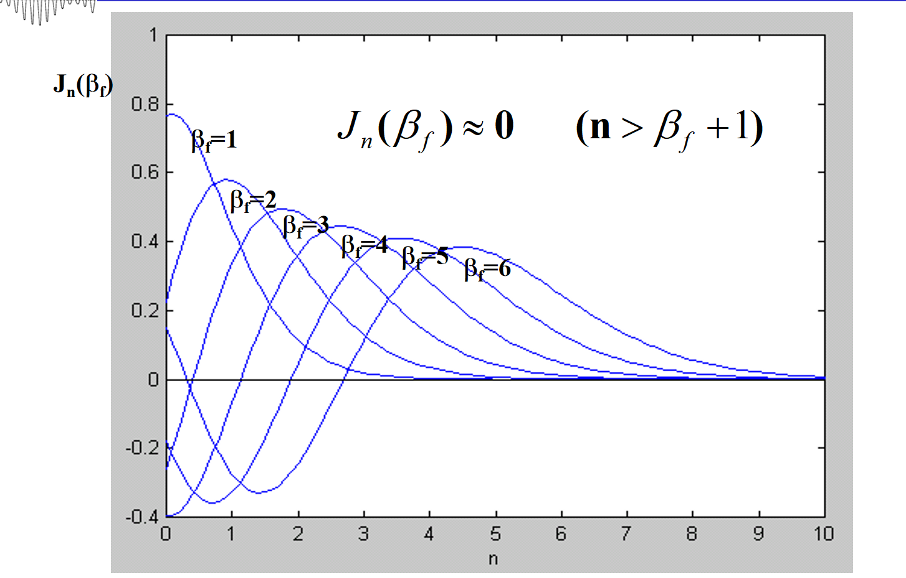
其中贝塞尔函数有两个重要性质：
1. 频谱上奇数次分量幅值相反，偶数次分量幅值相同：
$$J_n(M)=(-1)^nJ_{-n}{M}$$
2. 任意阶贝塞尔函数的能量均相同，均为1：
  $$\sum_{n=-\infty}^{+\infty}|J_n(M)|^2 = 1$$
* 角度调制的带宽
  由于角度调制的频谱由贝塞尔函数近似，而贝塞尔函数又是震荡衰减的。那么根据能量的99%近似截断以及上面推导出的 $\Delta{f_{max}}=M_fF$ 可以得到FM、PM带宽的一般表达式为:
  $$W=2(\Delta{f}_{max}+F)=2F(M_f+1) $$
## ✨模拟调制信号的抗噪声性能比较
### 复包络
由于我们知道，DSB和SSB调制实际上就是频谱线性搬移+带通滤波器，那么经过带通滤波器后的噪声该怎么表示呢？所以我们引出了复包络的概念——将一个带通信号等效为低通信号分析。（💡复包络的表达式就是窄带随机过程的表达式）。
#### 窄带随机过程
  在使用复包络的前提就是假设信号服从窄带随机过程（就是边带宽度$\Delta{f}<<f_c$），窄带随机过程包含以下性质：
  
#### 复包络的构建
  我们都知道在现实的复杂通信系统中，载波频率很高很复杂眼花缭乱，不可能利用足够大的采样率去获得低频的语音、视频信号的信息，而单纯的AM只能够提取简单信号的幅度信息。那当我们需要从一个复杂的载波中获取有用信号的幅度和相位信息该怎么化繁为简呢？🎶一个很美的数学概念诞生了！他就是复包络。
  **复包络的实质就是从复杂系统中抽离出有用信号的缓慢的幅度特征的同时还能得到相位特征。**
  任何一个满足窄带随机过程的信号可以表示为：
$$s(t) = a_I(t)cos(\omega_ct)-a_Q(t)sin(\omega_ct)$$
  其中$a_I(t)$和$a_Q(t)$分别为同相和正交分量。
  此时复包络（一个函数）定义为：
  $$g(t) = a_I(t)+ja_Q(t)$$
  从式子可以看出实际上复包络就是个时变的复数，他的模（也就是复平面上到原点的距离）就是我们想要的幅度信息。
  这个时候可以发现，s(t)可以表示为：
  $$s(t) = Re[g(t)e^{j\omega_{c}t}]$$
  $e^{j\omega_{c}t}$不就是绕着单位圆旋转吗？那么一个信号就可以想象为复平面的一个点绕着原点做着螺旋运动（距离远点的距离随复包络变化，而螺旋的速度则是由载频决定）。
  
#### 复包络的提取
  
   既然已经知道复包络怎么创建的了，那对于现实中一个复杂的接收信号，该怎么提取出他的复包络呢？💡这个时候就要联想到之前讲到的解析信号。
   我们已经知道一个实信号的解析信号为：
   $$y(t) =x(t)+j\hat{x(t)}$$
   解析信号引入了相位信息并且变成了单边频（幅值变为原来两倍），观察解析信号的形式就是复包络的形式（旋转的），**我们可以理解为解析信号就是复包络在物理世界中的实现！**
   那么：
   $$y(t) = g(t)e^{j\omega_ct}$$
   我只需要乘上$e^{-j\omega_ct}$就能够得到单纯的缓慢的幅度信息啦。
   💡当然任何一个调制都可以等效为一个复包络（AM的复包络相位为0【这也是为什么复包络有个“复”字】，PM的复包络幅度为常数，在QAM、量子力学中都有广泛应用...）
   总结来说：得到一个信号获得其复包络的步骤为：
   1. 让一个信号$x(t)$通过希尔伯特系统并得到$\hat{x(t)}$
   2. 构造解析信号$y(t)$（成了单边谱，幅值为原来两倍）
   3. $y(t)e^{-j\omega_ct}$获得复包络（时域相移对应频域左移到基频）
### 抗噪声性能比较
####  制度增益G和抗噪声性能
  💡首先我们要辨析这两个概念：
  制度增益是解调前后信噪比之比（反映的是系统解调之后信噪比的改善程度）：
  $$G = \frac{S_o/N_o}{S_i/N_i}$$
  而抗噪声性能不能通过制度增益比较！为了比较，根据控制变量法，应该通过控制输入功率、噪声、输入信号相同的情况下，根据输出信噪比来比较抗噪声性能。

  >以下均设定$A_c$为1，B为DSB带宽，$f_H$为输入基带信号的截止频率（$B = 2f_H$）

#### DSB
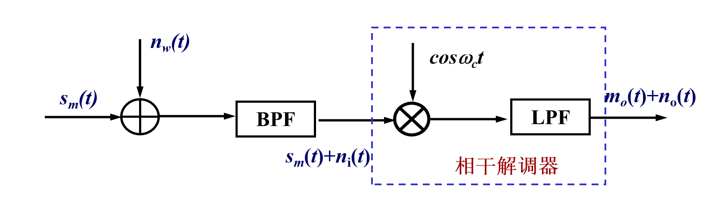
   $$\boxed{S_i=\overline{[m(t)cos(\omega_ct)]^2}=\frac{1}{2}P_m}$$
   由于加性噪声通过BPF变成窄带噪声，则n(t)表示为：
   $$n(t) = n_I(t)cos(\omega_ct)-n_Q(t)sin(\omega_ct)$$
   则$$\boxed{N_i=N_0B}$$
   解调后:
   $$s_o(t)=m(t)(\frac{1+cos(2\omega_ct)}{2})$$
   $$n_o(t) = n_I(t)(\frac{1+cos(2\omega_ct)}{2})-\frac{n_Q(t)sin(2\omega_ct)}{2}$$
   通过低通滤波器后:
   $$s_o(t) '= \frac{1}{2}m(t)$$
   $$n_o(t)' = \frac{n_I(t)}{2}$$
   则由$\overline{n_I(t)^2}=\overline{n_Q(t)^2}=\overline{n(t)^2}$得：$$\boxed{S_o =\frac{1}{4}P_m} $$
   $$\boxed{N_o = \frac{N_0B}{4}}$$
   制度增益为：$G_{DSB} = 2$
   输出信噪比：$SNR_o = \frac{P_m}{N_0W}(W=B)$
#### SSB
 $$s_{LSB}(t) = \frac{1}{2}[m(t)cos(\omega_ct)+\hat{m(t)}sin(\omega_ct)]$$
   则由解析信号只是相位改变，幅值相同的性质：
   $$\boxed{S_i = \frac{1}{4}P_m}$$
   $$n(t) = n_I(t)cos(\omega_ct)-n_Q(t)sin(\omega_ct)$$
   需要注意此时带宽为DSB的二分之一：$$\boxed{N_i=\frac{N_0B}{2}}$$
   解调后:
   $$s_o(t)=m(t)(\frac{1+cos(2\omega_ct)}{4})+\frac{\hat{m(t)}sin(2\omega_ct)}{2}$$
   $$n_o(t) = n_I(t)(\frac{1+cos(2\omega_ct)}{2})-\frac{n_Q(t)sin(2\omega_ct)}{2}$$
   通过低通滤波器后:
   $$s_o(t) '= \frac{1}{4}m(t)$$
   $$n_o(t)' = \frac{n_I(t)}{2}$$
   则由$\overline{n_I(t)^2}=\overline{n_Q(t)^2}=\overline{n(t)^2}$得：$$\boxed{S_o =\frac{1}{16}P_m} $$
   $$\boxed{N_o = \frac{N_0B}{8}}$$
   制度增益为：$G_{SSB} = 1$
   输出信噪比：$SNR_o = \frac{P_m}{N_0W}(W=\frac{B}{2})$
#### 包络调制
$$s(t) = A'm(t)cos(\omega_ct)+A_ccos(\omega_ct)=Ac(1+am_n(t))cos(\omega_ct)$$
- 包络检波（大信噪比）
  💡由于包络检波是非相干解调，会出现**门限效应**，故适合大信噪比情况下；此外非相干解调时无法将噪声和输入信号分离开：

  $$\boxed{S_i = \overline{[Ac(1+am_n(t))]^2} =\frac{A_c^2}{2}+\frac{a^2P_{mn}}{2}}$$
  $$\boxed{N_i=N_0B}$$
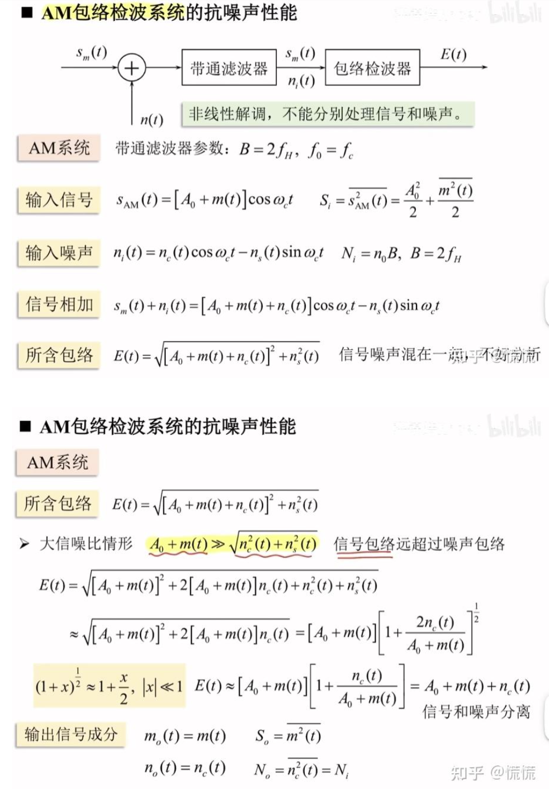
由上述推导可以得到:
$$\boxed{S_o =P_m} $$
$$\boxed{N_o = N_0B}$$
  制度增益为2倍的包络检波效率：$\color{yellow}{G_{AM}} = 2\eta$
  输出信噪比：$SNR_o = \eta\frac{P_m}{N_0W}(W=B)$
  💡可以看出包络检波到最后输出信号功率和噪声功率返璞归真了，与输入进去的一样。
  - 相干解调（小信噪比）
  💡制度增益与包络检波同
#### FM
同包络调制，FM解调也为非相干解调（也称鉴频）（💡联想到通信电路中[[通信电路|鉴频电路]]中的频相转换、频幅转换电路，**本质上就是利用的LC选频网络的幅频特性和相频特性曲线中的线性频偏**）
由带宽公式：
  $$W=2(\Delta{f}_{max}+F)=2F(M_f+1) $$
$$G_{FM} = 3M_f^2(M_f+1)$$
两个式子结合起来看，我们可以通过增大带宽来增大调制增益！

综上，我们给出各种调制方式的抗噪声性能比较：
从表中可以看出：
信噪比：FM>DSB=SSB>AM
频谱效率：SSB>DSB=AM>FM
复杂度：SSB>DSB=FM>AM

| 调制方式       | 带宽 $W$                       | 复杂度 | 频谱效率 | 输入信噪比 $S_i/N_i$             | 输出信噪比 $SNR_o$   | 制度增益 $G$             |
| ---------- | ---------------------------- | --- | ---- | --------------------------- | --------------- | -------------------- |
| DSB（相干 解调） | $2f_H$                       | 中等  | 低    | $P_m/(2N_0B)$               | $P_m/N_0B$      | $2$                  |
| SSB（相干解调）  | $f_H$                        | 高   | 高    | $P_m/(2N_0B)$               | $P_m/N_0B$      | $1$                  |
| 包络调制-包络检波  | $2f_H$                       | 低   | 低    | $(A_c^2+a^2P_{mn})/(2N_0B)$ | $\eta P_m/N_0B$ | $2\eta$（$\eta$为检波效率） |
| 包络调制-相干解调  | $2f_H$                       | 中等  | 低    | 同包络检波                       | 同包络检波           | $2\eta$              |
| FM（非相干解调）  | $2(\Delta f_{\text{max}}+F)$ | 中等  | 极低   | -                           | -               | $3M_f^2(M_f+1)$      |
|            |                              |     |      |                             |                 |                      |
## 😍本章总结
虽然说现实中不太用模拟通信系统了，但它却是入门通信的敲门砖。重充分理解之后不仅能在学习数字频带调制方面很轻松，而且通信电路中的线性/非线性频率变换电路的基本原理也能掌握的稳稳的。

本章的重点是：
- 幅度调制的调制和解调过程（⭐⭐⭐特别是SSB和包络调制）
- 掌握了从希尔伯特变换->解析信号->复包络的逻辑链（建立了对所有调制信号的宏观理解）
- 角度调制中的时域上的最大频偏、调制指数，频域上的贝塞尔函数以及其衍生出的卡森带宽公式
- 不同调制方法的抗噪声性能（输出信噪比）、调制增益比较

# 数字基带传输系统
## 😊学习概览
本章我们将从一个新的角度看待信号：即0与1表示的数字信号。这章不仅是ADC中采样、编码、量化的后续发展，也同上一章模拟通信系统的底层原理一同组成了下一章数字频带传输系统。（**模拟通信系统+数字基带传输系统=数字频带传输系统）

此外，本章的核心研究重点和难点除了调制外，还更加关注**平均误码率**这一接收端的最佳接收性能指标，可以和信息论与编码[[信息论与编码|信道译码准则]]的理论紧密结合。

本章我们将学习：

- 发送端数字脉冲调制（PAM）的原理、常见码型和功率谱密度计算
- AWGN信道->产生误码率->接收端匹配滤波器的最佳接收
- 限带信道->码间干扰->奈奎斯特第一准则->接收、发送滤波器的设计（理想低通、根升余弦）

## ✨数字基带信号及数字基带传输系统

### 数字基带信号

数字基带信号是适合于基带信号传输的脉冲信号（电脉冲），是二进制序列经过数字脉冲调制器(又称基带调制，具有低通特性）后所产生的信号。**数字基带信号的特点是功率谱密度为低通型。**

### 数字基带传输系统

**如果数字基带信号通过基带信道传输，则称为数字基带传输系统**。数字基带传输系统的传递函数也为低通型，在现实中，光纤、同轴电缆等有线信道均属于基带信道。

最简单的数字基带传输系统的框架包含波形转换发送（发送端）、匹配滤波器接收（接收端）等关键过程。
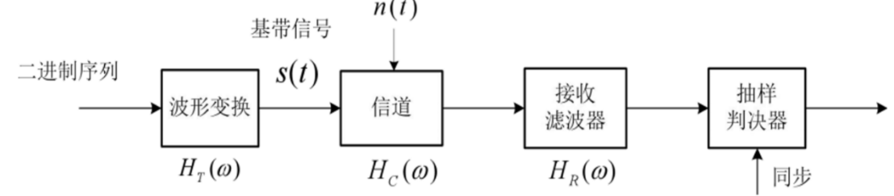
### 数字基带信号波形

#### 数字脉冲幅度调制PAM

- PAM波形产生
  数字脉冲幅度调制是将数字序列的信息加在脉冲载波的幅度上，从而输出MPAM信号。
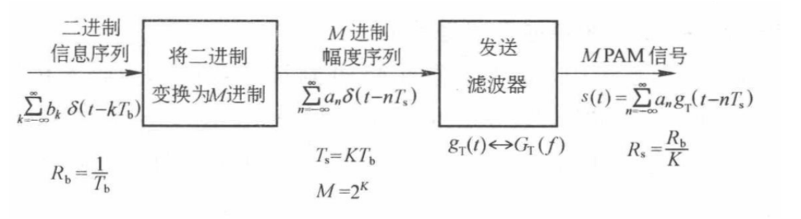

  MPAM 信号的一般表示式可写为:
$$s(t)=\sum_{n=-\infty}^{+\infty}a_ng_T(t−nTs)$$
$$K = log_2(M)$$
  对于 MPAM 来说，在 M 进制符号间隔 Ts内，每输入 K 个二进制符号，可映射为 M 个可能信号波形$s_i(t)$之一，**而其中 MPAM 信号波形的形状只由发送滤波器的传递函数$g_T(t)$决定**。

* PAM功率谱密度计算
  由于$a_n$为**广义平稳序列(循环平稳）**（💡联系到之前讲到的循环平稳随机过程的判断条件），可以推得一般形式的PAM信号功率谱密度公式为：
$$S(f)=\frac{1}{T_s}|G_T(f)|^2\sum_{m=−\infty}^{+\infty}R_a(m)e^{−j2\pi{f_mT_s}}$$
  其中 $|G_T(f)|^2$为发送滤波器的功率传递函数，$R_a(m)$为$a_n$的自相关函数。💡这个式子根据功率谱密度的定义式子可以理解为**输入二进制序列的功率谱密度与发送滤波器功率谱密度的乘积**，本质就是一个信号通过一个系统（时域卷积，频谱、功率谱相乘）

  💡此外还有一点需要注意哦，指数上的$2\pi{f_mT_s}$是数字角频率$\omega_s$(单位为rad），联系到[[数字信号处理]]中的定标准则：**数字角频率是模拟角频率在采样率上的归一化**。
  
  
  由于自相关函数与功率谱密度是一对傅里叶变换对，公式又可以写为：
$$S(f)=\frac{1}{T_s}|G_T(f)|^2P_a(f)$$
  两种特殊情况：
  1. 如果$a_n$为均值为0的不相关序列，则PAM信号的功率谱密度是**连续谱**（$a_n$的功率谱就是其方差）：
  $$R_a(k) = E[a_n a_{n+k}] = \begin{cases} \sigma_a^2, & k=0 \\ 0, & k \neq 0 \end{cases}$$
$$S(f)=\frac{σ_a^2}{T_s}|G_T(f)|^2$$
  >💡联想到AWGN的特性，由于$a_n$自相关函数只在$k=0$时有取值，那么结合维纳-辛钦定理，可以得到$a_n$的功率谱就是**单一频点有值的脉冲**，此时方差 = 功率谱密度 = 平均功率（所以也就为什么值为方差） 
  
  2. 如果$a_n$为均值不为0的不相关序列，则$a_n$可以表示为$c_n+m_a$，其中$m_a$为均值，则功率谱中还会存在离散谱（频率为$\frac{1}{T_s}$的整数倍）：
$$S(f)=\frac{σ_a^2}{T_s}|G_T(f)|^2+\frac{m_a^2}{T_s}\sum_{m=−∞}^{+∞}|G_T(\frac{m}{T_s})|^2δ(f−\frac{m}{T_s})$$
>💡后面离散谱的理解是：由于$s(t)$是二进制序列每隔$T_s$与发送滤波器成形一次，那么$m_a$就是一个冲激串（为周期信号，而周期信号的频谱是离散的）并且$m_a$的功率谱密度就是其平方。

#### PAM常用码型(发送滤波器的波形)
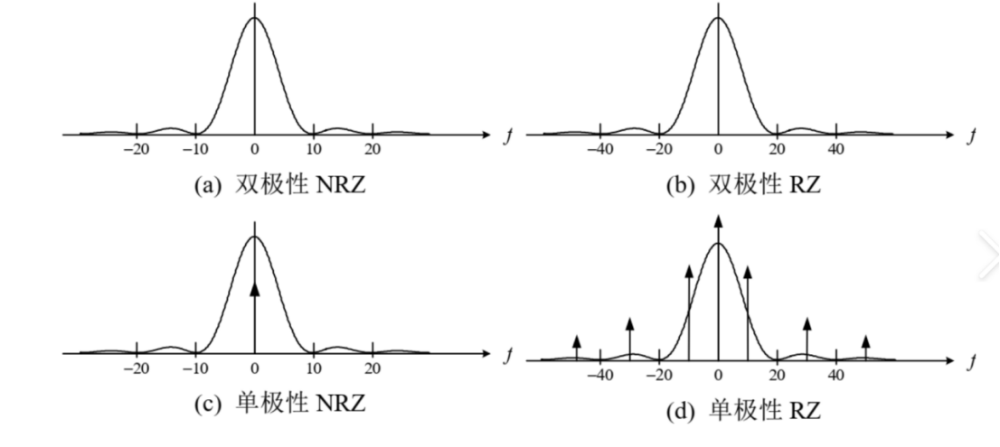
- 不归零码(NRZ)
  1. 单极性不归零码​
  其中2PAM的发送滤波器冲激响应为矩形不归零脉冲。
  
  单极性不归零码的功率谱密度的主瓣为Rb，且**具有直流分量，但是无时钟分量**。

  2. 双极性不归零码​
  其中2PAM的发送滤波器冲激响应为双极性矩形不归零脉冲。
  
  双极性不归零码的功率谱密度的主瓣为Rb，只有连续谱，没有直流分量。

-  归零码(RZ)
   假设为半占空：$T_s=\frac{T_b}{2}$，其中，单极性归零码的功率谱密度存在**连续、直流分量、时钟分量及其奇数次谐波分量，主瓣为2Rb**；双极性归零码的功率谱密度**只存在连续谱，主瓣也为2Rb**。
   
- ⭐差分码（相对码）
  差分码实际上就是相邻码元实现一个异或操作（模2加），使得编码后的输出不仅与本身有关，还与前一个码元有关。
  💡联想到差分码的特性可以解决BPSK的相位模糊问题，即DPSK技术
  
- AMI码
  AMI码又称交替极性码，编码规则为：**0对应零电平，1对应交替出现的正负脉冲**
  💡AMI码的特性使得其具有了**检错能力**（如果收到两个同极性的脉冲，则一定有误码），但是也存在出现长串0导致同步困难。
  
- ⭐$HDB_3$码
  为了解决AMI的问题，就提出了$HDB_3$码（提取时钟便捷）。其编码规则的核心就是当连续出现4个0时，将这`0000`替换为特定的码组`B00V`或`000V`。(**最后的检验有三步：V是否与前面的非零符号极性相同；V是否正负交替；去掉V剩下的所有符号是否正负交替**)
  >`B`（Balance）: 破坏脉冲，极性与前一个`1`码的极性**相同**，以破坏AMI的交替规则。`V`（Violation）: 平衡脉冲，极性与前一个`B`码的极性**相反**，以维持直流平衡。

- CMI码
  CMI码的编码规则为00、11均为1，上升沿（01）为0（**即同1异0**）

- 数字双相码（曼彻斯特编码）
  曼彻斯特编码的编码规则为根据电平的跳变：01为0，10为1。
  💡联想到[[计算机网络]]中的局域网编码就是用的曼彻斯特编码。

## ✨ 带宽无限AWGN信道下的最佳接收

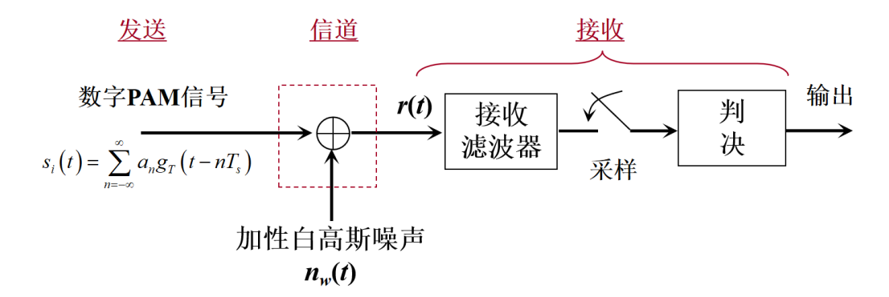
###  理想AWGN信道

 理想加性高斯白噪声（AWGN）信道的核心特征为：**噪声均值为0，双边功率谱密度为$\frac{N_0}{2}$**。在该信道中，PAM信号的传输模型为接收信号等于**发送信号与噪声的叠加**，即：

$$r(t)=s_i(t)+n(t)$$

 其中，$s_i(t)$ 为发送的PAM信号(i=1,2)，对应二进制符号“1”和“0”，n(t) 为均值为0、双边功率谱密度为 $\frac{N_0}{2}$的加性高斯白噪声。
### 匹配滤波器

为了使得PAM信号在接收端实现**平均误比特率最小且信噪比最大**，需设计一个匹配滤波器来进行接收。由柯西-施瓦茨不等式和Q函数单调递减的性质可以推得，匹配滤波器的冲激响应为：$$h(t)=s(Ts−t)$$其物理意义为一个时间反转的差值最佳滤波器。
### 误码率性能

在带宽无限AWGN信道下，接收信号经匹配滤波器滤波后，在Ts时刻抽样的输出信号为：
$$z=a_i+n_0$$

其中，抽样值$n_0$是**经过匹配滤波器后**的噪声样值，仍服从均值为0的高斯分布，其方差代表噪声的平均功率，表达式为：

$$σ_0^2=\frac{N_0}{2}\int_{−∞}^{+∞}h^2(t)dt$$

- 似然函数
  似然函数描述“已知发送某个符号的条件下，接收到某个值的概率密度”。（**就是先验转移概率**）结合接收信号模型$z=a_i+n_0$，由于$n_0$服从高斯分布，可推导得：
  1. 已知发送 s1 时，接收值为z的似然函数：
$$p(z|s_1) = \frac{1}{\sqrt{2\pi}\sigma_0} \exp\left(-\frac{(z-a_1)^2}{2\sigma_0^2}\right)$$

  2. 已知发送 s2 时，接收值为z的似然函数：
$$p(z|s_2) = \frac{1}{\sqrt{2\pi}\sigma_0} \exp\left(-\frac{(z-a_2)^2}{2\sigma_0^2}\right)$$
>**似然函数本质是平移后的高斯分布，如 p(z|s1) 以 a1 为中心。**

- 判决规则与判错概率
  设定判决门限γ0 （满足a1<γ0<a2），判决规则为若z>γ0 ，则判为发送s1；若z≤γ0，则判为发送s2。
  基于该规则，存在两种错判情况，对应的判错概率分别为：
  1. 发送s1但判为s2（此时z≤γ0）：
  $$P(e|s1)=\int_{−∞}^{γ_0}p(z|s_1)dz$$

  2. 发送s2但判为 s1（此时z>γ0）：
$$P(e|s2)=\int_{γ_0}^{+∞}p(z|s_2)dz$$
  则总误码率为两种错判概率的**加权和**（权重为各信号的先验概率）（就是乘法公式）：
$$P_E=P(s_1)P(e|s_1)+P(s_2)P(e|s_2)$$

-  最大似然判决准则（ML准则）
  最大似然判决准则的核心目标是**通过选择最佳判决门限γ0使总误码率Pe最小。对Pe求导并令导数为0，可得到最佳判决条件。** 💡联想到信息论与编码里面信道译码的最大似然准则！

  对于先验等概（P(s1)=P(s2)=12）的常见场景，ML准则简化为：
1. 若 p(z|s1)≥p(z|s2)，则判为发送s1；
2. 若 p(z|s1)<p(z|s2)，则判为发送s2。
  此时，最佳判决门限γ0 为 a1 和 a2 的中点：

$$γ_0=\frac{a_1+a_2}{2}$$
- 最佳判决时的误码率计算

  平均比特能量$E_b$代表单位比特携带的信号能量，是衡量系统传输效率的重要参数。结合匹配滤波器的最大信噪比特性，引入信号相关系数ρ后，可推导得到更通用的误码率公式。
 
$$P_E=Q(\sqrt{\frac{E_b(1-\rho)}{N_0}}$$
- 典型信号性能对比

  结合前文所述的单极性不归零码和双极性不归零码的信号特性，代入通用性能公式可得到具体的误码率表达式：
  
  1. 单极性不归零码的发送信号波形为s1(t)=A、s2(t)=0，对应的符号能量 $E_{s1}=A^2T_s$、$E_{s2}=0$，相关系数 ρ=0。平均比特能量$E_b=\frac{E_{s1}+E_{s2}}{2}=\frac{A^2T_s}{2}$，代入通用公式可得误码率：
$$P_E=Q(\sqrt{\frac{E_b}{N_0}})$$
  2. 双极性不归零码的发送信号波形为s1(t)=A、s2(t)=−A，对应的符号能量 $E_{s1}=E_{s2}=A^2T_s$，相关系数 ρ=−1。平均比特能量$E_b=A^2T_s$，代入通用公式可得误码率：
$$P_E=Q(\sqrt{\frac{2E_b}{N_0}})$$
  对比可知，在相同 $\frac{E_b}{N_0}$ 条件下，**双极性不归零码的误码率更低**，抗噪声性能更优，这也是其在实际通信系统中应用更广泛的原因。
## ✨ 限带信道与码间干扰

但由于现实中信道都是有限带宽的，当一个脉冲信号通过带限信道后，其波形会发生**展宽、拖尾**。如果前一个/后一个信号的尾巴延伸到了当前码元采样时刻则会造成判决干扰，这种就被称为**码间干扰**。

### 无码间干扰的奈奎斯特第一准则

为了解决码间干扰，确保接收端能准确判决码元，必须遵从**奈奎斯特第一准则**。该准则明确了无码间干扰传输的核心条件，分为**时域和频域**两种等价表述：

- 时域条件
  系统的联合冲激响应h(t) 需满足：在当前码元的抽样时刻(t=0)，对应k=0取值为非零常数，在所有其他码元的抽样时刻（t=kTs，k为非零整数）取值恰好为0，即：

$$\boxed{ h(kT) = \begin{cases} 1, & k=0 \ 0, & k \neq 0\end{cases}}$$
  该条件的物理意义是：仅当前码元在自身抽样时刻贡献信号能量，所有其他码元的拖尾在该时刻完全抵消，从而消除码间干扰。

- 频域条件

  将系统联合冲激响应h(t)（即滤波器的系统函数）的傅里叶变换H(f)（即系统的频率响应）按码元速率的1/Ts进行周期延拓，所有延拓后的频谱叠加结果应为一个常数，即：

$$\boxed{ \sum_{i=-\infty}^{\infty} H(f - \frac{i}{T_s}) = C \quad (\text{常数})}$$

#### 理想低通系统
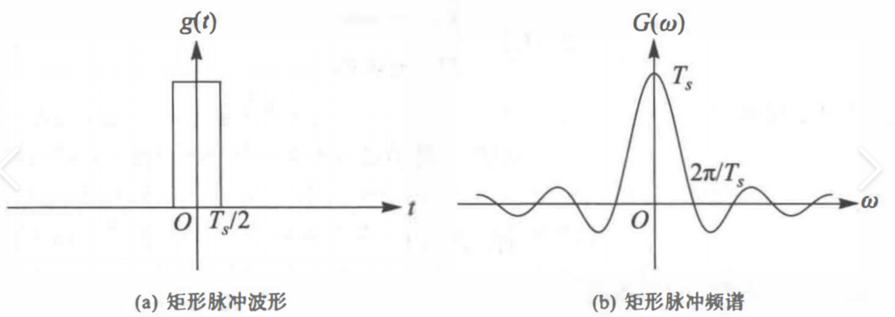

满足奈奎斯特第一准则的最窄带宽系统是**理想低通系统**，其频率响应具有严格的矩形特性，是无码间干扰传输的**理论极限模型**。

理想低通系统的频率响应为理想低通方波($|f|\leq{\frac{1}{T_s}}$)💡实质上就是奈奎斯特采样定理！

对应的冲激响应为：
$$h_{ideal}(t)=sinc(\frac{t}{Ts})=\frac{sin(\frac{πt}{T_s})}{\frac{πt}{Ts}}$$
理想低通系统的核心参数为**奈奎斯特带宽**（无码间干扰传输所需的最小带宽）
和**奈奎斯特速率（（带限信道无码间干扰传输的速率极限），其值分别为：
$$W_N=\frac{1}{2T_s}$$
$$R_s=\frac{1}{Ts}=2W_N$$
$$\eta = 2$$

💡但是理想低通系统存在两个关键缺点：
- 物理不可实现：理想低通（矩形）的频率响应在 f=±12Ts处存在突变，对应的冲激响应是无限长的sinc函数，无法通过实际电路实现。
- 定时精度要求高：冲激响应的拖尾衰减速度慢（与 1/t 成正比），若抽样时刻存在微小偏差，就会引入显著的码间干扰，实际系统中难以满足定时精度要求。

#### 升余弦滚降系统

为了克服理想低通系统**物理不可实现和定时敏感**的缺点，实际通信系统中通常采用**具有滚降特性**的滤波器，其中最典型的是升余弦滚降系统。该系统通过让**频谱从通带到阻带平滑过渡（滚降）**，实现物理可实现性并降低定时精度要求。

**滚降系数 α** 定义为滚降带宽与奈奎斯特带宽的比值，取值范围为 ( 0≤α≤1)，其物理意义是频谱过渡区的宽窄程度。

**升余弦滚降系统的带宽**为奈奎斯特带宽与滚降带宽之和，即：

$$W_{RC}=(1+α)W_N=\frac{(1+α)}{2T_s}$$
$$\eta = \frac{2}{1+\alpha}$$

由此可以看出，升余弦滚降系统是在**牺牲频带利用率和带宽**的前提下换取了物理上可实现。

## ✨带宽有限AWGN信道下的最佳接收
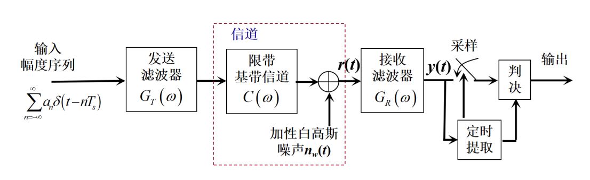

为了使得PAM信号能没有码间干扰前提下通过带限AWGN信道且能在接收端平均误码率最低的同时信噪比最大。我们需要设计发送滤波器和接收滤波器的波形均为**根升余弦**，经过理论推导得到：
$$G_T(f)=G_R(f)=X_{rcos}(f)$$
 其中$X(f)=G_T(f)·C(f)·G_R(f)$。
## 😍本章总结

本章我们主要学习了数字的发送与接收：
- 发送方面主要是PAM的原理、码型和功率谱密度
- 接收方面主要针对两个信道（AWGN和限带）分别处理其带来的误码率和码间干扰问题，引出匹配滤波器和奈奎斯特第一准则**两个利器**，实现最佳传输。