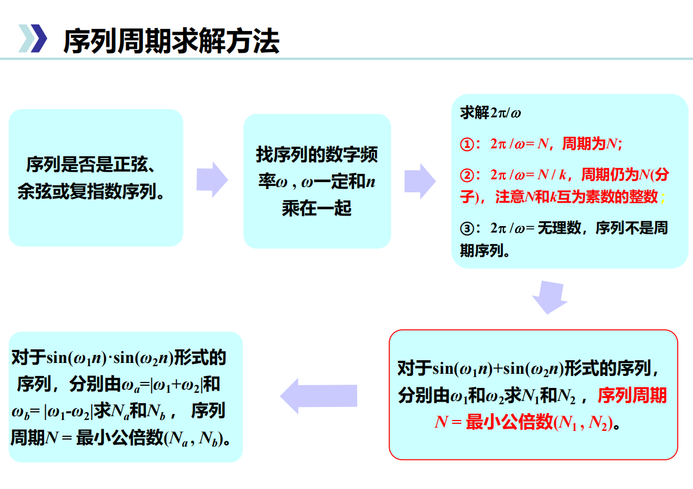
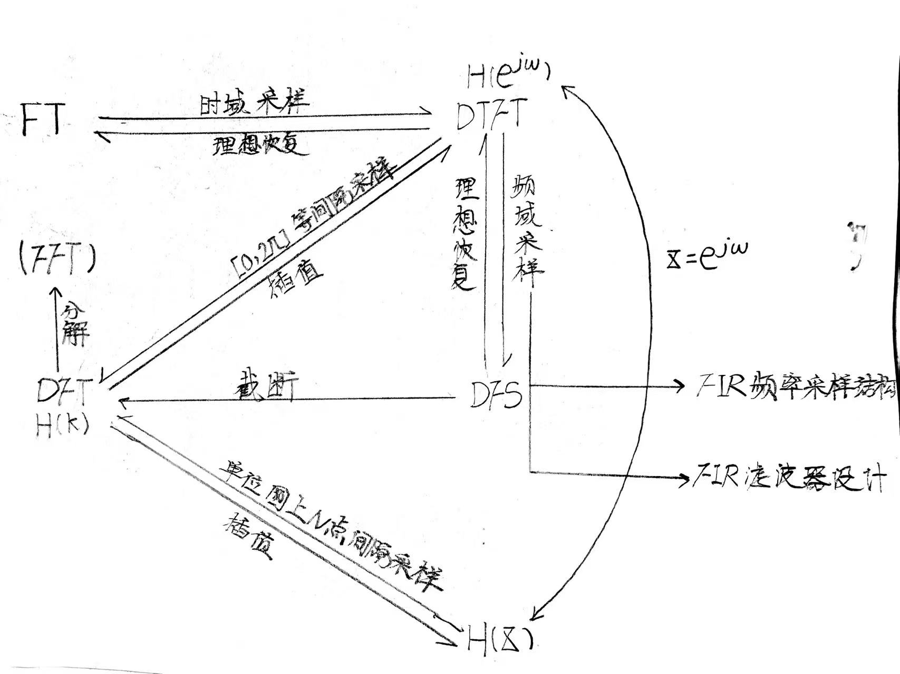
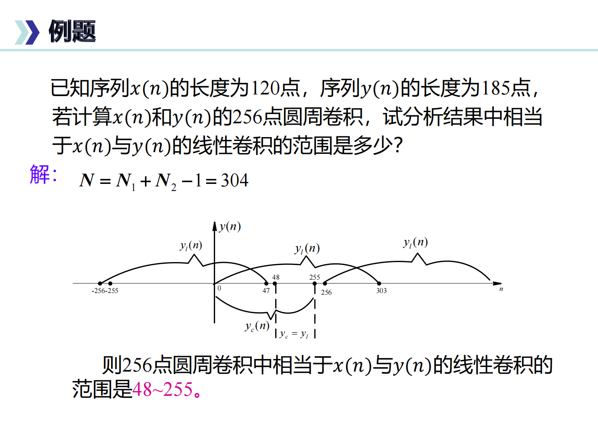
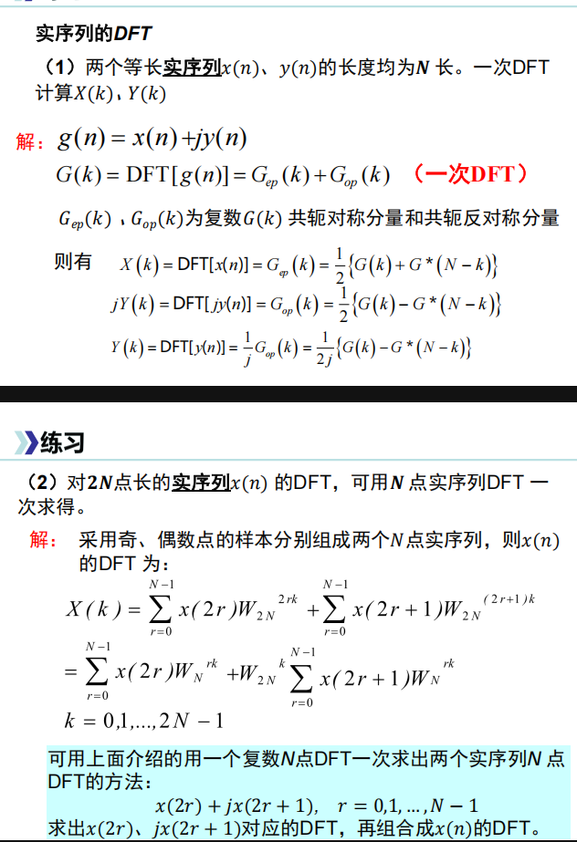
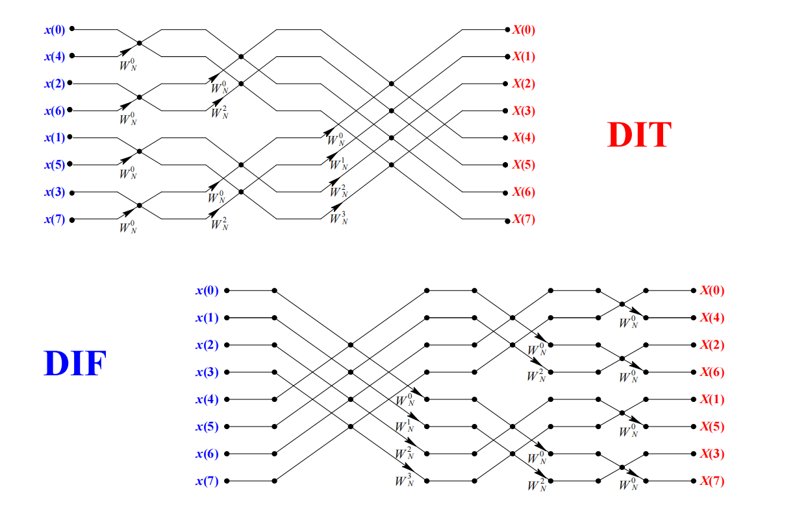
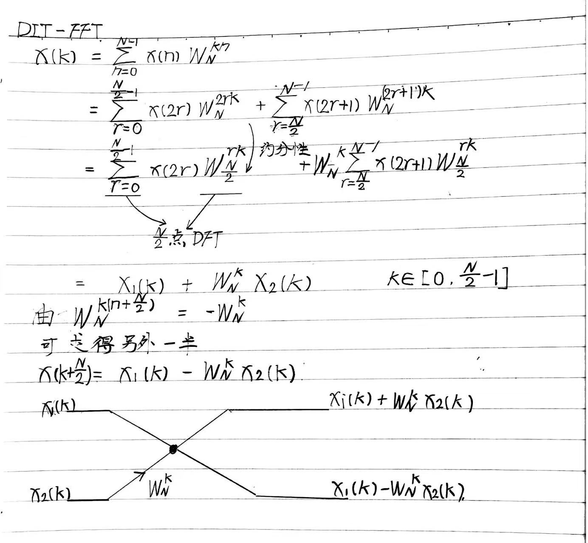
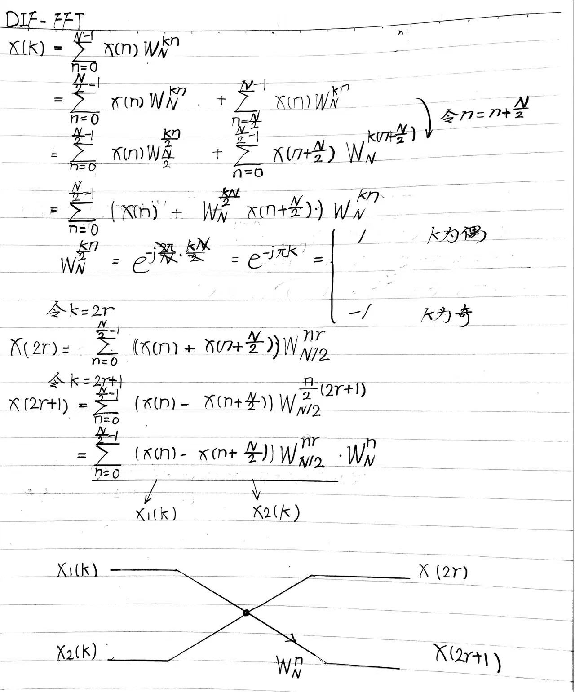

# ✨离散数字信号的时域分析

>💡辨析：离散信号是时域采样后的信号（时间离散幅值连续）；而数字信号是离散信号再经过量化这道工序的信号（时间、幅值均离散）

$$x[n]=x_a(nT_s)$$
## 常见序列
- 冲激序列$\delta[n]$
1. ⭐ 任意序列表示定理：$$x[n]=\sum_{m=-\infty}^{+\infty}x[m]\delta[n-m]=x[n]*\delta[n]$$
2. 与时域形式相同的卷积性质:$$x[n]*\delta[n-n_0]=x[n-n_0]$$
- 阶跃序列$u[n]$
1. ⭐$\delta[n]$与$u[n]$的关系（累加-差分）：
$$u[n]=\sum_{k=0}^{+\infty}\delta[n-k]=\sum_{k=-\infty}^{n}\delta[n]$$
$$\delta[n]=u[n]-u[n-1]$$
## 序列运算
- 线性卷积（💡联想到信号与系统的**列表法**，当然还有DFT中**循环卷积求线性卷积**！）
- 压缩/抽取 $x[mn]$（每个m-1点抽取1点）
- 拉伸/差值 $x[\frac{n}{m}]$（每两点之间插m-1个0值）
- 周期

## 线性系统
- 线性
$$T\{ax_1[n]+bx_2[n]\}=ay_1[n]+by_2[n]$$
- 时不变
$$y[n-n_0] = T\{x[n-n_0]\}$$
- ⭐因果
$$h[n]=0, n<0$$
>右边序列和FIR均为因果序列
- ⭐稳定
$$\sum_{n=-\infty}^{+\infty}h[n]<\infty$$
>简单来说就是输入有界，输出有界。**实验方法为输入阶跃序列，看输出是否收敛**
- ⭐⭐⭐差分方程（时域分析的利器⚔️）
$$y[n]=\sum_{i=0}^{N}b_ix[n-i]-\sum_{j=1}^{M}a_jy[n-j]$$
>💡联想到实验中求系统响应的两种方法：**差分方程递推法和单位脉冲响应线性卷积法**

# ✨数字离散信号的频域分析
## 傅里叶家族【四世同堂】（频域分析的利器1⚔️）

### ⭐单位对标关系
- 频率$f_s$ : 单位时间内单位圆旋转的圈数(Hz)
- 模拟角频率$\Omega_s$: 单位时间内转过的弧度(rad/s)
 $$\Omega_s = 2\pi{f_s}$$
- 数字角频率$\omega_s$: 模拟角频率在采样率上的归一化(rad)(范围$[0,2\pi]$)
 $$\omega_s = \Omega_sT_s=\frac{\Omega_s}{F_s}$$
 - 采样编号$k$: 对应N个采样点中的序号(范围$[0,N-1]$)
   $$\omega_s = \frac{2\pi{k}}{N}$$
 
>k即为在数字角频率$[0,2\pi]$上等间隔采样N个点。四个单位的对应关系为：$\frac{f_s}{2}$(奈奎斯特折叠频率)->$\frac{\Omega_s}{2}$->$\omega_s=\pi$(高通)->$k = \frac{N}{2}$

### FS
- 连续时间傅里叶级数表达式（**连续周期—离散非周期**）：
$$x(t) = \sum_{n=-\infty}^{+\infty}x_ne^{j\omega{n}t}$$
$$x_n = \frac{1}{T}\int_{-\frac{T}{2}}^{\frac{T}{2}}x(t)e^{-j\omega{t}}dt$$

###  FT
- 连续时间傅里叶变换表达式（**连续非周期—连续非周期**）：
$$X(e^{i\omega}) = \int_{-\infty}^{+\infty}x(t)e^{-j\omega{t}}dt$$
$$x(t) = \frac{1}{2\pi}\int_{-\pi}^{\pi}X(e^{j\omega})d\omega$$
- ⭐时域采样定理和理想恢复
$$y[n]=\sum_{n=-\infty}^{+\infty}x(nT_s)\delta(t-nT_s)$$
$$Y(j\Omega)=\frac{1}{T_s}X(j\Omega-jn\Omega_s)$$
  其中冲激串的DFS为梳状滤波器：
  $$H(\omega)=\frac{1}{T_s}\sum_{m=-\infty}^{+\infty}e^{jm\Omega_st}$$
  采样条件（奈奎斯特采样定理）
  $$f_s\geq{2f_c}$$
  
  理想内插公式为：
$$g(t)=\sum_{n=-\infty}^{+\infty}x(nT_s)sinc(\frac{t-nT_S}{T_s})$$
>💡由于时域采样会导致频域周期延拓，周期延拓则会造成混叠，故前提是满足$f_s\geq{2f_c}$；同理后面的频域采样会导致时域周期延拓，也会造成混叠，故前提是满足采样点数N大于序列长度M。

>💡时域采样和频域采样理想恢复的底层逻辑都是**加窗截断**，而这个思想在DSP很多地方都出现过: 抗混叠滤波器为了滤除$\frac{f_s}{2}$以上的高频分量；DFT进行谱分析对模拟信号时域加了时间长度为$T_p$的截断；DFT从DFS去取主值区间的截断；FIR滤波器的窗函数截断...

### DTFT
- 离散时间傅里叶变换表达式（**离散非周期—连续周期**）：
$$X(e^{i\omega}) = \sum_{n=-\infty}^{+\infty}x[n]e^{-j\omega{n}}dn$$
$$x[n] = \frac{1}{2\pi}\int_{-\pi}^{\pi}X(e^{j\omega})d\omega$$
- 性质
1. 微分性质
$$DTFT[nx[n]]=-j\frac{dX(\omega)}{d\omega}$$
>💡联想到Z变换中也有类似形式的性质：$$ZT[nx[n]]=-z\frac{dX(z)}{dz}$$

2. ⭐⭐⭐对称性
   对于**任意复序列**都可以表示为**共轭对称分量和共轭反对称分量的和**：
$$x[n] = x_{e}[n]+x_{o}[n]$$
$$X(e^{i\omega}) = X_{e}(e^{i\omega})+X_{o}(e^{i\omega})$$
   其中共轭对称分量满足（时域频域相同）:
   $$x_e[n]=x^*_e[-n]$$
   $$x_e[n]=\frac{1}{2}[x[n]+x^*[-n]]$$
   共轭反对称分量满足（时域频域相同）：
   $$x_o[n]=-x^*_o[-n]$$
$$x_o[n]=\frac{1}{2}[x[n]-x^*[-n]]$$
   又可知**任意复序列**可以表示为**实部与虚部的和**：
   $$x[n] = x_r[n]+jx_i[n]$$
   故
   $$FT[x_r[n]]=X_e(e^{j\omega})$$
  $$FT[jx_i[n]]=X_o(e^{j\omega})$$
   同理，**任意实序列**可以表示为偶分量和奇分量之和：
$$x[n] = x_{e}[n]+x_{o}[n]$$   $$x_e[n]=\frac{1}{2}[x[n]+x[-n]]$$
$$x_o[n]=\frac{1}{2}[x[n]-x[-n]]$$
>💡此时$X(e^{j\omega})$只存在共轭对称分量。

>💡DTFT的基本共轭对称结论：
>$$DTFT[x[-n]]=X(e^{-j\omega})$$
>$$DTFT[x^*[-n]]=X^*(e^{j\omega})$$
>$$DTFT[x^*[n]]=X^*(e^{-j\omega})$$

- ⭐频域采样定理和理想恢复
$$\omega = \frac{2\pi{k}}{N}$$
$$\tilde{Y}(K)=\sum_{n=-\infty}^{+\infty}x(n)e^{-j\frac{2\pi{k}}{N}}$$
  时域为周期延拓：
  $$\tilde{y}[n]=\sum_{r=-\infty}^{+\infty}x[n+rN]$$
  采样条件
  $$N\geq{M}$$
  
  理想内插公式推导为：
  
$$X(\omega)= \frac{1}{N}\sum_{k=0}^{N-1}X[k]\frac{sin[\frac{N}{2}(\omega-\frac{2\pi{k}}{N})]}{sin[\frac{1}{2}(\omega-\frac{2\pi{k}}{N})]}e^{-j\frac{N-1}{2}(\omega-\frac{2\pi{k}}{N})}$$
$$X(z) = \frac{1}{N}(1-z^{-N})\sum_{k=0}^{N-1}\frac{Y[k]}{1-W_N^{-k}z^{-1}}$$
>💡由理想插值公式的Z域表达式中的两项分别是梳状滤波器和谐振器，在后续**FIR的频率采样结构**和**频率采样法设计FIR滤波器**部分很重要。

### DFS
- 离散时间傅里叶级数表达式（**离散周期—离散周期**）（周期为N）：
$$\tilde{x}[k] = \sum_{n=0}^{N-1}\tilde{x}[n]e^{-j\frac{2\pi{k}n}{N}}$$
$$\tilde{x}[n] = \frac{1}{T}\sum_{k=0}^{N-1}\tilde{x}[k]e^{j\frac{2\pi{k}n}{N}}$$

### DFT
>DFT就是DFS取一个周期（0~N-1）的主值区间：
>$$x[n] = \tilde{x}[n]R_N[n]$$
>💡**DFT产生的根本原因就是为了能够让计算机计算！**
>💡DFT得到的序列$X[k]$的本质就是在DTFT$X(e^{j\omega})$在数字角频率$[0,2\pi]$上等间隔$T_s$采样N个点，在X(Z)的单位圆上等间隔采样N个点，在模拟信号时域采样后的频谱采样N个点（DTFT）。**所以DFT可以处理任何连续/离散、周期/非周期的所有信号，周期那就截断，连续那就采样**。所以DFT就是DSP的最核心的内容。

- 离散傅里叶变换表达式（**离散周期【有限】—离散周期【有限】**）（长度为N）：
$$x[k] = \sum_{n=0}^{N-1}x[n]e^{-j\frac{2\pi{k}n}{N}}$$
$$x[n] = \frac{1}{T}\sum_{k=0}^{N-1}x[k]e^{j\frac{2\pi{k}n}{N}}$$
- ⭐矩阵定义DFT/
$$X[k] = D_Nx[n]$$
$$x[n]=\color{yellow}\frac{1}{N}D_N^{-1}X[k]$$
>💡除了直接套公式求N点DFT，矩阵也是一种方式。**中期试卷上有道大题就是用矩阵求解，而自己当时不知道这种方法（学得不到位）以为很难求就没求**（没求真煤球了😭）（说明当时学习还是不细致不踏实）

- DFT的性质
1. 循环移位
   时域上的循环移位：
$$DFT(x((n-m))_NR_N(n))=X(K)W_N^{mk}$$
   频域上的循环移位：
   $$IDFT(X((K+l))_NR_N(k))=x(n)W_N^{-ln}$$
>💡循环移位又叫**圆周移位**，其取模操作让我想到了[[数据结构]]中的循环队列，循环移位的条件为移位量m<N。此外，DFT的循环移位要注意符号（n和k的对应、正负号与FT/DTFT的区别）🎶**其实正负号依旧是时移同频移反，这里看起来反的是因为旋转因子的定义本身就含有一个负号！**
2. L点循环卷积（$L>max\{M,N\})$
$$x(n)*h(n) = \sum_{m=0}^{L-1}h(n)x((n-m))_LR_L(n)$$
>💡循环卷积定理是后面DFT的重要应用之一。循环卷积定理的求法除了图解法更常用矩阵法（**但是矩阵的形式一定要注意！**）
3. 对称性
  >💡对称性也是后面DFT的重要应用之一。其性质与DTFT类似只不过$x(-n)$变为$x(N-n)$的形式
4. 隐含周期性
   **DFT的周期性的来源就是旋转因子$W_N$**:
$$W_N=e^{-j\frac{2\pi}{N}}$$
   旋转因子具有周期性、对称性、可约性：
   $$W_N^{nk}=W_N^{n(k+N)}=W_N^{(n+N)k}$$
$$W_N^{nk^*}=W_N^{-nk}=W_N^{(N-n)k}=W_N^{n(N-k)}$$
$$W_{mn}^{mnk}=W_N^{nk}=W_{\frac{N}{m}}^{\frac{nk}{m}}$$

- DFT的应用
1. DFT利用循环卷积计算线性卷积
	
>💡利用循环卷积（因为能用FFT算法！）的实质就是借助**频域上的乘积等于时域上的卷积这一性质**，而满足循环卷积等于线性卷积的条件是：**两个DFT补零后等长且$L\geq{M+N-1}$!**
>💡而线性卷积和循环卷积的关系是：**循环卷积是线性卷积以L为周期的周期延拓后取的主值区间**。这也就导致如果$L\leq{M+N-1}$则会导致**混叠**(第**四**次出现混叠：抗混叠滤波器、时域采样、频域采样和循环卷积计算线性卷积）。

$$y_c[n]=\sum_{k=-\infty}^{+\infty}y_l[n+kL]R_L[n]$$
🎶这个知识点的常考知识点有：循环卷积计算线性卷积的原理（框图如上）、矩阵法计算、**混叠判断什么区间内两者才相等（经典例题）**
	

2. DFT进行谱分析
>通过实验我对这部分有了十分深刻的理解（谱分析是DSP课程中的两大重点之一，另一个是**滤波器设计**）
   💡我理解到，用计算机得出任何信号的频谱，**才不用各种复杂的傅里叶家族公式**❌，都是FFT谱分析，可见其重要性！😁

>⭐谱分析的误差：
>主要是混叠效应、栅栏效应和截断效应。
>**混叠效应产生于对连续信号进行采样会出现频谱周期延拓造成的混叠，故需要满足奈奎斯特采样定理**
>**栅栏效应产生于对连续频谱采样离散个点所产生的误差（如透过栅栏看东西，可能某些重要的信息被遮挡住了）**
>**截断效应是由于时域加窗截断会导致频谱展宽拖尾，从而引起频谱泄露和频谱干扰**（故需要设计良好的窗💡 联想到FIR滤波器中的窗函数）
3. DFT进行快捷运算（2种）

### FFT
>⭐FFT(快速傅里叶变换)**(由库利、图基提出)** 只是DFT的一种快速算法，利于计算机实现。在计算机中，所有的信号求频谱、卷积都是使用FFT，甚至从频谱转时域的逆变换也是基于FFT的IFFT。
>💡FFT的思想其实生活中很常见：将一个复杂问题分解为多个子问题然后最后汇总（计算机中乘法比加法慢很多），那么我N点DFT可以拆分两个N/2点DFT，N/2点DFT又可以拆为两个N/4点DFT...**最后只剩下一个2点DFT(只剩下一个复数加一个复数乘的操作）**
>💡那一开始怎么分解呢？如果选择奇偶分解就是DIT-FFT；选择前后分解那就是DIF-FFT（**两者有一种很神奇的对偶关系，说明本质上是一样的**）

- DIT-FFT
>输入倒序，输出自然序
>先乘后加减
  
- DIF-FFT
>输入自然序，输出倒序
>先加减后乘

-  运算量比较
   1. N点DFT（**从矩阵的角度**）：复数乘$N^2$，复数加$N(N-1)$
   2. N点IDFT（**从矩阵的角度**）:   复数乘$N^2+N$，复数加$N(N-1)$
   💡由于IDFT矩阵前有$\frac{1}{N}$因子！需要注意。
   3. N点FFT（**从蝶形运算角度**）：复数乘$\frac{N}{2}log_2{N}$（由于每一级有N/2个蝶形单元，共有$log_2{N}$级），复数加$Nlog_2{N}$
   4. N点IFFT同样复数乘要加上N

- IFFT
> IFFT也是利用FFT实现，用DIT实现的IFFT的流图形式与DIF类似，只不过每一级旋转因子取共轭，最后一级替换为1/N。**再次证明了DIT和DIF的本质联系**（💡但在实际中计算机防止溢出将每一级每个蝶形运算加减后都乘了1/2）

> 除了流图，对于我们自己计算IFFT则是**FFT共轭的共轭**，推导为：
$$x(n) =\frac{1}{N}\sum_{k=0}^{N-1}X(k)W_N^{-kn}=\frac{1}{N}[\sum_{k=0}^{N-1}X^*(k)W_N^{kn}]^*$$
得出：$$x(n)\frac{1}{N}[FFT[X(k)^*]]^*$$

## Z变换（频谱分析的利器2⚔️)
> 💡为什么要用z变换？
> 我理解的z变换是对傅里叶计算中某些运算的**简化**，**后续应用广泛**：Z变换判断系统因果稳定、Z变换求解差分方程（系统响应）、逆Z变换用留数求解（**联系[[复变函数与积分变换]]**）、IIR滤波器设计的关键一步——将模拟滤波器的系统函数$H_a(s)$转换为数字滤波器的$H(z)$...
### Z变换的定义和常见z变换
- Z变换定义
$$X(z) = \sum_{n=-\infty}^{+\infty}x(n)z^{-n}$$
- ⭐⭐⭐收敛域ROC
>**没有ROC的Z变换表达式是不完整的！**，ROC在判断系统因果稳定起到核心作用。
>🎶熟记口诀：右外左内有限环双无穷（对应右边（因果序列）、左边（反因果序列）、有限序列和双边序列）
- 常用Z变换

### Z变换的重要性质（类比FT家族）
- 时移
- 尺度变换
- 微分
- 卷积

### Z变换的两大应用
- Z变换求解差分方程
- Z变换判断系统因果稳定

### 逆Z变换
- 分离因式法
- ⭐留数法
