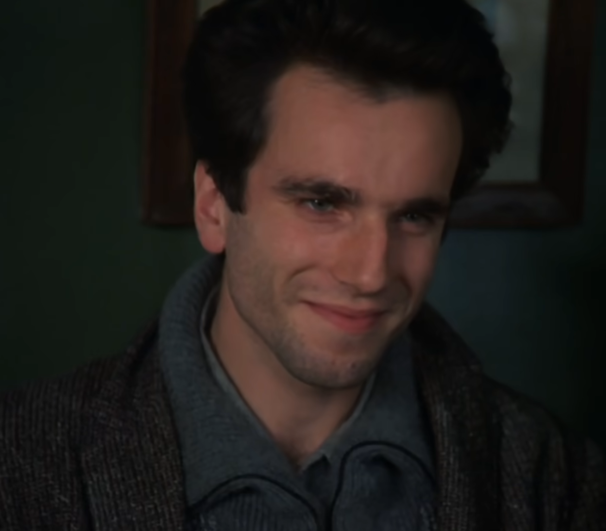

## **ES MUSS SEIN？**
**非如此不可？**

这一周发生了很多事：陪家人去医院与癌细胞作斗争、被自以为是的理想主义与清高的幻想所击垮、愈加的玩物丧志等种种恶习达到井喷......寒假的末端，其实这个寒假很正常，毕竟以前所有的假期都是如此”浑浑噩噩“度过的，但非如此不可吗？这是普通人的假期的开启模式，但我是否可以适当调整呢？一生难道就必须是这样痛苦地永恒轮回吗？直到今天看完了《不能承受的生命之轻》和丹尼尔戴刘易斯、朱丽叶比诺什主演的《布拉格之恋》。

这本书是第二遍读了，相较于高三毕业读的不懂一点，20岁的年纪感悟出来了一些心得，对，仅仅一些，不是全部。如施瓦辛格论健身时所说的：“**不要想着一下子完全了解健身原理知识和技巧，因为你还没有足够经验去理解去消化。**“ 所以，不要浮躁，任何知识永远不是一遍而过的，你要相信，只有你不厌其烦的回顾，才会有新的事物悄然生长。

《不可承受的生命之轻》，又是一本偏存在主义的书籍，步《局外人》《悉达多》《罪与罚》之程，又是偶然的时间点、偶然的动机、偶然的地点...陪伴在我身边。**偶然与必然**，昆德拉在书中阐释了其哲学之思：**偶然是美的，诸多的偶然汇聚成了必然之流。** 正是特蕾莎和托马斯的多次偶然，才铸就了爱情，救赎了自己。既然偶然那么美，那为什么生活中许多人却热衷于在社会制定的终点线下循规蹈矩过完一生呢？难道只是因为害怕出错畏惧偶然？

很长时间，我都无法理解何为”不可承受的生命之轻“。**轻与重**之间的分界线模糊不清，且与司马迁所说的”死或轻如鸿毛或重于泰山“并不相同。轻是自由、无所谓、欲望、躺平、无意义，重是责任、自律、信念、家庭。**生命本是轻的、没有意义的，宛如轮廓，而且只有一次，无法加以修改。但，生命越轻，越浮于半空中，越空虚反而更痛苦更重；生命越重，越贴近地面，越真实**。默尔索对一切都无所谓，是轻的，但是到了临刑前的最后一夜也曾有过动摇。特蕾莎是过于重的，一开始因为认为肉体=爱情而生活如此煎熬；托马斯是轻的，坚信肉体是肉体、爱情是爱情。但是在特蕾莎经历和所谓工程师的放纵试验、托马斯追回捷克去往农村之后，两人都获得了救赎：特蕾莎人生变轻了，托马斯因为特蕾莎而变重了。特蕾莎从在游泳池中看岸边托马斯在指挥整齐划一的裸体情人们到看到河流中漂浮着公园的长椅，她与自己和解了，从**灵与肉**的分离（肉体卑贱）到**灵与肉**的圆满合一。托马斯也在这个**从河流漂流到他身边的婴儿**中获得填充生命轮廓的幸福。

我近几年时常的困境就在于**轻与重的分离、灵与肉的分离**，无论是在期末周还是假期出现这种困境，我努力一次次调整却一次次失败告终。再向内审视深一点，过轻之下的没压力、及时享乐、逃避现实沉迷于虚拟世界、熬夜懒惰等等人性本能的释放反而让自己更空虚更痛苦；过重之下的拒绝偶然害怕变化、锱铢必较的饮食碳蛋脂到克、社交媒体一点都看不了、一项task没完成就对自己心灰意冷的苛求、严格的时间控和敷面膜、扫地、拖地频率让自己喘息不了难以坚持，甚至产生难以抗压下的情绪化进食和连续几天的彻底罢工与反抗......对生命轻重的误解与两极化的尝试，此困境如痼疾、如肿瘤时不时会发作出痛不欲生的感觉，而表象则是其他人眼中的**三天打鱼，两天晒网**和**不靠谱**。

自己灵与肉的分离在于：**明明自己有坚定信念、理想目标，对于身材、形象、生活有着无穷的欲望和渴求，但肉体却不断的摆烂、逃避现实、懒散而又麻木不仁，离自己理想的样子渐行渐远**。”思想上的巨人，行动上的胖子“本质上就是灵与肉的分离。灵肉合一最好的例子是健身，当母亲说我改掉了驼背的坏习惯，殊不知是健身潜移默化的改变了我。正是我对自己八块腹肌、倒三角身材和保持青春不油腻形象的无穷无穷的欲望（**灵**），让我更加努力刻苦、克服一切变化和阻力去力量训练和有氧训练提升身材（**肉**）；而每次力训反复的挑战自我与不断突破极限、力竭之后的泵感与内啡肽分泌（**肉**），让我学会活在当下并随现实一起奔跑，让我充满自信：**我相信，没有什么能难的，我选择的事情我一定能做好！**，如**精神氮泵**般让早睡早起、高效利用时间、热爱生活、干净饮食、形象管理...等习惯得以维持（**灵**）。我想如果没有健身、阅读等等这种灵与肉的外在实践，我可能真的会碌碌无为这一生。感恩。**施瓦辛格也在反反复复强调精神的重要性，毕竟，健身不是一朝之功，而是终身的事业**。

所以，自己的**人生应该轻上加点重、灵肉合一**，正如丹尼尔-戴-刘易斯饰演的托马斯为何如此具有魅力？在于其对待生活的热爱、情绪的稳定、形象干净得体、专注倾听他人且携带微笑、温柔的沟通与行为......这其实就是我想成为的样子的一个折影：**爱自己、他人和世界**。

轻与重、灵与肉。萨比娜是极度的轻与背叛，而轻的结局是空虚孤独；弗兰茨是极度的重与**媚俗**，而媚俗的结局却是荒谬的死（太想有意义下的无意义的死）。**粪便与媚俗**，是不是真实的人则取决于看待粪便的态度。粪便是指一切不完美、想要被虚伪的人销毁的事物：疾病、情欲、失败、缺点......，而媚俗则是一场表演，即昆德拉的第二滴眼泪。社会处处充满着媚俗，上到国家政治下到对待自己的方式，如网络世界一切都是虚幻与不真实，社会也始终在倡导建立起媚俗的外壳。**难道一定只有上好学找好工作结好婚生好娃才是对的嘛？之间只有一个小环节出现了一点波动就不行了嘛？** 太媚俗了，如同弗兰茨想象的前往柬埔寨的**伟大的进军**。而托马斯和萨比娜都在抵抗媚俗、活出真实的自己，托马斯的两次拒绝签字申明书，都是围绕于被媚俗篡改的《俄狄浦斯》，一个是政府的虚伪之媚俗，另一个是自己儿子的理想主义之媚俗。

而想到自己身边人用“同情”、异样的眼光看待生病的人以及关系社会下的现实与媚俗恶心到极点！当然，自己的理想主义和清高确实还是有问题的，因为理想主义也是一种媚俗。**家人生病了、关系社会的现实......你就接受好了，抛弃理想主义，在这个世界下你依旧能在灵魂深处找到一隅属于自己的内核，从而活出真正的自己**。足矣！

至于**卡列宁的微笑**，仿佛是来自另一个时空的浪漫，卡列宁生活在伊甸园中，一个循环往复的人生，而人类却只有一次，生命只是直线前进......

托马斯和特蕾莎在**孰偶然孰必然、孰轻孰重、孰灵孰肉、孰粪便孰媚俗**的清醒认识下最后找到了属于自己的人生与幸福，我相信自己也能用赫拉克勒斯巨人之帚清除一切障碍，活出真实的自己。
